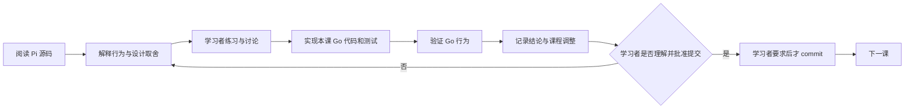

# Pi Core Go Port 课程

## 课程目标

第一期通过阅读冻结的 Pi 实现并逐课完成 Go 语义移植，得到一个可运行、可测试、能在单一目录中完成固定真实 coding 任务的最小 headless Agent Runtime。后续课程继续迁移 coding-relevant 能力，以 Pi parity 为下限，并通过受控评测追求稳定超过 Pi。课程不复刻 TypeScript 文件结构，而是理解、选择并验证 Pi coding loop 的可观察行为；长期产品方向、指标和投入领域以根目录 [`STRATEGY.md`](../../STRATEGY.md) 为准。

产品名统一为 **Pia**；`pi-go` 只保留为当前仓库、目录和 Go module 标识，旧课程记录中的历史称呼不做机械改写。

固定参考基线：

- Pi commit：`dcfe36c79702ec240b146c45f167ab75ecddd205`
- Pi agent package version：`0.80.7`
- Go module language version：`1.26.0`
- 首个真实模型提供方：DeepSeek

如果上游 Pi 或 DeepSeek 在课程期间变化，先记录差异，再决定是否更新基线。已经通过的课程不会静默跟随上游漂移。

`STRATEGY.md` 负责产品方向与取舍原则，不定义具体 API、课程状态或实施细节。技术与课程契约的当前权威顺序是：

1. Lesson 06 的命令、prompt、输出、trace 和验收行为以 [`pia` one-shot 实施计划](../plans/2026-07-19-001-feature-pia-one-shot-coding-agent-plan.md)为准；
2. 其余第一阶段契约以[基础实施计划](../plans/2026-07-15-001-pi-core-go-learning-port-plan.md)为准；
3. [课程与架构决策](decisions.md)；
4. 本课程总纲和单课文档；
5. 冻结 Pi 源码、文档与测试。

出现冲突时先修正文档，不让实现静默选择一套语义。

## 第一期边界

第一阶段只证明最短 coding 闭环：

```text
task + system prompt + working context + tool schemas + workspace context
  -> DeepSeek response
  -> read/write/edit/bash tool stages
  -> ordered tool results appended to working context
  -> next model turn
  -> assistant response without tool calls
  -> run-local message delta committed to conversation history
  -> final assistant text
  -> local ignored acceptance project
```

核心术语：

- `Core Agent`：通用模型与工具循环，拥有可替换的 Working Context，并负责 Provider 调用、工具循环和取消。
- `Conversation Owner`：Coding Agent 的私有应用层责任，保存同一 Conversation 的完整有序内存 History，并提交 Core Agent 每次 Run 返回的 message delta。
- `Run`：一次任务 prompt 启动的完整循环，可以包含多个模型 Turn；课程使用 `run_start/run_end`，引用 Pi 源码时保留 `agent_start/agent_end`。
- `Turn`：一次 assistant response，以及它触发的 tool calls 和 tool results。
- `Tool stage`：同一 assistant message 中的一个执行阶段。连续 parallel-safe calls 构成并行阶段，其他调用分别构成串行屏障。
- `Headless`：没有 TUI 或网页界面。第一阶段还进一步限定为单目录、单 active Run 和单进程内存上下文，但这些不是“headless”一词本身的定义。
- `Agent Manager`：后续可能负责用户、仓库、Session、并发、worktree 和 IM 路由的服务；不属于第一阶段 Runtime。

第一阶段不实现 Goal Runtime、Session 创建/持久化/恢复、自动 compaction、steering/follow-up、完整 subscription 生命周期、权限审批、公共 SDK、gRPC、IM、多用户、多仓库、worktree、GitHub 管理或自动 Pi 对比。这里推迟的是 Session 基础设施；Coding Agent 在当前进程内保留完整 Conversation History、Core Agent 保留 Working Context，属于已经实现的核心语义。

## 每课工作方式

每一课按下面的闭环推进：



第 00 课是基线例外：只建立 `go.mod`、课程文档和验证证据，不创建占位 Runtime package。

执行规则：

1. 课程文档、代码、测试、讨论结论和进度都保存在本仓库。
2. 每课先解释该模块在 Pi 中解决的问题，再写 Go 代码。
3. 实现课程覆盖适用的正常路径、错误路径、取消和并发行为；能用 Faux Provider 确定性验证的语义不调用真实模型。
4. 讨论改变范围、接口、顺序或验收时，先更新本总纲、单课文档、决策记录或实施计划。
5. 每课完成后停在“待理解确认”或“待提交”；只有学习者明确要求时才创建 commit。
6. 一个 commit 只收录已确认课程或学习者明确要求的计划调整，不夹带下一课或无关修改。
7. 讨论或确认课程设计不等于开始课程；只有学习者明确说“开始第 NN 课”后，该课才进入“学习中”。
8. 导师必须持续质疑学习者提出的设计，也要复查自己先前给出的判断；以冻结 Pi 的源码、文档、测试和可复现实验为证据，不以双方同意代替验证。
9. 讨论中明确区分“学习者假设”“已验证的 Pi 契约”“候选 Go 机制”和“已确定的 pi-go 决策”。证据推翻旧结论时，先明确纠正并更新记录，再进入实现。
10. 每个新概念必须先讲解术语、Pi 源码路径和至少一个具体例子，再进行理解检查。
11. 课程默认采用循序渐进、讲解优先的方式；练习只用于检查关键理解，不用连续出题代替讲解。
12. 开始实现后，讲解必须跟随实际 Go 代码和测试展开；遇到不确定或困难的设计点，先共同检查证据和取舍，确认理解后再继续。
13. 课程直接在对话中讲解，仓库只保存必要的课程记录、代码和测试；除非学习者明确要求，不生成独立 HTML 讲义。
14. 讲解聚焦关键语义、源码证据和未决设计，不重复已经确认的概念；加快课程进度不能弱化最终实现，代码和测试仍覆盖完整设计中的错误、取消、并发、所有权与顺序契约。

## 进度状态

- `待开始`：只有课程设计，尚未共同学习。
- `学习中`：正在阅读、练习或讨论。
- `实现中`：课程结论已足够明确，正在写 Go 代码和测试。
- `待理解确认`：代码与验证完成，等待学习者确认理解。
- `待提交`：学习者已确认理解，尚未明确要求 commit。
- `已提交`：学习者明确要求后完成了该课提交。

## 第一期课程地图

| 课次 | 主题 | 核心产物 | 状态 |
|---|---|---|---|
| 00 | 学习契约与冻结基线 | `go.mod`、仓库约束和上游源码基线 | 已提交 |
| 01 | AI 协议与 Faux Provider | 消息、内容块、stream、Provider 接口和脚本 Provider | 已提交 |
| 02 | 单次 Provider Turn 与 transcript | 一次模型流、assistant message、request context 和 Run 终态 | 已提交 |
| 03 | 多轮 Tool Loop 与屏障式调度 | schema、参数校验、tool results、错误继续、只读并行和串行屏障 | 已提交 |
| 04 | DeepSeek Provider | OpenAI-compatible 消息转换、SSE、reasoning、tool calls、usage 和错误映射 | 已提交 |
| 05 | Coding Tools | `read`、`write`、`edit`、`bash`、workspace 边界和进程取消 | 已提交 |
| 06 | Headless coding task | 当前 `pia` 本地入口、coding prompt、final-only 输出和本地 Go bug-fix 验收 | 已提交 |

## 后续课程的滚动式大纲

后续课程不一次性写成详细实施计划。大纲只给最近、边界已经基本明确的课程分配稳定课次；越远的内容只保留阶段方向，等前面课程产生真实代码和问题后再决定如何拆课。表格增加信息是为了说明判断依据，不是提前锁定接口、package、算法或完整测试矩阵。

更新大纲不等于开始课程。每一课仍需学习者明确要求开始；开课时再重新核对冻结 Pi、当前 pi-go 结构以及 Codex/Grok Build 中与该能力直接相关的证据，并允许据此修正原大纲。

### 规模约定

规模描述责任范围和架构影响，不表示人工工期：

| 规模 | 含义 |
|---|---|
| Small | 单一叶子责任，通常不改变跨 package 所有权或生命周期 |
| Medium | 一个聚焦能力，边界清楚，可用一组确定性验收闭环 |
| Large | 一个仍然不可再少的核心契约，但会跨层改变状态、所有权或生命周期 |
| XLarge | 混合了多个可独立讲解和验收的能力；不是可开课规模，必须先讨论并拆分 |

### 已编号的近期课程

| 阶段内课次 | 全局课次 | 解锁的闭环 | Pi 的大致做法 | pi-go 本课边界 | 结束信号 | 依赖 | 规模 | 状态 |
|---|---:|---|---|---|---|---|---|---|
| 二期 01 | 07 | [Conversation History、Working Context 与 Request Snapshot](lessons/07-conversation-history-and-active-context.md) | `SessionManager` 保存完整 session entries 并构造上下文，core `Agent` 持有 working messages，每次模型调用再生成 request-local view | 只建立三种角色的内存所有权边界；不做 compaction、持久化或 Skills | history 与 working context 的所有权独立，Provider 不能反向修改任何 owner | 06 | Large | 已提交 |
| 二期 02 | 08 | [Context budget 与 compaction 核心](lessons/08-context-budget-and-compaction.md) | `AgentSession` 在 `agent_end` 后和新 prompt 前检查阈值；compaction core 摘要旧内容并保留 protocol-valid 近期后缀，`SessionManager` 重建 model context | 只完成 settled Run 后、下一次 Provider call 前的 threshold compaction 闭环；不含 context-overflow retry、branch summary 或持久化 | 人为缩小 budget 后，两次顺序 Run 之间可触发压缩；下一次 request 使用 summary 加保留后缀，完整 History 仍保留原始消息 | 07 | Large | 已提交 |
| 二期 03 | 09 | [Pia Project Skills v1 的发现与基础披露](lessons/09-skill-discovery-and-bounded-catalog.md) | `skills.ts` 先暴露 bounded metadata，并让模型用普通 `read` 按需读取正文 | 只发现 selected workspace 的 `.pia/skills/<direct-child>/SKILL.md`，解析最小 name/description catalog，并复用普通 `read` 建立基础使用闭环；不做 community/global sources 或 managed activation | initial request 只有 bounded metadata；匹配后普通 `read` 才得到 instructions，其他 roots 和正文均不自动进入 context | 07、08 | Medium | 已提交 |
| 二期 04 | 10 | [受管理的 Skill 激活与 Context Continuity](lessons/10-skill-activation-and-context-continuity.md) | Pi 使用普通 `read`；Agent Skills guide 另推荐 dedicated activation、dedupe 与 compaction protection | 把 Lesson 09 的普通 read 使用升级为稳定 identity、结构化 instructions、去重和 compaction continuity；不同时加入 community/global discovery 或完整 resources runtime | Skill 只在选择后结构化注入一次，compaction 后指令仍有明确 model-visible 表达 | 08、09 | Large | 未开始 |

这些行有意不回答具体 Go 类型、package 布局、token estimator、摘要 prompt、Skills 搜索优先级或全部 corner cases。真正进入某课时，先把那一行扩展为本课文档；如果扩展后估算变成 XLarge，就在实现前重新拆课和编号。

### 尚未编号的后续方向

| 阶段方向 | Pi 的大致做法 | 当前判断 | 何时细化 |
|---|---|---|---|
| Agent Skills 与社区兼容扩展 | Pi、Claude Code 与 Codex 支持更多 source scopes、metadata、symlink、resources 和 invocation/runtime 行为 | 在 Pia Skill v1 和 managed activation 稳定后，再分别评估 `.agents`/`.claude` project roots、global scopes、完整 Agent Skills、supporting resources 与 vendor semantics；整体是 XLarge，必须拆课 | Lesson 10 完成且真实 Pia Skills 使用暴露兼容需求后逐项编号 |
| 项目指令兼容增强 | 冻结 Pi 从 global agent dir 和 ancestor directories 读取每层第一个 `AGENTS.md`/`CLAUDE.md`；Codex 与 Claude 的层级、候选和 lazy-loading 语义不同 | Lesson 06 已完成 workspace-root `AGENTS.md` 优先、`CLAUDE.md` fallback 的最小支持；完整 project-only instruction chain 是独立于 Skills 的 prompt/context 能力，不并入 Lesson 09/10，也不扫描 user/global instructions | Lesson 10 后，或 monorepo/nested-workspace 需求出现时，先校准 project root、启动目录和按需子目录语义再编号 |
| Runtime 韧性 | `AgentSession` 对可恢复 Provider 错误做有界退避，并把 context overflow 交给 compaction 路径 | Provider retry、执行预算与循环保险丝可能不是同一课，不能现在打包 | Lesson 10 完成后，依据真实长任务失败重新拆分 |
| 事件与文本交互 | core Agent 和 `AgentSession` 发出语义事件，并用 steering/follow-up queues 接收运行中的输入 | 整体是 XLarge 方向；事件契约和文本交互至少需要分别形成闭环 | 出现第一个真实 headless consumer 时细化 |
| Session 持久化与恢复 | `SessionManager` 保存版本化记录，并从记录重建 active context | 存储格式与恢复生命周期是两个候选责任，不预先合课 | 内存上下文和 compaction 契约稳定后细化 |
| Orchestration、Gateway 与 IM | Pi 的 coding core 提供 Session 生命周期与事件，但不替 pi-go 定义外部服务拓扑 | Orchestrator 需要协调多个隔离 Session，Gateway 与 IM adapters 只做外层接入；整体是 XLarge 方向，必须按已证明的 Session、事件和任务生命周期责任拆分 | Session 持久化/恢复和非 UI 事件消费者稳定后细化 |
| TUI | Pi 的 interactive mode 订阅 Session 事件并处理 terminal、渲染和输入 | 整体是 XLarge 方向，进入独立后续阶段且必须拆课；TUI 只做外层投影 | 事件、交互和恢复均有非 TUI 消费者验证后细化 |
| 稳定对照评测 | Pi 没有替 pi-go 定义对照协议；需要在两个 agent 外建立公平实验 | 评测契约、runner/corpus 和对照迭代是多个能力，不提前塞进一课 | coding-relevant Pi 能力完成覆盖审计后细化 |

Goal Runtime、Orchestrator/Agent Manager、Gateway、公共 SDK、gRPC、IM、多用户、多仓库、worktree/GitHub 管理、extensions 和 MCP 仍未进入已编号课程。它们是否属于长期策略与它们何时进入实施是两个问题；第 00 课已经讨论过的 lifecycle/listener 内容仍是学习记录，不等于已经确定后续公开 API。

### 长期 coding 能力与评测目标

最终目标不是“代码结构像 Pi”，而是在完成 coding-relevant 能力迁移后，让 Pi parity 成为能力下限，并用稳定、可重复的评测追求 Pia 的 coding 能力持续超过冻结的 Pi coding-agent 基线。Pi 仍是语义基线和主要对照组；其他优秀开源 coding agent 以及 Codex、Grok 的可获得证据用来提供候选机制与工程经验。

正式评测至少遵守以下约束：

- 两个 agent 使用相同的模型版本、Provider profile、初始仓库、任务文字和资源限制，并记录所有有意差异；
- 同一任务进行多次独立运行，以自动测试或隐藏验证作为主要成功判据，不以一次演示或主观观感下结论；
- coding resolve rate 是“能力更强”的主要指标，同时记录 token/cost、turn 数、wall time、tool-call 错误、恢复能力和长上下文完成率；
- 协议完整性、安全边界和可恢复性是门槛，不能用更高的任务通过率掩盖明显回归；
- 具体任务集、重复次数、统计门槛、trace 规范和评测产物位置留到正式评测课程决定，不在当前大纲中提前设计。

Lesson 06 被忽略的本地 fixture 和人工复核只证明第一期闭环，不承担上述对照结论。后续每课仍做本课的确定性验收；正式 benchmark 设施等评测方向被拆成可实施课程后再建设。

## 课程记录约定

每课文档至少维护：

- 学习目标和前置知识；
- Pi 源码阅读路径；
- 要掌握的行为契约；
- 讨论题和学习者结论；
- Go 实现范围与明确非目标；
- Pi 源码证据和 pi-go 测试场景；
- 本课产生或修改的文件；
- 未解决问题和对后续课程的影响；
- 当前状态与提交信息。

长期有效的架构选择写入 `docs/course/decisions.md`。只影响一课的推导、问题和练习答案保留在对应课文档中。

## 第一期代码边界

```text
pi-go/
├── cmd/pia/                   # 当前 one-shot 本地入口
├── internal/
│   ├── ai/                    # 消息、ai.Provider、stream 和通用模型协议
│   │   └── provider/          # 具体 Provider 实现的归类目录，不是 registry
│   │       ├── faux/          # 确定性脚本 Provider
│   │       ├── openaicompatible/ # Chat Completions 线协议
│   │       └── deepseek/      # DeepSeek 配置和兼容 profile
│   ├── agent/                 # 通用模型与工具循环及可替换 Working Context
│   └── coding/                # Conversation History、prompt、workspace、装配和 coding tools
├── docs/
│   ├── course/                # 课程、讨论与决策
│   └── plans/                 # 当前实施计划
└── go.mod
```

`internal/` 是当前的有意选择：接口会随学习不断校正。`cmd/pia` 把启动时的当前目录作为 workspace，只接收一条 task prompt，用于本地运行与验收；Pia 产品名已经确定，但当前 CLI 参数与外部协议仍不稳定。等核心语义稳定并出现真实调用方后，再决定公共 Go SDK、gRPC 或 Agent Manager。

冻结 Pi commit 和 package version 只保存在课程文档，不进入 Runtime package。Lesson 06 的真实验收项目、运行副本和 trace 只保存在被忽略的 `tmp/` 中，不提交 fixture 或 harness。正式 Pi 对照评测属于尚未编号的后续方向；其可重复设施和产物边界在对应课程开始时另行决定。

第 06 课的详细记录见 [Headless one-shot Coding Task](lessons/06-headless-coding-task.md)，第 07 课记录见 [Conversation History、Working Context 与 Request Snapshot](lessons/07-conversation-history-and-active-context.md)。Lesson 08 的边界、源码证据和实现结果记录在 [Context budget 与 compaction 核心](lessons/08-context-budget-and-compaction.md)。Lesson 09 已完成并记录在 [Pia Project Skills v1 的发现与基础披露](lessons/09-skill-discovery-and-bounded-catalog.md)；拆出的 Lesson 10 [Skill 激活与 Context Continuity](lessons/10-skill-activation-and-context-continuity.md) 尚未开始。
