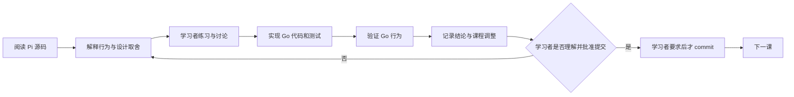

# Pi Core Go Port 课程

## 课程目标

通过阅读 Pi 当前实现并逐课完成 Go 语义移植，最终得到一个可运行、可测试、能完成真实 coding 任务的 headless Agent Runtime。课程不以复刻 TypeScript 文件结构为目标，而以理解并验证 Pi 的行为契约为目标。

固定参考基线：

- Pi commit：`dcfe36c79702ec240b146c45f167ab75ecddd205`
- Pi package version：`0.80.7`
- 本地 Go：`go1.26.1 darwin/arm64`
- 初始模型提供方：DeepSeek

如果上游 Pi 或 DeepSeek 在课程期间变化，先记录差异，再决定是否更新基线。已经通过的课程不会静默跟随上游漂移。

## 术语边界

- `Agent Runtime`：当前课程的核心，负责 Agent Loop、模型、工具、Goal Runtime 和 Session 状态。
- `cmd/pi-go`：Agent Runtime 的本地无 UI 运行与验收入口；当前不承诺可供外部系统依赖的调用协议。
- `Agent Manager`：后续负责用户、仓库、Session、并发、worktree 和生命周期调度的常驻服务。
- `IM Adapter`：后续把飞书或其他 IM 消息转换为 Manager 请求，再把 Runtime 事件转换为聊天回复。

“Headless”只表示没有 TUI 或网页界面，不表示一次性、无 Session、不能并发或不能接入服务。第一阶段允许每个运行中的 Session 使用独立进程和 worktree；同一 Session 同时只有一个 active run。多用户统一调度属于 Agent Manager，不塞入 Agent Loop。

## 每课工作方式

每一课按下面的闭环推进：



执行规则：

1. 课程文档、代码、测试、讨论结论和进度都保存在本仓库。
2. 每课先解释该模块在 Pi 中解决的问题，再写 Go 代码。
3. 每课必须覆盖适用的正常路径、错误路径、取消和并发行为；能用 Faux Provider 确定性验证的语义不调用真实模型。
4. 讨论改变范围、接口或顺序时，先更新课程文档和 `docs/course/decisions.md`。
5. 每课完成后停在“待理解确认”或“待提交”；只有学习者明确要求时才创建 commit。
6. 一个 commit 只收录已确认课程的文件，不夹带下一课或无关修改。
7. 讨论或确认课程设计不等于开始课程；只有学习者明确说“开始第 NN 课”后，该课才进入“学习中”。
8. 导师必须持续质疑学习者提出的设计，也要复查自己先前给出的判断；以冻结 Pi 的源码、文档、测试和可复现实验为证据，不以双方同意代替验证。
9. 讨论中明确区分“学习者假设”“已验证的 Pi 契约”“候选 Go 机制”和“已确定的 pi-go 决策”。证据推翻旧结论时，先明确纠正并更新记录，再进入实现。
10. 每个新概念必须先讲解术语、Pi 源码路径和至少一个具体例子，再进行理解检查；不能要求学习者在尚未获得行为模型时猜答案。

## 课程术语规则

- 后续讲解使用 `run_start/run_end` 表示一次 Run 的语义边界。
- 引用冻结 Pi 的事件名或源码时保留原文 `agent_start/agent_end`，并说明它们分别对应 `run_start/run_end`。
- 课程术语不自动决定未来的外部协议；第 05 课只确定 Runtime 内部事件的生命周期语义和 Go 命名。

## 进度状态

- `待开始`：只有课程设计，尚未共同学习。
- `学习中`：正在阅读、练习或讨论。
- `实现中`：课程结论已足够明确，正在写 Go 代码和测试。
- `待理解确认`：代码与验证完成，等待学习者确认理解。
- `待提交`：学习者已确认理解，尚未明确要求 commit。
- `已提交`：学习者明确要求后完成了该课提交。

## 课程地图

| 课次 | 主题 | 核心产物 | 状态 |
|---|---|---|---|
| 00 | 学习契约与冻结基线 | `go.mod`、仓库约束和上游源码基线 | 已提交 |
| 01 | AI 协议与 Faux Provider | 消息、内容块、流事件、模型接口、确定性脚本 Provider | 待开始 |
| 02 | 单轮 Agent Loop | prompt、流式响应、事件序列、transcript | 待开始 |
| 03 | 顺序 Tool Loop | 工具 schema、参数校验、执行、tool result、错误语义 | 待开始 |
| 04 | 并行工具与顺序不变量 | preflight、并发执行、完成事件顺序、transcript 源顺序 | 待开始 |
| 05 | Agent 生命周期 | busy、cancel、listener settlement、状态与异常收敛 | 待开始 |
| 06 | Steering 与 Follow-up | 插队、下一轮排队、continue、turn stop hooks | 待开始 |
| 07 | DeepSeek Provider | SSE、thinking、tool calls、认证与错误映射 | 待开始 |
| 08 | Coding Tools | read、write、edit、bash、cwd 边界、截断和进程取消 | 待开始 |
| 09 | Headless Agent Runtime | system prompt、上下文组装、工具注册、目标输入输出 | 待开始 |
| 10 | Goal Runtime | plan、execute、observe、replan、done/blocked | 待开始 |
| 11 | Session 与恢复 | 每任务 Session、事件日志、checkpoint、resume | 待开始 |

课次编号是稳定标识。调整顺序时移动课程，不重编号；拆课时使用新的未占用编号。

## 课程记录约定

每课文档至少维护以下内容：

- 学习目标和前置知识
- Pi 源码阅读路径
- 要掌握的行为契约
- 讨论题和学习者结论
- Go 实现范围与明确非目标
- Pi 源码证据和 pi-go 测试场景
- 本课产生或修改的文件
- 未解决问题和对后续课程的影响
- 当前状态与提交信息（只有提交后填写）

长期有效的架构选择写入 `docs/course/decisions.md`。只影响一课的推导、问题和练习答案保留在对应课文档中。

## 初始代码边界

```text
pi-go/
├── cmd/pi-go/             # Agent Runtime 的本地运行与验收入口
├── internal/
│   ├── ai/                # 消息、模型、流事件和 Provider
│   ├── agent/             # 通用 Agent 状态与循环
│   ├── coding/            # coding runtime、workspace 和工具
│   ├── goal/              # 目标规划与收敛控制
│   └── session/           # 每任务会话、持久化和恢复
├── testdata/              # 确定性 Provider、工具和 Session fixtures
├── docs/
│   ├── course/            # 课程、讨论与决策
│   └── plans/             # 实施计划
└── go.mod
```

`internal/` 是当前的有意选择：接口会随学习不断校正。等核心语义稳定并出现真实外部调用方后，再决定是否建立公开 SDK 或 RPC 协议。

当前不为外部 Go 项目提供调用方式。未来出现 Agent Manager 或 IM 集成需求时，再根据部署和语言边界选择 gRPC、公共 Go SDK 或两者组合。

冻结 Pi commit 和 package version 只保存在课程文档，不进入 Runtime package。
