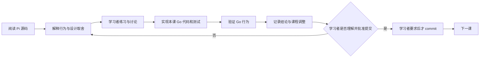

# Pia Coding Agent 课程

## 课程目标

第一阶段通过阅读冻结的 Pi 实现并逐课完成 Go 语义移植，得到一个可运行、可测试、能在单一目录中完成固定真实 coding 任务的最小 headless Agent Runtime。第二阶段继续迁移 Conversation/Working Context、compaction、Skills 与 overflow recovery 等 coding-relevant 能力；第三阶段再系统建设可观察、可控制、可持久化、可恢复且实例隔离的 Session Runtime。更长期的课程以 Pi parity 为能力下限，并通过受控评测追求稳定超过 Pi。课程不复刻 TypeScript 文件结构，而是理解、选择并验证 Pi coding loop 的可观察行为；长期产品方向、指标和投入领域以根目录 [`STRATEGY.md`](../../STRATEGY.md) 为准。

仓库与产品名统一为 **Pia**，Go module path 统一为 `github.com/yuanbohan/pia`；课程、计划和决策记录使用同一项目名称。

固定参考基线：

- Pi commit：`dcfe36c79702ec240b146c45f167ab75ecddd205`
- Pi agent package version：`0.80.7`
- Go module language version：`1.26.0`
- 首个真实模型提供方：DeepSeek

如果上游 Pi 或 DeepSeek 在课程期间变化，先记录差异，再决定是否更新基线。已经通过的课程不会静默跟随上游漂移。

`STRATEGY.md` 负责产品方向与取舍原则，不定义具体 API、课程状态或实施细节。技术与课程契约的当前权威顺序是：

1. Lesson 06 的命令、prompt、输出、trace 和验收行为以 [`pia` one-shot 实施计划](../plans/2026-07-19-001-feature-pia-one-shot-coding-agent-plan.md)为准；
2. 其余第一阶段契约以[基础实施计划](../plans/2026-07-15-001-pi-core-go-learning-port-plan.md)为准；
3. [课程与架构决策](decisions.md)；
4. 本课程总纲和单课文档；
5. 冻结 Pi 源码、文档与测试。

出现冲突时先修正文档，不让实现静默选择一套语义。

## 课程阶段与文档索引

| 阶段 | 课程范围 | 阶段目标 | 实施与课程文档 | 当前状态 |
|---|---|---|---|---|
| 第一阶段 | Lessons 00–06 | 建立最小 headless coding loop，并用本地 `pia` 命令完成真实 one-shot coding task | [基础实施计划](../plans/2026-07-15-001-pi-core-go-learning-port-plan.md)、[Lesson 06 one-shot 实施计划](../plans/2026-07-19-001-feature-pia-one-shot-coding-agent-plan.md)、[第一阶段课程表](#phase-1-courses) | 全部已提交 |
| 第二阶段 | Lessons 07–11 | 扩展 Conversation/Working Context、compaction、project-local Skills 与 overflow recovery，保持完整 History 和模型工作视图可独立演进 | [第二阶段滚动课程实施计划](#第二阶段滚动课程实施计划)、[第二阶段课程表](#phase-2-courses) | 全部已提交 |
| 第三阶段 | Lesson 12 与待编号后续课 | 建立可观察、可控制、可持久化、可恢复且实例隔离的 Session Runtime | [第三阶段滚动课程实施计划](#第三阶段滚动课程实施计划) | 预先大纲已记录；尚未开始 Lesson 12 |
| 更长期后续 | 第三阶段之后 | 根据 Session Runtime 和真实使用证据，再拆分 Skills compatibility、Orchestration、TUI、评测等方向 | [尚未编号的后续方向](#尚未编号的后续方向) | 尚未进入实施 |

根 README 只保留本页入口；阶段实施文档、逐课链接和状态以这里为准。第一阶段有稳定的基础计划与 Lesson 06 专项计划；第二、三阶段采用滚动计划，由本页课程表和对应 lesson 文档共同承载，不再创建重复的阶段计划文件。新增课程时，只需在所属阶段的课程表增加一行并链接 lesson 文档；边界尚未明确的能力先保留阶段内临时顺序或放入“尚未编号的后续方向”。

## 第一阶段边界

第一阶段包含 Lessons 00–06。它的实施契约由[基础实施计划](../plans/2026-07-15-001-pi-core-go-learning-port-plan.md)与 [Lesson 06 one-shot 实施计划](../plans/2026-07-19-001-feature-pia-one-shot-coding-agent-plan.md)共同承载。

下面使用 Lesson 07 已校准的 Conversation History、Working Context 和 Conversation Owner 术语描述第一阶段闭环，以保持当前文档一致；这只是后续课程对所有权的修正，不把 Lesson 07 归入第一阶段。

第一阶段只证明最短 coding 闭环：

```text
task + system prompt + working context + tool schemas + workspace context
  -> DeepSeek response
  -> read/write/edit/bash tool stages
  -> ordered tool results appended to working context
  -> next model turn
  -> assistant response without tool calls
  -> run-local message delta committed to conversation history
  -> final assistant text
  -> local ignored acceptance project
```

核心术语：

- `Core Agent`：通用模型与工具循环，拥有可替换的 Working Context，并负责 Provider 调用、工具循环和取消。
- `Conversation Owner`：Coding Agent 的私有应用层责任，保存同一 Conversation 的完整有序内存 History，并提交 Core Agent 每次 Run 返回的 message delta；一次 overflow recovery 可在同一外层 guard 内顺序协调 input-started Run 与 input-free Continue。
- `Run`：一次 accepted Agent Loop execution，可以包含多个模型 Turn；`Run(ctx, input)` 在接受时追加 user message，`Continue(ctx)` 从既有 user/tool-result tail 无输入继续。课程使用 `run_start/run_end`，引用 Pi 源码时保留 `agent_start/agent_end`。
- `Turn`：一次 assistant response，以及它触发的 tool calls 和 tool results。
- `Tool stage`：同一 assistant message 中的一个执行阶段。连续 parallel-safe calls 构成并行阶段，其他调用分别构成串行屏障。
- `Headless`：没有 TUI 或网页界面。第一阶段还进一步限定为单目录、单 active Run 和单进程内存上下文，但这些不是“headless”一词本身的定义。
- `Agent Manager`：后续可能负责用户、仓库、Session、并发、worktree 和 IM 路由的服务；不属于第一阶段 Runtime。

第一阶段交付时不实现 Goal Runtime、Session 创建/持久化/恢复、自动 compaction、steering/follow-up、完整 subscription 生命周期、权限审批、公共 SDK、gRPC、IM、多用户、多仓库、worktree、GitHub 管理或自动 Pi 对比。Lesson 07 后续把完整 Conversation History 与 Working Context 的所有权分开，Lesson 08 再加入自动 compaction；它们都属于第二阶段，不改变 Lessons 00–06 的阶段归属。

## 每课工作方式

每一课按下面的闭环推进：



第 00 课是基线例外：只建立 `go.mod`、课程文档和验证证据，不创建占位 Runtime package。

执行规则：

1. 课程文档、代码、测试、讨论结论和进度都保存在本仓库。
2. 每课先解释该模块在 Pi 中解决的问题，再写 Go 代码。
3. 实现课程覆盖适用的正常路径、错误路径、取消和并发行为；能用 Faux Provider 确定性验证的语义不调用真实模型。
4. 讨论改变范围、接口、顺序或验收时，先更新本总纲、单课文档、决策记录或实施计划。
5. 每课完成后停在“待理解确认”或“待提交”；只有学习者明确要求时才创建 commit。
6. 一个 commit 只收录已确认课程或学习者明确要求的计划调整，不夹带下一课或无关修改。
7. 讨论或确认课程设计不等于开始课程；只有学习者明确说“开始第 NN 课”后，该课才进入“学习中”。
8. 导师必须持续质疑学习者提出的设计，也要复查自己先前给出的判断；以冻结 Pi 的源码、文档、测试和可复现实验为证据，不以双方同意代替验证。
9. 讨论中明确区分“学习者假设”“已验证的 Pi 契约”“候选 Go 机制”和“已确定的 Pia 决策”。证据推翻旧结论时，先明确纠正并更新记录，再进入实现。
10. 每个新概念必须先讲解术语、Pi 源码路径和至少一个具体例子，再进行理解检查。
11. 课程默认采用循序渐进、讲解优先的方式；练习只用于检查关键理解，不用连续出题代替讲解。
12. 开始实现后，讲解必须跟随实际 Go 代码和测试展开；遇到不确定或困难的设计点，先共同检查证据和取舍，确认理解后再继续。
13. 课程直接在对话中讲解，仓库只保存必要的课程记录、代码和测试；除非学习者明确要求，不生成独立 HTML 讲义。
14. 讲解聚焦关键语义、源码证据和未决设计，不重复已经确认的概念；加快课程进度不能弱化最终实现，代码和测试仍覆盖完整设计中的错误、取消、并发、所有权与顺序契约。

## 进度状态

- `待开始`：只有课程设计，尚未共同学习。
- `学习中`：正在阅读、练习或讨论。
- `实现中`：课程结论已足够明确，正在写 Go 代码和测试。
- `待理解确认`：代码与验证完成，等待学习者确认理解。
- `待提交`：学习者已确认理解，尚未明确要求 commit。
- `已提交`：学习者明确要求后完成了该课提交。

<a id="phase-1-courses"></a>

## 第一阶段课程（Lessons 00–06）

| 课次 | 课程文档 | 核心产物 | 状态 |
|---|---|---|---|
| 00 | [学习契约与冻结基线](lessons/00-learning-contract-and-baseline.md) | `go.mod`、仓库约束和上游源码基线 | 已提交 |
| 01 | [AI 协议与 Faux Provider](lessons/01-ai-protocol-and-faux-provider.md) | 消息、内容块、stream、Provider 接口和脚本 Provider | 已提交 |
| 02 | [单次 Provider Turn 与 transcript](lessons/02-agent-loop-and-transcript.md) | 一次模型流、assistant message、request context 和 Run 终态 | 已提交 |
| 03 | [多轮 Tool Loop 与屏障式调度](lessons/03-tool-loop-and-staged-scheduling.md) | schema、参数校验、tool results、错误继续、只读并行和串行屏障 | 已提交 |
| 04 | [DeepSeek Provider](lessons/04-deepseek-provider.md) | OpenAI-compatible 消息转换、SSE、reasoning、tool calls、usage 和错误映射 | 已提交 |
| 05 | [Coding Tools](lessons/05-coding-tools.md) | `read`、`write`、`edit`、`bash`、workspace 边界和进程取消 | 已提交 |
| 06 | [Headless coding task](lessons/06-headless-coding-task.md) | 当前 `pia` 本地入口、coding prompt、final-only 输出和本地 Go bug-fix 验收 | 已提交 |

## 第二阶段滚动课程实施计划

第二阶段从 Lesson 07 开始，在第一阶段 one-shot coding loop 上继续建设 Conversation/Working Context、compaction、Skills 与 context-overflow recovery。稳定范围是 Lessons 07–11；Lesson 11 用有界 compact-and-continue 补齐当前内存 coding loop 的 overflow 缺口，并作为本阶段收尾。Goal Runtime、Session 持久化、Orchestration、Gateway、IM、TUI 和正式对照评测不因长期策略已确认就提前进入本阶段。

本节是第二阶段的滚动课程实施计划。它只给边界已经基本明确的课程分配稳定课次，并记录能力、来源证据、Pia 边界、完成信号、依赖、规模和状态；具体 API、package、算法和测试矩阵在每课开课时通过源码校准后写入对应 lesson 文档。越远的内容只保留阶段方向，等前面课程产生真实代码和问题后再决定如何拆课。

更新计划不等于开始课程。每一课仍需学习者明确要求开始；开课时再重新核对冻结 Pi、当前 Pia 结构以及 Codex/Grok Build 中与该能力直接相关的证据，并允许据此修正滚动计划。

### 规模约定

规模描述责任范围和架构影响，不表示人工工期：

| 规模 | 含义 |
|---|---|
| Small | 单一叶子责任，通常不改变跨 package 所有权或生命周期 |
| Medium | 一个聚焦能力，边界清楚，可用一组确定性验收闭环 |
| Large | 一个仍然不可再少的核心契约，但会跨层改变状态、所有权或生命周期 |
| XLarge | 混合了多个可独立讲解和验收的能力；不是可开课规模，必须先讨论并拆分 |

<a id="phase-2-courses"></a>

### 第二阶段课程（Lessons 07–11）

| 阶段内课次 | 全局课次 | 课程文档与解锁的闭环 | Pi 的大致做法 | Pia 本课边界 | 结束信号 | 依赖 | 规模 | 状态 |
|---|---:|---|---|---|---|---|---|---|
| 二期 01 | 07 | [Conversation History、Working Context 与 Request Snapshot](lessons/07-conversation-history-and-active-context.md) | `SessionManager` 保存完整 session entries 并构造上下文，core `Agent` 持有 working messages，每次模型调用再生成 request-local view | 只建立三种角色的内存所有权边界；不做 compaction、持久化或 Skills | history 与 working context 的所有权独立，Provider 不能反向修改任何 owner | 06 | Large | 已提交 |
| 二期 02 | 08 | [Context budget 与 compaction 核心](lessons/08-context-budget-and-compaction.md) | `AgentSession` 在 `agent_end` 后和新 prompt 前检查阈值；compaction core 摘要旧内容并保留 protocol-valid 近期后缀，`SessionManager` 重建 model context | 只完成 settled Run 后、下一次 Provider call 前的 threshold compaction 闭环；不含 context-overflow retry、branch summary 或持久化 | 人为缩小 budget 后，两次顺序 Run 之间可触发压缩；下一次 request 使用 summary 加保留后缀，完整 History 仍保留原始消息 | 07 | Large | 已提交 |
| 二期 03 | 09 | [Pia Project Skills v1 的发现与基础披露](lessons/09-skill-discovery-and-bounded-catalog.md) | `skills.ts` 先暴露 bounded metadata，并让模型用普通 `read` 按需读取正文 | 只发现 selected workspace 的 `.pia/skills/<direct-child>/SKILL.md`，解析最小 name/description catalog，并复用普通 `read` 建立基础使用闭环；不做 community/global sources 或 dedicated activation tool | initial request 只有 bounded metadata；匹配后普通 `read` 才得到 instructions，其他 roots 和正文均不自动进入 context | 07、08 | Medium | 已提交 |
| 二期 04 | 10 | [按需 Skill Activation Tool](lessons/10-skill-activation-and-context-continuity.md) | Pi 使用普通 `read`；Grok Build 用 dedicated `skill` tool 按 name 读取当前正文，旧 result 按普通历史参与 compaction | 把 Lesson 09 的普通 read 使用升级为 project-local `skill(name)` tool 和有界结构化 instructions；不建立 activation registry、dedupe、receipt 或 Skill-specific compaction | initial request 只有 catalog；调用后才出现完整 instructions，重复调用重新读取，旧 result 可被普通 compaction 回收且没有 protected Skill projection | 08、09 | Medium | 已提交；真实模型产品路径验收通过 |
| 二期 05 | 11 | [Context overflow 恢复与无输入 continuation](lessons/11-context-overflow-recovery-and-input-free-continuation.md) | Core `Agent.continue()` 从 user/tool-result tail 无输入续跑；`AgentSession` 保存 error、从 active context 排除它、执行 overflow compaction，并阻止未取得进展的连续 compact-and-retry | 只处理有明确证据且 terminal 不含 completed tool calls 的 error-based overflow；完整 History 保留 overflow error assistant，retry projection 以 absolute History position 排除该 assistant并 forced compact，再做一次 input-free Core continuation；每个 accepted user advance 最多一次自动 recovery，不含未来用户显式 retry、generic retry、事件、队列或 Session | 原 user 只出现一次，已执行 tools 不重放，overflow assistant 永久保留在 History 但不再回到 model projection；第二次 overflow 有界失败 | 08、10 | Large | 已提交 |

这些行有意不回答所有具体 Go 类型、package 布局和 corner cases。真正进入某课时，先把那一行扩展为本课文档；如果扩展后估算变成 XLarge，就在实现前重新拆课和编号。Lesson 11 已按校准后的 projection、自动 recovery budget、两段提交、cancellation commit section、阶段性 private classifier placement 与 Run/Continue terminology 完成实现、验证、理解确认和提交；第二阶段至此结束。

## 第三阶段滚动课程实施计划

第三阶段主题是 **Session Runtime：可观察、可控制、可持久化、可恢复、实例间隔离**。它把第二阶段已经稳定的 Core Agent、complete Conversation History、replaceable Working Context、compaction、Skills 和 overflow recovery 组织成可被未来 Orchestrator 长期驱动的运行单元，但本阶段本身不建设 Orchestrator、Gateway 或 IM。

Lesson 11 已经完成实现、验证与理解确认，因此可以开始第三阶段的课程规划讨论；这不等于 Lesson 12 已经开课。下面是基于当前冻结 Pi 源码、Pia 代码边界和长期策略形成的**滚动假设**，不是九份已经定型的 implementation spec。Lesson 12 是最近且边界已足够清楚的稳定全局课次；其余行只有阶段内顺序，开课时必须重新阅读对应 Pi 源码与测试、追踪当时 Pia 路径，并允许拆分、合并、换序或推翻。

Lesson 12 是第三阶段的第一课，不是对第二阶段的再次补课。它观察第二阶段已经建立的 Run、tool、compaction 与 overflow-recovery 语义，并把这些事实转换成可由 headless consumer 使用的实时事件；它不回头改变 Lesson 11 的恢复闭环，也不在这一课实现 Session 持久化。

### 阶段准入与退出边界

准入时，Pia 应已经能在一个内存 Conversation 中：保存完整 History、独立替换 Working Context、在 Runs 之间 threshold compact、按需使用 project-local Skills，并从一次明确 context overflow 中有界 compact-and-continue。

退出时，Pia 应具备一个 internal、headless 的 Session Runtime：外部 host 可以观察语义事件，顺序推进和控制一个长期 Session；进程重启后可恢复 settled state，遇到 interrupted execution 时不会猜测性重放未知副作用；多个 Session instances 可并发运行而不共享可变状态。此退出信号不承诺公共 SDK、网络协议、Manager/scheduler 或 UI。

<a id="phase-3-courses"></a>

### 第三阶段课程系列

| 阶段内课次 | 全局课次 | 解锁能力 | Pi 的大致做法与源码区域 | Pia 预先边界与非目标 | 结束信号 | 依赖 | 规模 | 状态 |
|---|---:|---|---|---|---|---|---|---|
| 三期 01 | 12 | Core semantic events 与真实 headless observer | `packages/agent/src/{types,agent-loop,agent}.ts` 定义 run/turn/message/tool events，`AgentSession` 转发并补充 settled lifecycle | 先建立 terminal/semantic event ordering 与至少一个真实非 UI consumer，并覆盖 compaction/recovery 的实时 lifecycle；不做 token delta、TUI、持久化或 steering | observer 能在执行发生时按顺序重建 accepted Run、Turns、terminal messages、tool starts/results、compaction attempt 与最终 settlement，而不是事后猜 transcript | 11 | Large | 待开始 |
| 三期 02 | 待编号 | 单个长期 in-memory Session lifecycle 与控制 | `AgentSession` 组合 prompt、abort、wait-for-idle、state 与 teardown，并在 core executions 外形成 settled boundary | 只支持顺序推进、busy/idle、cancel、wait 和 close 的一个 Session instance；不做持久化、公共 SDK、Manager 或网络服务 | 同一 Session 可接受多次 user advance，active control 与资源关闭确定收敛，close 后不再接受工作且无 goroutine/resource leak | 三期 01 | Large | 待开始 |
| 三期 03 | 待编号 | 有界 Provider retry 与失败收敛 | `AgentSession` 的 auto-retry 协调配合 `packages/ai/src/utils/retry.ts`，overflow 先走独立 compaction path | 只处理有证据的瞬时 Provider/transport failures，包含有界 attempt/backoff/cancellation；不 retry tools，不混入 overflow、预算或 circuit breaker | Faux clock/provider 可证明 attempt 上限、等待取消、成功复位与最终 error/history/event ordering，不发生重复 user input | 11、三期 01–02 | Large | 待开始 |
| 三期 04 | 待编号 | Steering queue 与安全 Turn boundary 注入 | core Agent 在 tool loop 的安全边界拉取 steering messages，`AgentSession` 维护 queue 并暴露状态 | 只允许 active execution 中的 input 在已定义安全边界进入；不抢占正在执行的 Provider/tool，不持久化，不做多用户优先级 | 多条 steering input 各提交一次、顺序确定，既不越过 active tool settlement，也不会启动并发 Core execution | 三期 01–02 | Large | 待开始 |
| 三期 05 | 待编号 | Follow-up queue 与 quiescence | core Agent 在本来将停止时检查 follow-up queue，必要时继续新的 prompt cycle；Session 区分 steering/follow-up | 只处理“当前 execution 将结束后再推进”的输入，并定义何时真正 idle；不合并两种 queue，不做 scheduler | follow-up 只在正常停止边界消费，和 steering 保持可观察区分；全部队列与 execution settled 后 Session 才报告 idle | 三期 04 | Medium | 待开始 |
| 三期 06 | 待编号 | Versioned durable Session journal | `SessionManager` 以 versioned append-only JSONL entries 保存 messages、compaction 与状态变化，并验证/迁移记录 | 先保存 authoritative History、已接受 pending inputs 与恢复所需 lifecycle facts；compaction 作为与 message 并列的 settled typed record 保存 trigger、outcome 及成功时的 projection，不把内部 summary exchange 或 live event stream 当数据库，不做 branch/tree、cloud DB 或跨 Session index | crash-safe write/close 与损坏输入测试证明 settled facts 可持久读取；最新 committed compaction 可恢复 model view，failed/canceled attempt 可追溯但不改变 projection，版本不支持或尾部不完整时不静默改写历史 | 三期 01–05 | Large | 待开始 |
| 三期 07 | 待编号 | Clean settled Session restore 与 Working Context 重建 | `SessionManager.buildSessionContext()` 从 entries、latest compaction 和 kept boundary 重建 model context，`AgentSession` 恢复 model/session state | 只恢复干净 settled Session 的 History、projection、queues 与下一次可继续状态；不处理 active crash 的未知副作用，不做 branch navigation | 重启前后的 complete History、下一次 Provider request、pending-input order 与 compaction continuity 等价，恢复不会重复已完成 work | 三期 06 | Large | 待开始 |
| 三期 08 | 待编号 | Interrupted execution 检测与未知副作用收敛 | Pi 以 append-only entries、tool settlement 和 resume checks 暴露不完整状态，但其完整产品恢复策略不能机械照搬 | 检测进程退出时未 settled 的 Provider/tool work，保留已提交事实并阻止自动重放未知副作用；具体 recovery classes 若在开课校准后成为 XLarge，必须拆课 | 重启后能区分 settled、未发出、已发出但结果未知的工作；默认不会重新执行可能有副作用的 tool，并给调用方明确可推进状态 | 三期 07 | Large | 待开始 |
| 三期 09 | 待编号 | Concurrent Session instance isolation 与阶段验收 | Pi 的多个 `AgentSession`/`SessionManager` instances 各自拥有 model、queues、events 与 persistence；外层 application 负责选择实例 | 只证明同进程多个 Session instances 的 workspace、Provider、History、projection、queues、events、cancellation 与 journal 隔离；不做 Manager、调度、租户或路由 | race 与 headless end-to-end acceptance 证明一个 Session 的运行、取消、失败、compaction 或恢复不会污染另一个实例 | 三期 03、05、08 | Large | 待开始 |

### 第三阶段的滚动规则

- 每一行只表达一个可独立讲解和验收的 capability，不预先确定公开类型、storage schema、event payload 或 package layout。
- 后一行的存在不表示前一课实现时要预留它的 API。只有当前 concrete consumer 证明共享责任时才抽取 interface 或 common package。
- Lesson 12 开课时仍要重新确认“哪个 headless consumer 足以证明 event contract”。如果没有真实 consumer，不能只发布无人使用的 event types。
- Persistence 不等于 event sourcing。Semantic events 服务实时观察；durable journal 服务权威恢复。是否共享内部事实必须由当时证据决定，不能先把两者合成一个 log。
- D80 已固定 compaction 的持久化归属：未来使用 Session journal 中独立的 settled record，而不是 Conversation History、Working Context、live event stream 或 trace 文件。首版不为没有状态正确性需求的中途进程崩溃预写 durable `Started` record；若后续审计证据要求完整识别 interrupted compaction，再在 journal 课程重新评估成对 lifecycle entries。
- Interrupted recovery 是当前最可能在源码校准后继续拆分的行。如果 Provider in-flight、tool pre-start、tool running 与 tool result commit 不能由一个 closed capability 准确覆盖，就在进入实现前分课并重新编号。
- 单 Session lifecycle 课程开课时必须重新审查 Session、Conversation 与 Core Agent 的 ownership。若 Session 已独占后两者并成为唯一 user-advance 入口，应优先让它吸收外层 lifecycle guard，并评估降低 Conversation/Core 的重复职责；不得机械叠加可能分歧的 `active`、`busy`、queue、wait、cancel 或 close 状态。局部 guard 只有在独立 package contract 或具体并发 invariant 仍需要时才保留。
- 第三阶段完成后再设计 Orchestrator/Agent Manager。多个 Session instances 可隔离并发，是 Manager 的前置能力，不等于本阶段已经有 scheduling、routing 或 multi-tenant policy。

第三阶段明确不包含 Goal Runtime、Gateway、gRPC、IM adapters、公共 SDK、TUI、worktree/GitHub 管理、完整 Agent Skills/community compatibility、正式 Pi 对照 benchmark、分布式 lease 或多进程调度。它们留在真实 Session Runtime evidence 之后单独拆分。

### 尚未编号的后续方向

| 阶段方向 | Pi 的大致做法 | 当前判断 | 何时细化 |
|---|---|---|---|
| Agent Skills 与社区兼容扩展 | Pi、Claude Code 与 Codex 支持更多 source scopes、metadata、symlink、resources 和 invocation/runtime 行为 | 在 Pia Skill v1 和 dedicated activation tool 稳定后，再分别评估 `.agents`/`.claude` project roots、global scopes、完整 Agent Skills、supporting resources 与 vendor semantics；整体是 XLarge，必须拆课 | Lesson 10 完成且真实 Pia Skills 使用暴露兼容需求后逐项编号 |
| 项目指令兼容增强 | 冻结 Pi 从 global agent dir 和 ancestor directories 读取每层第一个 `AGENTS.md`/`CLAUDE.md`；Codex 与 Claude 的层级、候选和 lazy-loading 语义不同 | Lesson 06 已完成 workspace-root `AGENTS.md` 优先、`CLAUDE.md` fallback 的最小支持；完整 project-only instruction chain 是独立于 Skills 的 prompt/context 能力，不并入 Lesson 09/10，也不扫描 user/global instructions | Lesson 10 后，或 monorepo/nested-workspace 需求出现时，先校准 project root、启动目录和按需子目录语义再编号 |
| Goal Runtime 与高级执行保护 | Pi 的 Session 设置、retry 与 compaction 提供部分机制，但不替 Pia 定义 goal、deadline、cost、turn/tool budget 或 circuit breaker | 第三阶段只做 evidence-backed Provider retry；Goal progression、wall-clock/model-turn/cost budget 与循环保险丝不是一个能力，不能打包成“Runtime 完善” | Session telemetry 和真实长任务 failure distribution 可用后逐项拆课 |
| Orchestration、Gateway 与 IM | Pi 的 coding core 提供 Session 生命周期与事件，但不替 Pia 定义外部服务拓扑 | Orchestrator 需要协调多个隔离 Session，Gateway 与 IM adapters 只做外层接入；整体是 XLarge 方向，必须按已证明的 Session、事件和任务生命周期责任拆分 | Session 持久化/恢复和非 UI 事件消费者稳定后细化 |
| TUI | Pi 的 interactive mode 订阅 Session 事件并处理 terminal、渲染和输入 | 整体是 XLarge 方向，进入独立后续阶段且必须拆课；TUI 只做外层投影 | 事件、交互和恢复均有非 TUI 消费者验证后细化 |
| 稳定对照评测 | Pi 没有替 Pia 定义对照协议；需要在两个 agent 外建立公平实验 | 评测契约、runner/corpus 和对照迭代是多个能力，不提前塞进一课 | coding-relevant Pi 能力完成覆盖审计后细化 |

第三阶段已经为 Session Runtime 分配滚动系列，不表示这些能力已经实现，也不表示后续临时课次已获得稳定全局编号。Goal Runtime、Orchestrator/Agent Manager、Gateway、公共 SDK、gRPC、IM、多用户、多仓库、worktree/GitHub 管理、extensions 和 MCP 仍未进入已编号课程。它们是否属于长期策略与它们何时进入实施是两个问题；第 00 课已经讨论过的 lifecycle/listener 内容仍是学习记录，不等于已经确定后续公开 API。

### 长期 coding 能力与评测目标

最终目标不是“代码结构像 Pi”，而是在完成 coding-relevant 能力迁移后，让 Pi parity 成为能力下限，并用稳定、可重复的评测追求 Pia 的 coding 能力持续超过冻结的 Pi coding-agent 基线。Pi 仍是语义基线和主要对照组；其他优秀开源 coding agent 以及 Codex、Grok 的可获得证据用来提供候选机制与工程经验。

正式评测至少遵守以下约束：

- 两个 agent 使用相同的模型版本、Provider profile、初始仓库、任务文字和资源限制，并记录所有有意差异；
- 同一任务进行多次独立运行，以自动测试或隐藏验证作为主要成功判据，不以一次演示或主观观感下结论；
- coding resolve rate 是“能力更强”的主要指标，同时记录 token/cost、turn 数、wall time、tool-call 错误、恢复能力和长上下文完成率；
- 协议完整性、安全边界和可恢复性是门槛，不能用更高的任务通过率掩盖明显回归；
- 具体任务集、重复次数、统计门槛、trace 规范和评测产物位置留到正式评测课程决定，不在当前大纲中提前设计。

Lesson 06 被忽略的本地 fixture 和人工复核只证明第一阶段闭环，不承担上述对照结论。后续每课仍做本课的确定性验收；正式 benchmark 设施等评测方向被拆成可实施课程后再建设。

## 课程记录约定

每课文档至少维护：

- 学习目标和前置知识；
- Pi 源码阅读路径；
- 要掌握的行为契约；
- 讨论题和学习者结论；
- Go 实现范围与明确非目标；
- Pi 源码证据和 Pia 测试场景；
- 本课产生或修改的文件；
- 未解决问题和对后续课程的影响；
- 当前状态与提交信息。

长期有效的架构选择写入 `docs/course/decisions.md`。只影响一课的推导、问题和练习答案保留在对应课文档中。

## 当前代码边界

```text
pia/
├── cmd/pia/                   # 当前 one-shot 本地入口
├── internal/
│   ├── ai/                    # 消息、ai.Provider、stream 和通用模型协议
│   │   └── provider/          # 具体 Provider 实现的归类目录，不是 registry
│   │       ├── faux/          # 确定性脚本 Provider
│   │       ├── openaicompatible/ # Chat Completions 线协议
│   │       └── deepseek/      # DeepSeek 配置和兼容 profile
│   ├── agent/                 # 通用模型与工具循环及可替换 Working Context
│   └── coding/                # Conversation History、prompt、workspace、装配和 coding tools
├── docs/
│   ├── course/                # 课程、讨论与决策
│   └── plans/                 # 第一阶段与专项实施计划
└── go.mod
```

`internal/` 是当前的有意选择：接口会随学习不断校正。`cmd/pia` 把启动时的当前目录作为 workspace，只接收一条 task prompt，用于本地运行与验收；Pia 产品名已经确定，但当前 CLI 参数与外部协议仍不稳定。等核心语义稳定并出现真实调用方后，再决定公共 Go SDK、gRPC 或 Agent Manager。

冻结 Pi commit 和 package version 只保存在课程文档，不进入 Runtime package。Lesson 06 的真实验收项目、运行副本和 trace 只保存在被忽略的 `tmp/` 中，不提交 fixture 或 harness。正式 Pi 对照评测属于尚未编号的后续方向；其可重复设施和产物边界在对应课程开始时另行决定。
