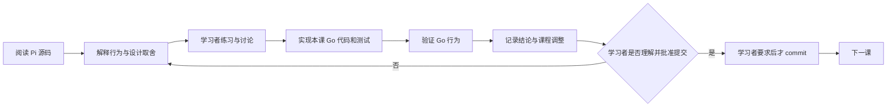

# Pi Core Go Port 课程

## 课程目标

通过阅读冻结的 Pi 实现并逐课完成 Go 语义移植，最终得到一个可运行、可测试、能在单一目录中完成固定真实 coding 任务的最小 headless Agent Runtime。课程不复刻 TypeScript 文件结构，而是理解、选择并验证 Pi coding loop 的可观察行为。

固定参考基线：

- Pi commit：`dcfe36c79702ec240b146c45f167ab75ecddd205`
- Pi agent package version：`0.80.7`
- Go module language version：`1.26.0`
- 首个真实模型提供方：DeepSeek

如果上游 Pi 或 DeepSeek 在课程期间变化，先记录差异，再决定是否更新基线。已经通过的课程不会静默跟随上游漂移。

当前权威顺序是：

1. [完整实施计划](../plans/2026-07-15-001-pi-core-go-learning-port-plan.md)中的 Product Contract 与 Planning Contract；
2. [课程与架构决策](decisions.md)；
3. 本课程总纲和单课文档；
4. 冻结 Pi 源码、文档与测试。

出现冲突时先修正文档，不让实现静默选择一套语义。

## 第一期边界

第一阶段只证明最短 coding 闭环：

```text
task + system prompt + transcript + tool schemas + workspace context
  -> DeepSeek response
  -> read/write/edit/bash tool stages
  -> ordered tool results appended to transcript
  -> next model turn
  -> assistant response without tool calls
  -> loop terminal result
  -> independent fixture acceptance
```

核心术语：

- `Agent Runtime`：当前课程的本地核心，拥有同一对话的完整有序内存 transcript，并负责 Provider 调用、工具循环、事件和取消。
- `Run`：一次任务 prompt 启动的完整循环，可以包含多个模型 Turn；课程使用 `run_start/run_end`，引用 Pi 源码时保留 `agent_start/agent_end`。
- `Turn`：一次 assistant response，以及它触发的 tool calls 和 tool results。
- `Tool stage`：同一 assistant message 中的一个执行阶段。连续 parallel-safe calls 构成并行阶段，其他调用分别构成串行屏障。
- `Headless`：没有 TUI 或网页界面。第一阶段还进一步限定为单目录、单 active Run 和单进程内存上下文，但这些不是“headless”一词本身的定义。
- `Agent Manager`：后续可能负责用户、仓库、Session、并发、worktree 和 IM 路由的服务；不属于第一阶段 Runtime。

第一阶段不实现 Goal Runtime、Session 创建/持久化/恢复、自动 compaction、steering/follow-up、完整 subscription 生命周期、权限审批、公共 SDK、gRPC、IM、多用户、多仓库、worktree、GitHub 管理或自动 Pi 对比。这里推迟的是 Session 基础设施；Agent 在当前进程内保留完整 transcript 属于核心语义。

## 每课工作方式

每一课按下面的闭环推进：



第 00 课是基线例外：只建立 `go.mod`、课程文档和验证证据，不创建占位 Runtime package。

执行规则：

1. 课程文档、代码、测试、讨论结论和进度都保存在本仓库。
2. 每课先解释该模块在 Pi 中解决的问题，再写 Go 代码。
3. 实现课程覆盖适用的正常路径、错误路径、取消和并发行为；能用 Faux Provider 确定性验证的语义不调用真实模型。
4. 讨论改变范围、接口、顺序或验收时，先更新本总纲、单课文档、决策记录或实施计划。
5. 每课完成后停在“待理解确认”或“待提交”；只有学习者明确要求时才创建 commit。
6. 一个 commit 只收录已确认课程或学习者明确要求的计划调整，不夹带下一课或无关修改。
7. 讨论或确认课程设计不等于开始课程；只有学习者明确说“开始第 NN 课”后，该课才进入“学习中”。
8. 导师必须持续质疑学习者提出的设计，也要复查自己先前给出的判断；以冻结 Pi 的源码、文档、测试和可复现实验为证据，不以双方同意代替验证。
9. 讨论中明确区分“学习者假设”“已验证的 Pi 契约”“候选 Go 机制”和“已确定的 pi-go 决策”。证据推翻旧结论时，先明确纠正并更新记录，再进入实现。
10. 每个新概念必须先讲解术语、Pi 源码路径和至少一个具体例子，再进行理解检查。
11. 课程默认采用循序渐进、讲解优先的方式；练习只用于检查关键理解，不用连续出题代替讲解。
12. 开始实现后，讲解必须跟随实际 Go 代码和测试展开；遇到不确定或困难的设计点，先共同检查证据和取舍，确认理解后再继续。
13. 课程直接在对话中讲解，仓库只保存必要的课程记录、代码和测试；除非学习者明确要求，不生成独立 HTML 讲义。
14. 讲解聚焦关键语义、源码证据和未决设计，不重复已经确认的概念；加快课程进度不能弱化最终实现，代码和测试仍覆盖完整设计中的错误、取消、并发、所有权与顺序契约。

## 进度状态

- `待开始`：只有课程设计，尚未共同学习。
- `学习中`：正在阅读、练习或讨论。
- `实现中`：课程结论已足够明确，正在写 Go 代码和测试。
- `待理解确认`：代码与验证完成，等待学习者确认理解。
- `待提交`：学习者已确认理解，尚未明确要求 commit。
- `已提交`：学习者明确要求后完成了该课提交。

## 第一期课程地图

| 课次 | 主题 | 核心产物 | 状态 |
|---|---|---|---|
| 00 | 学习契约与冻结基线 | `go.mod`、仓库约束和上游源码基线 | 已提交 |
| 01 | AI 协议与 Faux Provider | 消息、内容块、stream、Provider 接口和脚本 Provider | 已提交 |
| 02 | 单次 Provider Turn 与 transcript | 一次模型流、assistant message、request context 和 Run 终态 | 已提交 |
| 03 | 多轮 Tool Loop 与屏障式调度 | schema、参数校验、tool results、错误继续、只读并行和串行屏障 | 已提交 |
| 04 | DeepSeek Provider | OpenAI-compatible 消息转换、SSE、reasoning、tool calls、usage 和错误映射 | 待理解确认 |
| 05 | Coding Tools | `read`、`write`、`edit`、`bash`、workspace 边界和进程取消 | 待开始 |
| 06 | Headless coding task | 本地入口和固定 Go bug-fix 验收 | 待开始 |

原计划中的 Agent 生命周期、subscription、steering/follow-up、Goal Runtime 和 Session 课程保留为二期候选，不占用第一期课次。第 00 课已经讨论过的 lifecycle/listener 内容仍是学习记录，不等于第一期必须实现。

## 课程记录约定

每课文档至少维护：

- 学习目标和前置知识；
- Pi 源码阅读路径；
- 要掌握的行为契约；
- 讨论题和学习者结论；
- Go 实现范围与明确非目标；
- Pi 源码证据和 pi-go 测试场景；
- 本课产生或修改的文件；
- 未解决问题和对后续课程的影响；
- 当前状态与提交信息。

长期有效的架构选择写入 `docs/course/decisions.md`。只影响一课的推导、问题和练习答案保留在对应课文档中。

## 第一期代码边界

```text
pi-go/
├── cmd/pi-go/                 # 本地运行与固定验收入口
├── internal/
│   ├── ai/                    # 消息、ai.Provider、stream 和通用模型协议
│   │   └── provider/          # 具体 Provider 实现的归类目录，不是 registry
│   │       ├── faux/          # 确定性脚本 Provider
│   │       ├── openaicompatible/ # Chat Completions 线协议
│   │       └── deepseek/      # DeepSeek 配置和兼容 profile
│   ├── agent/                 # 通用模型与工具循环
│   └── coding/                # prompt、workspace、Runtime 装配和 coding tools
├── testdata/                  # Provider fixtures 和固定 coding acceptance fixture
├── docs/
│   ├── course/                # 课程、讨论与决策
│   └── plans/                 # 当前实施计划
└── go.mod
```

`internal/` 是当前的有意选择：接口会随学习不断校正。`cmd/pi-go` 只接受工作目录和任务 prompt，用于本地运行与验收，不承诺稳定外部协议。等核心语义稳定并出现真实调用方后，再决定公共 Go SDK、gRPC 或 Agent Manager。

冻结 Pi commit 和 package version 只保存在课程文档，不进入 Runtime package。Pi 与 pi-go 的效果比较由学习者在仓库外手动执行，不在本项目创建 benchmark、eval 或比较协议。
