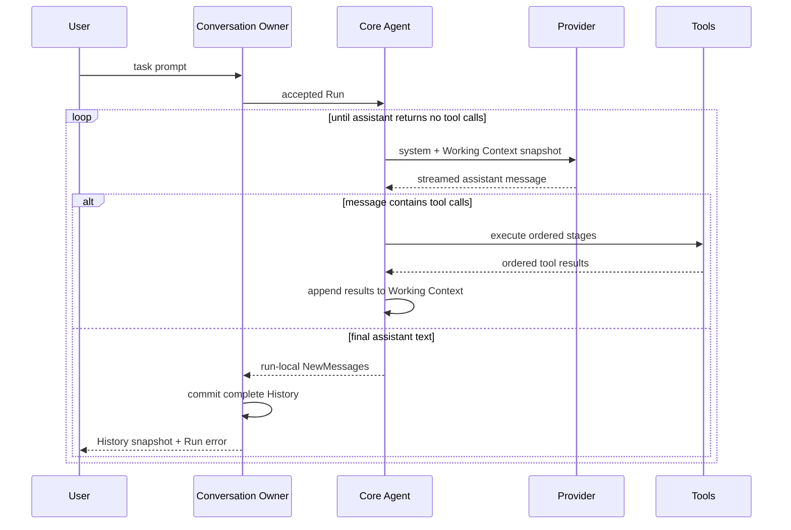
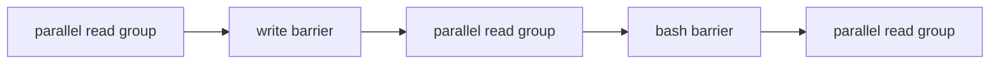

# Pi Core Go Learning Port - Plan

## Goal Capsule

在 `pi-go` 中以课程驱动完成 Pi 核心 coding loop 的 Go 语义移植，最终让一个 DeepSeek-first、无 TUI 的本地 headless agent 在指定目录中独立完成一个固定的小型 bug-fix 任务。

第一阶段只证明最短闭环：模型接收基础上下文，产生文本或工具调用，Runtime 安全调度 `read`、`write`、`edit`、`bash`，把结果加入 transcript 并继续调用模型，直到模型停止调用工具。课程不以复制 TypeScript 文件结构为目标，也不在第一阶段解决 Session、Goal Runtime、权限审批、IM 或多仓库管理。

本计划继续作为第一阶段基础契约。自 2026-07-19 起，Lesson 06 的命令、prompt、输出、trace 和真实验收行为以 `docs/plans/2026-07-19-001-feature-pia-one-shot-coding-agent-plan.md` 为权威；本文件中与它冲突的早期 `cmd/pi-go`、实时事件、启动 warning、tracked fixture/harness 和 acceptance deadline 设定均已被取代。Lesson 07 又以 `docs/course/decisions.md` 的 D46–D51 修正了内部消息所有权：coding-owned Conversation Owner 保存完整 History，Core Agent 保存可替换 Working Context并返回 run-local `NewMessages`；本计划中描述“Agent 返回或拥有完整 transcript”的旧里程碑文字只保留为形成过程，不再是当前 API 契约。其余权威顺序为：本计划的 Product Contract 与 Planning Contract → `docs/course/decisions.md` 的当前决定 → 当前课程文档 → 冻结 Pi 源码与测试。`session-settled:` 只标记已经由学习者明确决定、未经重新讨论和确认不得改变的事项。出现冲突时先修正文档，不让实现静默选择一套语义。

执行采用交互式课程节奏。每课先讲解和讨论；涉及 Go 实现的课程再完成对应代码与测试。第 00 课是只建立 module、课程文档和验证证据的基线例外，不创建占位 Runtime package。学习者确认理解并明确要求后才能 commit。计划更新不等于自动开始下一课。

停止条件：DeepSeek 当前协议不能表达必需的流式 tool call；核心 loop 无法在 Faux Provider 下确定性验证；或者实现需要引入第一阶段明确排除的 Session、Goal Runtime 或外部服务协议。

---

## Product Contract

### Summary

本项目通过逐课阅读冻结的 Pi 源码、提炼可观察契约、实现 Go 版本并验证自身行为，构建一个能在单一工作目录中完成真实编程任务的最小 coding agent。仓库同时保存最终代码和形成设计的学习过程。

### Actors

- A1. 学习者：阅读、讨论、确认理解，并决定何时提交和进入下一课。
- A2. 本地操作者：在选定工作目录中提供一条 coding task prompt，读取最终结果，并独立检查本地验收项目。

### Requirements

**学习与可追溯性**

- R1. 每课必须在同一仓库交付课程内容和验证证据；涉及 Go 实现的课程还必须交付对应 Go 代码与测试。第 00 课是只建立 module 和课程契约的基线例外，不创建占位 Runtime package。
- R2. 每课只有在学习者确认理解后才能进入待提交状态，并且只有学习者明确要求时才 commit。
- R3. 会影响范围、接口、顺序或验收的讨论必须更新课程文档或决策记录。

**AI 与上下文**

- R4. Go Agent Loop 必须保留 Pi 的 user、assistant、tool call、tool result、stop reason 和多轮 transcript 核心语义。
- R5. 系统必须提供可脚本化 Faux Provider，使模型流、工具循环、错误和取消在无网络、无密钥的环境中确定性验证。
- R14. Coding Agent 的第一次 Run 把原始用户任务转换成 Conversation History 与 Core Agent Working Context 的首条 user message；同一 Conversation 的后续 Run 继续追加。每次 Provider 调用必须收到包含 workspace/cwd 说明的稳定 system prompt、截至当前的完整有序 Working Context snapshot 和当前 tool schemas，不增加独立 task 或 workspace context AI 协议字段。Lesson 07 不实现自动压缩、摘要、持久化恢复或跨 Session 上下文，因此当前 Working Context 与完整 History 内容相同但所有权独立。

**工具循环**

- R6. Tool Loop 必须覆盖工具查找、模型可见 schema、Go 侧参数校验、未知工具、非法参数、截断调用、执行错误和有序 tool results。
- R15. 工具调度必须把连续的只读并行安全调用组成并行阶段，把其他工具作为串行屏障，并按模型源顺序执行这些阶段。
- R16. 未知工具、参数错误、执行错误、单工具超时和非零 bash exit 必须形成 call-local error tool result 并继续同批后续阶段；单工具超时使用 child context，只有 Run context 取消才中止未开始的调用。

**Provider 与 coding 能力**

- R8. 第一个真实 Provider 必须支持 DeepSeek SSE、reasoning content、tool calls、usage 和错误映射；非本地 endpoint 默认要求 HTTPS。
- R9. coding runtime 必须提供 `read`、`write`、`edit`、`bash`；文件工具通过固定 workspace root 执行 root-relative I/O。bash 每次从固定 workspace 启动新 shell，继承完整父进程环境，不提供 sandbox 或交互 stdin/PTY，并支持可选无默认 timeout、取消时进程组 hard kill、正常退出保留后台进程、合并输出 tail 截断和完整临时文件。
- R10. 临时 `cmd/pia` 必须把启动时的当前目录作为唯一 workspace，接收一个原始位置参数作为任务，并在成功时只输出最终 assistant 文本；名称、参数和输出不构成公共 SDK 或稳定外部协议。
- R17. 第一阶段最终验收必须在被忽略的 `tmp/pia-acceptance/` 中使用一个能构建但 Fibonacci 实现错误、且没有测试的本地 baseline。每次从 untouched baseline 建立新副本并启动新进程，要求 Agent 修复实现、增加有意义的测试并验证；导师检查测试、程序输出和新增测试在原始错误实现上能够失败。连续两次成功后才通过，仓库不提交 fixture、prompt 或 harness。
- R18. 操作者文档必须明确工作目录内容和 tool results 会发送给 DeepSeek，并披露 Provider 生成的 bash 命令拥有启动用户的主机和网络权限。操作者自行选择可披露、可信的 workspace；Runtime 不显示启动 warning，也不实现确认、审批、secret detector 或 redactor。transcript 只驻留内存，可选调试 trace 由操作者显式启用。
- R19. Run 取消必须停止新的 Provider 调用和工具阶段，取消并等待所有已启动的 stream、工具以及仍在执行的 bash shell/原进程组收敛，然后返回明确的 canceled 非成功结果。正常完成的 bash call 可以按 R9 有意留下后台进程，不属于 Run cancellation 必须追溯清理的 active work。第一版不建立观察通道或自动执行预算。

### Key Flows

- F1. 课程闭环：选择当前课 → 阅读 Pi → 讲解与讨论 → 完成本课适用的 Go 实现和测试 → 验证 → 记录结论 → 理解确认 → 学习者要求 commit → 下一课。第 00 课按 R1 的基线例外执行。
- F2. coding task：把用户任务转换成首条 user message，组装包含 workspace/cwd 说明的 system prompt、Working Context snapshot 与 tool schemas → 调用模型 → 执行工具阶段 → 把 tool results 加入 Working Context → 再次调用模型 → 完整 assistant response 不含 tool calls 时结束 Run → Conversation Owner 提交 run-local delta 到完整 History → 外部验收测试独立判断代码结果。

### Acceptance Examples

- AE1. 当一课代码和测试已完成但学习者尚未要求提交时，仓库保留未提交修改，Runtime 不执行任何 Git 提交。
- AE2. 当同一只读阶段中的工具 A、B 按 B、A 的顺序实际完成时，transcript 中 tool results 仍必须保持 A、B 的模型源顺序。
- AE5. 当调用序列为 `read(a)`、`read(b)`、`write(c)`、`read(c)`、`read(d)` 时，两个 read 组分别并行，`write(c)` 作为屏障位于两组之间。
- AE6. 当并行 read 阶段中一个调用失败时，其他 read 仍完成，后续串行阶段继续执行；所有结果在下一轮一起交给模型。
- AE7. 当本地 Fibonacci baseline 初始实现错误且没有测试时，Agent 使用真实 DeepSeek 在 fresh 副本中修正实现并增加测试；`go test ./...` 通过、`go run .` 输出 `55`，新增测试复制到原始错误实现后至少一项失败。两个新进程连续完成该结果才通过；该验收不声称限制 unsandboxed bash 的主机级副作用。

### Success Criteria

- Faux Provider 下已移植的消息、流、工具、错误、取消和顺序契约都有确定性测试。
- 临时 `pia` 能在两个连续的 fresh Fibonacci workspace 上通过真实 DeepSeek 完成 read、edit 或 write、bash test 的多轮闭环。
- 并行只读阶段没有 data race；取消不会留下仍属于被取消调用原进程组的模型流、工具 goroutine 或 bash 进程。正常 bash exit 后有意保留的后台进程、以及自行创建新 session 而逃出原组的 daemon，遵循已记录的 Pi 语义而不是被描述为可完全回收。
- 正常命令只输出最终 assistant 文本；可选敏感 trace 和保留的本地 workspace 为失败诊断提供完整 transcript、tool calls/results 与顶层错误。
- 第一阶段代码中不存在 Goal Runtime、Session persistence、IM、RPC、公共 SDK、权限审批或 benchmark/eval 模块。

### Scope Boundaries

**第一阶段不做**

- TUI、主题、按键、命令提示和 slash command UI。
- 多 Provider 矩阵；真实 Provider 只实现 DeepSeek。
- Goal Runtime、结构化 plan/progress/replan/done/blocked 状态机；第一阶段由模型决定是否继续调用工具，由外部测试判断任务是否成功。
- Session 创建、持久化、恢复、自动 compaction、跨 Session 上下文和多 active run 管理；Coding Agent 当前进程内的完整 Conversation History 与 Core Agent Working Context 不属于该推迟范围。
- Steering、follow-up、continue、完整 listener subscription 生命周期和 Agent Manager。
- 公共 Go SDK、gRPC、IM 适配、多用户、多仓库、worktree 与 GitHub issue/PR 管理。
- 权限审批、trust/yolo 配置矩阵和真正 sandbox；本地命令以当前用户权限运行并完整继承父进程环境，文件工具路径边界、active call 取消和进入 transcript 前的输出限制仍是强制不变量。已经存在于父环境中的 Provider 凭据对 bash 可见，这不是 secret isolation。
- 通用 secret scanning 或 redaction。操作者必须只选择允许发送给 DeepSeek 的 workspace；final-only 输出减少终端重复复制，但不阻止模型看到 tool results，也不清理显式启用的敏感 trace。
- Windows bash 进程树管理；第一阶段只验证 macOS 和 Linux 的进程组取消与回收。
- Pi 与 pi-go 的自动 benchmark、eval package、进程比较协议或评分工具；本地验收项目也不进入 tracked tree。

**Deferred to Follow-Up Work**

- 原 U6 的完整 Agent 生命周期与订阅语义。
- 原 U7 的 steering、follow-up、continue 和 turn hooks。
- 原 U11 的 Goal Runtime。
- 原 U12 的 Session persistence 与恢复。
- Agent Manager、IM、worktree、多用户、SDK/RPC、GitHub 管理和更强权限策略。

### Dependencies

- 冻结 Pi 源码和测试：commit `dcfe36c79702ec240b146c45f167ab75ecddd205`，agent package version `0.80.7`。
- Go toolchain：`go.mod` 使用 Go `1.26.0`。
- DeepSeek OpenAI-compatible API；底层 Provider 保留显式配置，Lesson 06 产品 composition 固定 `deepseek-v4-pro`、thinking mode 和 high reasoning effort。

---

## Planning Contract

### Key Technical Decisions

- KTD1. 以可观察行为为移植边界，使用 Go 原生并发和取消机制，不复制 TypeScript API 形状。（session-settled: user-approved — chosen over line-by-line translation: 目标是掌握并验证 Pi 核心设计）
- KTD2. 当前代码放入 `internal/`，由临时 `cmd/pia` 提供本地 one-shot 运行和验收入口，不做 SDK-first，也不承诺命令名稳定。（session-settled: user-directed — chosen over SDK-first: 核心接口需要随课程校正）
- KTD3. 首个真实 Provider 只实现 DeepSeek，consumer-owned `ai.Provider` 接口保持在模型无关 `internal/ai`；具体实现归类到 `internal/ai/provider/`，其中 DeepSeek 薄层复用最小 OpenAI-compatible Chat Completions 线协议层。（session-settled: user-directed — chosen over a multi-provider matrix or Pi-style registry: 先验证核心 loop）
- KTD4. 不移植 TUI，只保留 Runtime 的本地 headless 运行和 Run settlement 后的最终 assistant 结果。（session-settled: user-directed — chosen over porting CLI/TUI behavior: UI 不决定 coding 目标能否完成）
- KTD5. Faux Provider 先于 DeepSeek，用脚本响应锁定模型流、工具循环和 transcript 语义。
- KTD6. 第一阶段不实现 Goal Runtime；通用 Agent Loop 只负责模型与工具循环，任务成功由外部验收判断。（session-settled: user-directed — chosen over building plan/replan/done state now: 当前只验证 coding loop 能否完成任务）
- KTD7. `internal/agent` 定义通用 Tool 契约，`internal/coding/tools` 提供文件和进程实现，避免核心层依赖 workspace。
- KTD8. 第一阶段没有审批或 trust 策略系统；`read`、`write`、`edit` 受 workspace root 限制，bash 只保证每次从 workspace 启动。Provider 生成的命令拥有启动用户的主机和网络权限。bash 沿用冻结 Pi 的完整父进程环境，已经存在于环境中的 Provider 凭据对命令可见；只存在于 Provider 内存配置中的凭据不被额外注入 argv、tool config、transcript、trace、日志或错误。（session-settled: user-directed — chosen over per-action approval and an environment allowlist: 本地 CLI 信任模型命令，并需要保留用户终端的 PATH、代理与工具链环境）
- KTD10. 每课是文档、代码、测试和讨论记录的共同边界，只有学习者明确要求后才 commit。（session-settled: user-directed — chosen over automatic course commits: 学习者需要理解和调整节奏）
- KTD12. 第一轮课程冻结 Pi commit 和 package version；上游升级通过显式决策处理，不静默改变基线。
- KTD13. Provider 对 Agent 暴露可取消的 pull/receive stream。Lesson 06 的 one-shot CLI 只投影 Run 结束后的最终 assistant 文本；bash 增量 pipe drain、tail accumulator 和完整临时文件只负责进程正确性与有界模型结果。Agent event sink 和实时展示推迟到未来交互式消费者。（session-settled: user-directed — chosen over adding a speculative Tool progress callback now: 第一版没有需要过程事件的消费者）
- KTD14. Tool 对模型暴露 JSON Schema，并用自身的 Go 解码与校验逻辑保护执行；初始版本不实现通用 JSON Schema evaluator。
- KTD16. 第一阶段 bash 进程树管理只支持 macOS 和 Linux；Windows 的进程模型与取消语义延后单独设计。
- KTD17. Headless Agent Runtime 与未来 Agent Manager 分层；第一阶段只有单目录、单 active Run 的本地 Runtime。（session-settled: user-approved — chosen over building multi-tenant orchestration into the loop: 先掌握和验证 Agent 核心）
- KTD18. Coding-owned Conversation Owner 保存同一 Conversation 的完整有序内存 History，Core Agent 保存可替换 Working Context；顺序 Run 的新 user input 同时进入本次 delta 和 Working Context，settlement 后 delta 提交 History。当前不做 Session 持久化、恢复或自动上下文整理。（supersedes the original single-Agent transcript owner in Lesson 07: 完整事实与模型工作视图需要在 compaction 前先分离所有权）
- KTD19. 工具调度使用屏障式分段：连续 `CanRunParallel` 调用并行，其他调用逐个成为串行屏障，阶段之间保持模型源顺序。（session-settled: user-approved — chosen over Pi default whole-batch parallel and whole-batch sequential fallback: 保留只读并行，同时避免 read/write/bash 竞态）
- KTD20. `CanRunParallel` 是工具显式声明且默认 false；第一阶段只有 `read` 为 true，`write`、`edit`、`bash` 和未知工具均为 false。
- KTD21. 普通工具错误不触发 fail-fast；结果作为模型观察继续同批后续阶段，只有 Run context 取消才停止。（session-settled: user-directed — chosen over skipping the remaining batch after any error: 避免调度器猜测依赖并保持 Pi 的恢复方式）
- KTD22. Fibonacci baseline、运行副本、task 和 trace 只保存在被忽略的 `tmp/`，项目不提交 fixture/harness，也不实现 Pi 比较或评分模块。（session-settled: user-directed — chosen over an in-repo eval module: 当前只需要专家迭代首个真实闭环）
- KTD23. 四个 coding tools 操作同一个 Run-pinned workspace；工具只返回原子能力的模型可用结果，不增加 `run_tests` 等 workflow tool。后一个阶段可以观察前一个阶段已完成的文件副作用。
- KTD24. 完整接收且不含 tool calls 的 assistant response 即正常 loop completion，即使文本为空；provider/stream failure 与 Run cancellation 是不同非成功终态。第一版没有自动 wall-clock 或 model-turn budget；CLI 在 nil Run error 后投影最终文本，本地专家验收独立判断 coding task 是否成功。
- KTD25. Run cancellation 停止新工作，取消所有已启动 child contexts，等待 stream、tool workers 和仍在执行的 bash shell/原进程组收敛后返回 canceled result；正常完成的 bash call 按 KTD35 可以有意留下后台进程，不追溯为 active work。工具阶段 terminal assistant 中的每个 tool call 都按模型源顺序得到一个 settlement result：已完成调用保留实际结果，执行中调用记录 canceled，未启动调用明确记录因 Run 取消而未执行；若 Provider aborted/error terminal 自身保留了已完成组装、尚未进入工具阶段的 calls，它们全部不执行并得到同 ID not-executed results。未启动调用绝不产生工具副作用。这样取消后的 Working Context 与已提交 Conversation History 都可直接用于下一次 Run，不依赖 Provider request 阶段临时修复 orphaned tool calls；未来交互式消费者真正引入 event sink 时，再定义 observer settlement。（session-settled: user-approved — intentional divergence from Pi request-time synthetic `No result provided`: 权威状态显式保存完整配对关系）
- KTD26. Go `os.Root` 是第一阶段文件工具的 workspace boundary primitive；workspace 在 Run 开始时打开，read/create/overwrite/edit/replace 都通过 root-relative 方法完成，不使用易受 symlink TOCTOU 影响的“检查绝对路径后再普通 open”。
- KTD27. 发送给模型的 transcript 只驻留内存；read 和 bash 在内容进入 transcript 或 Provider request 前完成大小限制。bash 超限时沿用 Pi，把完整 raw output 写入无大小上限且不会自动删除的系统临时文件并返回路径；这个恢复文件和可选 `PIA_TRACE_PATH` 都不提供 secret redaction。（session-settled: user-directed — chosen over discarding earlier output or adding a new file cap: 保留 Pi 的完整输出恢复能力并接受磁盘增长与残留风险）
- KTD28. `Agent.Run(ctx, userInput)` 返回 ownership-independent run-local `NewMessages` 与 Go error，不增加重复 Run outcome；正常完成返回 nil error，Provider/stream failure 返回非 nil error，取消保留 context cause。Conversation Owner 无论 accepted Run 的 error 是否为 nil，都先提交 delta，再由 Coding Agent 返回完整 `RunResult.Transcript` snapshot。
- KTD29. Core Agent 把每条 accepted user、terminal assistant 和 tool result 追加到 Working Context；Conversation Owner 按 Run settlement 把相同 delta 追加到完整 History。后续 Provider call 发送当前 Working Context。新对话通过新的 Conversation Owner 和 Core Agent 开始；两层 owner 都拒绝并发 Run，外层 guard 覆盖 History commit。
- KTD30. Provider terminal message、Provider Request、Core `RunResult.NewMessages`、Working Context replacement 输入和 Coding `RunResult.Transcript` 在真实所有权边界深复制；Conversation Owner 接管已经独立的 delta 时不重复 clone。调用方和 Provider 不能通过嵌套 content slice、tool-call arguments 或 tool schema JSON 反向修改任何 owner state；clone 规则由 `internal/ai` 统一拥有。
- KTD31. Core Agent 与 Conversation Owner 都在自己的锁内先拒绝 active Run，再检查 context；预取消在 acceptance point 前不修改 Working Context 或 History、不调用 Provider、不产生 aborted assistant。越过该点后到 terminal settlement 前的取消保留 user 并只产生一条 aborted assistant，Conversation Owner 提交该失败 delta。assistant exactly-once 只约束 assistant 数量；若该 terminal 含已完成 tool calls，KTD25 允许其后追加非执行型 settlement results。`ReplaceWorkingContext` 只在 Core Agent idle 时深复制并原子替换。
- KTD32. 每次 Provider call 的 stream consumer 在所有退出路径只返回 `(terminal AssistantMessage, error)`；Turn/Run coordinator 在该次调用的唯一位置深复制并追加该消息。第一条有效 terminal event 是该 Turn 的 settlement point，之后的取消不追溯这条 assistant；同一次 `Receive()` 同返有效 terminal event 与 error 时 terminal 优先。terminal 前 raw stream failure 依据 context cause 合成 aborted 或 error assistant，nil stream 合成协议错误 assistant；Agent 等待绑定 context 的 `Receive()` 真正收敛而不遗留竞争 goroutine。第 02 课一个 Run 只有一个 Turn，第 03 课多 Turn Run 对每次 Provider call 重复同一规则；assistant 写入点唯一不排斥协调层随后追加 tool-result settlement。
- KTD33. Agent Runtime 对每个 tool call 只执行一次，不在通用 Tool Loop 自动重试；失败形成 tool result，由模型决定是否发起新调用。未来只有能够明确分类瞬时错误的具体 I/O 后端，才可在单次 `Execute` 内实现有界、可取消的内部重试。
- KTD34. Tool-call terminal 先校验可配对 identity，再按 reason/content 分类：空或重复 call ID、`toolUse` 却无 call 是 Provider protocol error；`stop + calls` 执行，`length + calls` 全部不执行并返回 truncation results；ID 有效时的空/未知 tool name、非法/不合语义的 arguments 和 execute failure 是 call-local errors；Provider error/aborted terminal 中的 calls 全部不执行，只追加 not-executed settlement results。（session-settled: user-approved — extends assistant exactly-once with explicit tool-result closure: 不修改或重复 terminal assistant，也不让失败 Turn 的 calls 产生副作用）
- KTD35. bash 沿用冻结 Pi 的本地 CLI 核心语义：直接执行、完整父环境、每次新建无 stdin/PTY shell、可选无默认 timeout、正常 exit 不清理后台进程、取消/超时以 `SIGKILL` 终止原进程组、stdout/stderr 合并增量 drain、最后 2000 行或 50 KiB 进入模型、完整 output 写入无上限临时文件，非零 exit 形成 call-local error。第一期支持可选 shell path 和 `/bin/bash -> PATH bash -> sh` fallback，不移植 remote operations、command prefix、spawn hook、TUI 或 Windows transport。（session-settled: user-directed — chosen over the plan's earlier minimum-environment and all-descendants-cleanup proposal: 学习者要求以冻结 Pi 的实际行为塑造本地 coding-agent CLI）

### High-Level Technical Design

第一阶段 Go import 依赖保持单向，composition root 负责装配具体 Provider 和 tools：


一次 Run 的核心序列为：



工具批次通过一次线性扫描分段：



并行阶段为每个 source index 预留 result slot。worker 完成后写入自己的 slot；阶段结束后再按 source index 把 tool results 加入 Working Context 和最终 run-local delta。串行屏障完成后才开始下一阶段。第一阶段不为这个内部完成顺序建立外部 event sink。

### Pi Baseline and Intentional Divergence

冻结 Pi 的 agent-core 默认整批并行；全局 `sequential` 或批内任一 sequential tool 会让整批串行。coding-agent 的 `write` 和 `edit` 另用同文件 mutation queue 降低覆盖风险，但 `read` 和 `bash` 不受该队列保护。

pi-go 第一阶段有意不复制这一并发策略。它采用更保守的屏障式分段，换取简单、可解释的读写顺序；这项差异必须由测试和课程文档明确记录，不能被描述成 Pi 的原始行为。

### Course Sequencing

| 课次 | 实现单元 | 主题 | 主要结果 |
|---|---|---|---|
| 00 | U1 | 学习契约与冻结基线 | 最小 Go module 和学习门禁 |
| 01 | U2 | AI 协议与 Faux Provider | 模型无关消息、stream 和脚本 Provider |
| 02 | U3 | 单次 Provider Turn 与 transcript | 一次模型流、assistant message 和 Run 终态 |
| 03 | U4、U5 | 多轮 Tool Loop 与屏障式调度 | tool-result 驱动下一轮、只读并行和串行屏障 |
| 04 | U8 | DeepSeek Provider | SSE、reasoning 和 tool-call streaming |
| 05 | U9 | Coding Tools | read、write、edit、bash 和 workspace 边界 |
| 06 | U10 | Headless coding task | 临时 `pia`、稳定 coding prompt、final-only 输出和本地 Fibonacci 验收 |

课次是学习边界，U-ID 是计划追踪边界；一课可以包含两个紧密依赖的实现单元。原 U6、U7、U11、U12 保留其历史含义，但移出第一阶段。

### Risks and Mitigations

- DeepSeek 模型或 SSE 协议漂移：Provider 层保持显式配置，Lesson 06 composition 固定已核验的 `deepseek-v4-pro`、thinking/high profile；离线协议测试与真实验收分开。
- 模型把有依赖的工具放进同一 assistant message：调度器只保证执行顺序，不制造新的 LLM 推理步骤；需要读取结果后再决定的操作必须进入下一轮模型调用。
- `CanRunParallel` 被错误标记：默认 false，只有能证明无副作用的工具才显式开启，并用 race test 与阶段顺序测试锁定。
- bash 逃逸 workspace：第一阶段明确不提供 sandbox；产品命令继承完整父环境，Provider 生成的命令拥有启动用户的主机和网络权限。本地验收只检查所选 workspace 的结果，不把 cwd 或 diff 描述为主机隔离。
- workspace symlink race：文件工具固定 `os.Root` 并只使用 root-relative I/O；测试用 outside canary 验证 ancestor、final 和替换竞态不能越界。
- 数据发送与日志泄漏：操作者只选择 disclosure-safe workspace；工具在进入 transcript 前限制输出，正常 CLI 只投影 final。显式启用的 trace 和 bash 完整输出文件可能保存敏感数据，且没有通用 redaction。
- bash 后台进程与输出：每次调用拥有独立进程组；超时和取消 hard-kill 原组并回收 shell，正常 exit 则允许后台进程继续。后台失败、文件竞态、端口占用、daemon 逃组、持续持有 pipe 和完整临时文件无上限增长属于已接受的 Pi corner cases；测试分别锁定 quiet/active descendant、取消与 timeout，而不是声称能清理所有 OS descendants。
- 真实模型行为不确定：Faux Provider 证明 Runtime 契约；同一 untouched Fibonacci baseline 的两个连续 fresh 真实运行证明首个端到端能力。任何产品代码、prompt 或 task 调整都会重置连续成功计数。

---

## Implementation Units

### U1. Establish Learning Contract and Frozen Baseline

- **Goal:** 建立最小 Go module、冻结 Pi 基线，并定义课程学习与提交门禁。
- **Requirements:** R1-R3；KTD1、KTD10、KTD12。
- **Dependencies:** 无。
- **Files:** `AGENTS.md`、`README.md`、`go.mod`、`docs/course/README.md`、`docs/course/decisions.md`、`docs/course/lessons/00-learning-contract-and-baseline.md`。
- **Approach:** 冻结信息只进入课程文档，不创建课程专用 Runtime package。
- **Test scenarios:** `go list -m` 返回预期 module；所有基线文档引用同一 Pi commit 和 package version。
- **Verification:** module 边界成立，仓库没有占位 Go package 或公共 SDK。

### U2. Define AI Protocol and Faux Provider

- **Goal:** 建立模型无关消息、内容块、usage、stop reason、流事件和可脚本 Provider。
- **Requirements:** R4、R5、R14；KTD3、KTD5、KTD13。
- **Dependencies:** U1。
- **Files:** `internal/ai/message.go`、`internal/ai/model.go`、`internal/ai/provider.go`、`internal/ai/stream.go`、`internal/ai/provider/faux/provider.go`、`internal/ai/provider/faux/provider_test.go`、`docs/course/lessons/01-ai-protocol-and-faux-provider.md`。
- **Approach:** 从 Pi `packages/ai/src/types.ts` 和 stream contract 提取通用类型；Faux Provider 使用脚本事件，不加入 DeepSeek 专用字段。根 README、课程总纲和决策记录已在开课前对齐本计划，不把文档清理混入第 01 课实现。
- **Execution note:** 先用测试定义事件流和取消语义，再实现 Faux Provider。
- **Test scenarios:** 文本增量、reasoning 增量、tool-call argument 分片、正常结束、provider error、context cancel、脚本耗尽和重复读取结束状态。
- **Verification:** 测试不访问网络，脚本输入产生稳定、可比较的事件序列。

### U3. Implement One Provider Turn and Agent Transcript Assembly

- **Goal:** 完成 user message → provider stream → assistant message → Agent transcript 的一次 Provider turn，证明顺序 Run 保留完整历史，并建立明确的正常、失败和取消终态。
- **Requirements:** R4、R5、R14、R19；F2；KTD6、KTD18、KTD24、KTD25、KTD28、KTD29、KTD30、KTD31、KTD32。
- **Dependencies:** U2。
- **Files:** `internal/ai/clone.go`、`internal/ai/clone_test.go`、`internal/ai/provider/faux/provider.go`、`internal/agent/loop.go`、`internal/agent/types.go`、`internal/agent/loop_test.go`、`docs/course/lessons/02-agent-loop-and-transcript.md`。
- **Historical approach, superseded by Lesson 07 ownership only:** 本单元最初实现有状态 Agent 与无工具的一次 Provider turn；`Agent.Run()` 在同一个锁内拒绝 active Run、检查预取消 context，并以设置 active 加追加新 user input 作为 acceptance point。当时每次 Provider 请求包含截至当前的完整 transcript，`RunResult.Transcript` 返回同一 Agent 的完整 snapshot。该形状已由 D46–D51 替换，正常/失败/取消 settlement 语义仍保留。
- **Current contract:** Core Agent 保存 Working Context、发送其 request snapshot 并返回 run-local `NewMessages`；coding-owned Conversation Owner 提交完整 History 并返回 Coding `RunResult.Transcript`。Provider terminal、request、delta 和 History snapshot 在各自所有权边界深复制。不加入 Agent event sink、运行过程展示、Session 持久化、steering、follow-up 或 compaction。
- **Execution note:** Lesson 02 先锁定单 owner 的顺序和 settlement；Lesson 07 根据冻结 Pi 的 compaction/context 证据拆分 owner，但没有改变 Provider Turn 的终态契约。
- **Test scenarios:** 单轮文本、空文本正常结束、reasoning 与 text 混合、同一 Agent 两次顺序 Run 的第二次 request 包含 `[user1, assistant1, user2]`、并发 Run 拒绝、预取消不修改 transcript 且不调用 Provider、acceptance point 后取消保留 user 和唯一 aborted assistant、完整 Provider request 字段、provider error、stream cancel、Run cancel 等待已启动 stream 收敛、明确的 canceled result，以及修改 Provider Request、Provider terminal message 或 RunResult 的嵌套 slice/JSON bytes 都不能反向修改 Agent transcript。这里的“唯一”只计 assistant；第 03 课负责失败 terminal 中 tool calls 的 result closure。
- **Verification:** 每条退出路径产生一致的 assistant message 和明确 Run 结果；取消只在已启动 stream settlement 后返回且没有遗留 goroutine。

### U4. Implement Tool Contract and Error Semantics

- **Goal:** 让 Agent 校验和执行工具，把结果加入 transcript，并由 tool results 驱动下一轮 Provider 调用。
- **Requirements:** R4、R6、R16；F2；KTD7、KTD14、KTD21、KTD34。
- **Dependencies:** U3。
- **Files:** `internal/agent/tool.go`、`internal/agent/validation.go`、`internal/agent/loop.go`、`internal/agent/loop_test.go`、`docs/course/lessons/03-tool-loop-and-staged-scheduling.md`。
- **Approach:** Tool 同时提供模型可见 schema 和 Go 参数解码校验；未知工具、非法参数、execute error、单工具 timeout 和非零 bash exit 都形成 call-local error tool result。单工具 timeout 使用 Run context 的 child context；模型因长度截断的 tool calls 全部失败且不执行。Provider error/aborted terminal 中已完成的 calls 也不执行，但必须追加同 ID not-executed results，保持完整 transcript 可直接继续。
- **Execution note:** 从顺序执行写出失败测试，先证明 tool result 能驱动下一轮，再接入并行阶段。
- **Test scenarios:** 成功调用、未知工具、非法 JSON、参数语义错误、execute error、单工具 timeout 不取消 Run、截断消息不执行、普通错误后同批后续调用继续、`toolUse` 无 call、空/重复 call ID、`stop + calls`、Provider error/aborted calls 不执行但显式闭合、失败 Turn 后同一 Agent 继续 Run、下一轮 Provider 收到以同一原始 user message 开始的完整有序 transcript、未变化的 tool schemas 和包含同一 workspace/cwd 说明的 system prompt、模型从 edit failure 恢复。
- **Verification:** 非取消批次中的每个 tool call 都得到同 ID 的 tool result；普通错误不崩溃、不产生 terminal Run reason，也不阻止下一轮模型恢复。

### U5. Implement Barrier-Based Staged Scheduling

- **Goal:** 在保持源顺序和安全屏障的前提下并行执行连续只读工具。
- **Requirements:** R15、R16、R19；AE2、AE5、AE6；KTD19-KTD21、KTD25。
- **Dependencies:** U4。
- **Files:** `internal/agent/tool.go`、`internal/agent/loop.go`、`internal/agent/loop_test.go`、`docs/course/lessons/03-tool-loop-and-staged-scheduling.md`。
- **Approach:** Tool 通过默认 false 的能力标记声明是否可并行；一次线性扫描把连续 parallel-safe calls 组成阶段，非并行工具各自成为屏障。并行 worker 只提交 outcome；result slots 保持 transcript 源顺序。观察事件和 sink 等本地入口出现展示需求时再接入。
- **Execution note:** 先用受控阻塞工具证明并发度、完成顺序和 transcript 顺序，再实现调度扫描。
- **Test scenarios:** 全 read 并行、read-read-write-read-read 分成三个阶段、连续 write/edit/bash 严格串行、B 先完成但 transcript 保持 A/B、并行 read 单个失败或 child timeout 后其余完成且下一阶段继续；Run cancel 停止启动后续阶段、取消并等待已启动 workers，为 completed/canceled/not-executed 调用按源顺序追加同 ID settlement results；取消后同一 Agent 的下一次 Run 直接发送完整配对历史，不依赖 Provider 层 orphan repair。
- **Verification:** `go test -race ./...` 通过；transcript 源顺序和 cancellation settlement 分别满足测试契约。

### U8. Implement OpenAI-Compatible DeepSeek Provider

- **Goal:** 参考冻结 Pi 的 Provider/API 分层，把 OpenAI-compatible Chat Completions 消息和 SSE 映射到通用 AI stream，再用薄 DeepSeek 配置层提供认证、endpoint 与兼容语义。
- **Requirements:** R8；KTD3、KTD13。
- **Dependencies:** U2。课程顺序位于 U3-U5 之后，但 Provider package 不导入 Agent。
- **Files:** `internal/ai/provider/openaicompatible/request.go`、`internal/ai/provider/openaicompatible/provider.go`、`internal/ai/provider/openaicompatible/stream.go` 及其离线测试，`internal/ai/provider/deepseek/provider.go`、`provider_test.go`、`provider_integration_test.go`，以及 `docs/course/lessons/04-deepseek-provider.md`。
- **Approach:** 只抽取当前 DeepSeek 真正使用的 OpenAI-compatible Chat Completions 线协议，不移植 Pi 的 Provider registry、模型目录、动态刷新、认证存储或多 API dispatch。使用标准库 `net/http` 和可注入 client/transport，显式控制 SSE、取消、错误上限且不实现 Provider-level retry；redirect 继续服从注入 client 的标准策略。DeepSeek 层冻结兼容 profile 并校验 endpoint/认证，模型 ID 和 endpoint 来自运行配置。先用本地 SSE fixture 验证协议，再提供显式 opt-in 的真实 smoke test。
- **Test scenarios:** 文本、reasoning、分片 tool arguments、多 tool calls、usage、HTTP error、malformed SSE、context cancel、远程明文 endpoint 被拒绝、本地测试 endpoint 显式放行；assistant tool calls 后跟显式 completed/canceled/not-executed tool results 和新 user message 时能够直接序列化，不静默插入或删除历史消息。
- **Verification:** 离线 fixture 全通过；有凭据时 smoke test 完成文本和 tool-call 响应，并额外验证一份取消后已显式闭合 tool calls 的历史能够继续请求 DeepSeek，日志和事件不包含 API key。
- **Execution note:** OpenAI-compatible 与薄 DeepSeek 层已完成并提交；离线测试覆盖完整历史转换、pull SSE、reasoning、交错多 tool calls、usage-after-finish、双 terminal、错误/取消 settlement、大小上限、凭据 redaction 和 endpoint policy。3xx 不做特殊处理，其真实影响留待后续有证据时独立验证。真实测试使用 `integration` build tag 与独立环境开关，未 opt-in 时不读取 key 或联网。

### U9. Implement Coding Tools and Workspace Boundary

- **Goal:** 提供能修改真实临时仓库并运行验证的 `read`、`write`、`edit`、`bash`。
- **Requirements:** R9、R15、R16、R18、R19；KTD7、KTD8、KTD16、KTD20、KTD23、KTD25-KTD27、KTD35。
- **Dependencies:** U4、U5。
- **Files:** `internal/coding/workspace.go`、`internal/coding/tools/read/`、`internal/coding/tools/write/`、`internal/coding/tools/edit/`、`internal/coding/tools/bash/`、`internal/coding/tools/toolargs/`、`internal/coding/tools/fileutil/`、`docs/course/lessons/05-coding-tools.md`。
- **Approach:** Run 开始时用 `os.Root` 固定 canonical workspace，文件工具只使用 root-relative I/O 并拒绝非 regular-file 目标；每个模型工具使用独立子 package，只有已经证明跨工具复用的能力进入 coding-owned `tools/toolargs` 或 `tools/fileutil`，不提前上移 Agent 层，也不创建尚未实现的空 package。write 和 edit 通过 workspace 内临时文件与替换提交结果；edit 保留冻结 Pi 的非空 `edits[]` 模型协议，所有 `oldText` 都在同一原文件上精确匹配且必须唯一、互不重叠，整组验证后一次提交。冻结 Pi 的 fuzzy normalization 涉及错误匹配风险、offset 映射与大量组合测试，第一期明确不实现，待真实需求出现后作为独立工作评估。bash 按 KTD35 从 workspace 启动新 shell，继承完整父环境，以独立进程组处理 timeout/cancel，正常 exit 保留后台进程，并在运行期间合并 drain stdout/stderr 到有界 tail 与完整临时文件；第一阶段只支持 macOS 和 Linux。read 标记为 parallel-safe，其他三个工具保持默认 false。
- **Execution note:** U9 四个工具已完成本地实现与测试；bash 使用临时 workspace 验证完整父环境、fresh shell、child/grandchild 进程组取消、正常退出后台存活、idle-drain、tail/完整临时文件，以及与 read/edit 的跨工具可见性。Lesson 06 已确认不消费实时 output；event presentation 继续推迟到未来交互式 UI。
- **Test scenarios:** read 成功与不存在、write 新建与覆盖、edit 多段精确替换、原文件匹配、零/多匹配、overlap、全有或全无以及 fuzzy candidate 安全失败、非 regular-file 拒绝、`..` 穿越、ancestor/final/dangling symlink、validation-to-open swap 和 outside canary；bash 完整父环境、每次新 shell/cwd reset、stdin EOF、shell fallback、stdout/stderr 合并、非零 exit error、无输出、可选 timeout、预取消、运行中取消、原进程组 grandchild hard kill、正常 exit 后 quiet background 存活、持续输出 descendant 的 idle/drain、UTF-8 chunk、2000 行/50 KiB tail、单个超长行和完整临时文件；`write → read`、`edit → bash`、`bash-created file → read` 观察同一 workspace。
- **Verification:** `os.Root` 文件操作不能越出 workspace；bash timeout/cancel 在返回前 kill 并 reap 直接 shell 与仍属于原组的进程，正常 exit 不主动 kill 后台进程，模型结果始终有界而完整临时文件保持可读；`go test -race ./...` 通过。

### U10. Assemble Headless One-Shot Coding Agent

- **Goal:** 让操作者在当前目录用一条 prompt 启动临时 `pia`，并在本地 Fibonacci 项目上完成两次连续真实 bug fix。
- **Requirements:** R10、R17-R19；F2；AE7；KTD2、KTD4、KTD6、KTD17、KTD22-KTD25、KTD27。
- **Dependencies:** U3-U5、U8、U9。
- **Files:** `internal/coding/prompt.go`、`internal/coding/prompt_test.go`、`internal/coding/runtime.go`、`internal/coding/runtime_test.go`、`internal/coding/trace.go`、`cmd/pia/main.go`、`cmd/pia/main_test.go`、`cmd/pia/trace.go`、`cmd/pia/trace_test.go`、`docs/course/lessons/06-headless-coding-task.md`、`README.md`。
- **Approach:** 详细产品与实施契约见 `docs/plans/2026-07-19-001-feature-pia-one-shot-coding-agent-plan.md`。`internal/coding` 根据实际 tool definitions 构建稳定 system prompt，装配固定 `deepseek-v4-pro` thinking/high profile、内存 Agent 和 `read`/`bash`/`edit`/`write`；`cmd/pia` 只处理一个 raw task、启动 cwd、继承 key、signal、final-only stdout、stderr/exit status 和可选 post-run trace。没有 event sink、启动 warning、自动预算、tracked fixture 或 harness。
- **Execution note:** 先完成全部离线 prompt/composition/CLI/trace tests 和质量门禁，再在 ignored `tmp/pia-acceptance/` 创建 baseline 与 fresh copies；任何产品代码、prompt 或 task 调整都会重置连续成功计数。
- **Test scenarios:** instruction-file 优先级、regular-file/UTF-8/size boundary、实际四工具 schema 与稳定 prompt、Faux 多轮 read/edit/bash、完整 request context、final projection、无效 workspace、缺少 DeepSeek key、zero-tool assistant response、Provider failure、用户取消、CLI 参数/stdout/stderr/exit status、trace create-new/permissions/sensitive DTO，以及两个独立真实进程的 Fibonacci 修复和 test discrimination。
- **Verification:** `make check`、`make race` 和 `go build ./cmd/pia` 通过；两个从同一 untouched baseline 开始的连续真实运行都满足 `go test ./...`、`go run . == 55`，且 Agent 新增测试在原始错误实现上至少一项失败。运行副本与 trace 留在 ignored `tmp/` 供学习者检查。

---

## Verification Contract

### Per-Lesson Gates

涉及 Go 代码的课程必须运行：

```bash
make check
```

涉及并行、取消或进程管理时还必须运行：

```bash
go test -race ./...
```

课程只提交学习者已确认的课时文件。计划、课程文档和代码出现语义冲突时，先修正文档再通过门禁。

### Provider Gates

默认测试不得读取 DeepSeek key 或调用付费 API。真实 smoke test 必须显式 opt-in，记录模型 ID 和 endpoint，并验证 Provider 不把仅存在于配置中的 key 写入 argv、tool config、transcript、trace metadata、日志或错误。bash 按 KTD8 完整继承 smoke-test 进程环境，因此测试不再声称环境来源的 key 对命令不可见，也不通过执行回显环境的命令制造额外副本。真实 smoke test 只证明协议可用，不能替代 Faux Provider 的确定性测试。

README 与 Lesson 06 必须明确告知操作者：system prompt、用户任务、模型选择的文件内容、命令和 tool output 会发送到 DeepSeek，Provider 生成的 bash 命令拥有启动用户的主机与网络权限。正常 CLI 只输出 final；transcript 默认不落盘，显式 `PIA_TRACE_PATH` 会保存完整敏感诊断内容。

### Final Coding Acceptance

最终验收只在 ignored `tmp/pia-acceptance/` 中创建一个能构建但 Fibonacci 实现错误、且没有测试的 baseline。每次直接从 untouched baseline 复制一个新 workspace，并启动一个新的 `pia` 进程；产品代码只读取其父进程继承的 `DEEPSEEK_API_KEY`，不解析 `.zshrc`，本地验收 launcher 可以通过交互 zsh 导出用户已有的环境。

每次通过都要求 `go test ./...` 成功、`go run .` 输出 `55`，并将 Agent 新增测试复制到原始错误实现后确认至少一项失败。最终 diff、trace 和 assistant 回答由导师检查；两个 fresh 进程必须连续成功。任何产品代码、system prompt 或 task wording 调整都会重置计数。验收不证明 unsandboxed bash 没有访问主机其他位置，也不改变正常 bash call 可以有意保留后台进程的产品契约。

---

## Definition of Done

- R1-R6、R8-R10、R14-R19 均由至少一个 active U-ID 和可观察验证覆盖。
- U1-U5、U8-U10 的课程文档、代码、测试和决策记录一致；被移出的 U6、U7、U11、U12 没有残留实现。
- Faux Provider 下消息流、完整 request context、基础 transcript、多轮 tool loop、错误继续、屏障调度和 cancellation settlement 都有确定性测试；第一阶段没有 event sink。
- DeepSeek Provider 的离线 SSE fixtures 通过，并完成显式真实 text/tool-call smoke test以及一次取消后显式闭合 tool calls、继续同一对话的 Provider compatibility smoke test。
- 四个 coding tools 在临时 workspace 中组合工作，`os.Root` 文件边界、进程组清理、超时、截断和凭据不传播测试通过。
- 临时 `cmd/pia` 在两个 consecutive fresh Fibonacci workspace 上完成真实 coding task，独立专家验收通过。
- 第一阶段没有 TUI、Goal Runtime、Session、Agent Manager、SDK/RPC、IM、权限审批、GitHub 管理或自动 Pi 对比模块。
- `make check`、适用的 `go test -race ./...` 和 `go build ./cmd/pia` 通过。
- 放弃的实验代码和未使用抽象已清理；本地 baseline、fresh run workspace 和 trace 作为 ignored evidence 留给学习者检查。
- 每个 commit 都由学习者明确要求，并且只包含已经理解和确认的课程文件。

---

## Appendix

### Frozen Pi Source Paths

- `packages/ai/src/types.ts`
- `packages/ai/src/models.ts`
- `packages/ai/src/providers/deepseek.ts`
- `packages/ai/src/providers/deepseek.models.ts`
- `packages/ai/src/api/openai-completions.lazy.ts`
- `packages/ai/src/api/openai-completions.ts`
- `packages/ai/src/api/transform-messages.ts`
- `packages/agent/src/types.ts`
- `packages/agent/src/agent-loop.ts`
- `packages/agent/src/agent.ts`
- `packages/agent/test/agent-loop.test.ts`
- `packages/agent/test/agent.test.ts`
- `packages/coding-agent/src/core/tools/file-mutation-queue.ts`
- `packages/coding-agent/src/core/tools/read.ts`
- `packages/coding-agent/src/core/tools/write.ts`
- `packages/coding-agent/src/core/tools/edit.ts`
- `packages/coding-agent/src/core/tools/bash.ts`

### External Sources for Provider Lesson

- [DeepSeek API documentation](https://api-docs.deepseek.com/)
- [DeepSeek chat completion API](https://api-docs.deepseek.com/api/create-chat-completion)
- [DeepSeek tool calls guide](https://api-docs.deepseek.com/guides/tool_calls)
- [Go `os.Root`](https://pkg.go.dev/os#Root)
