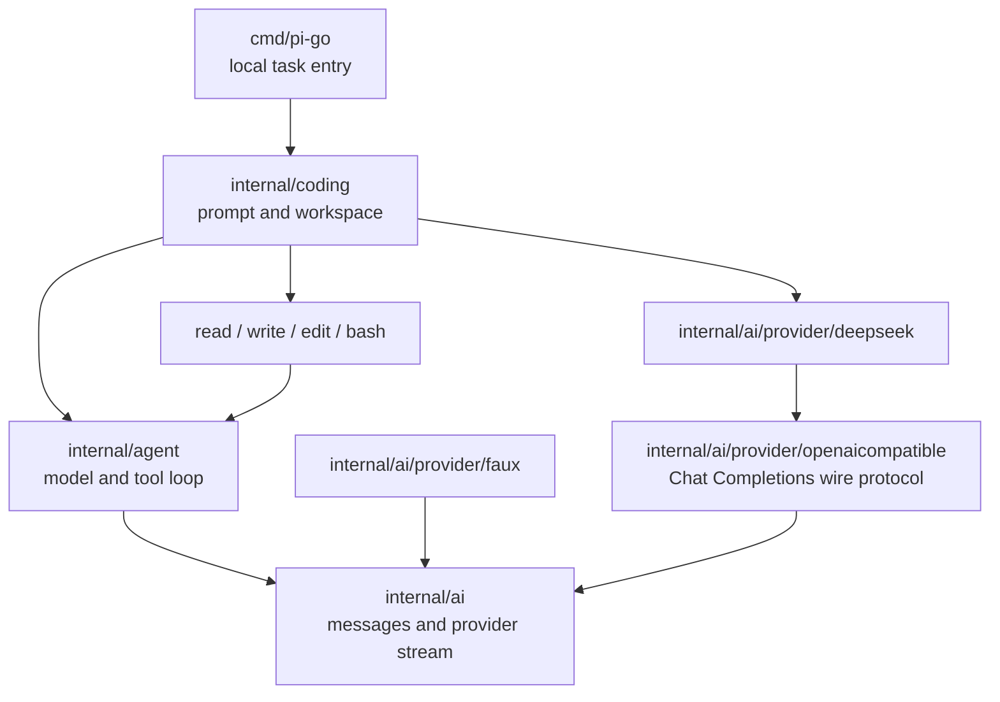
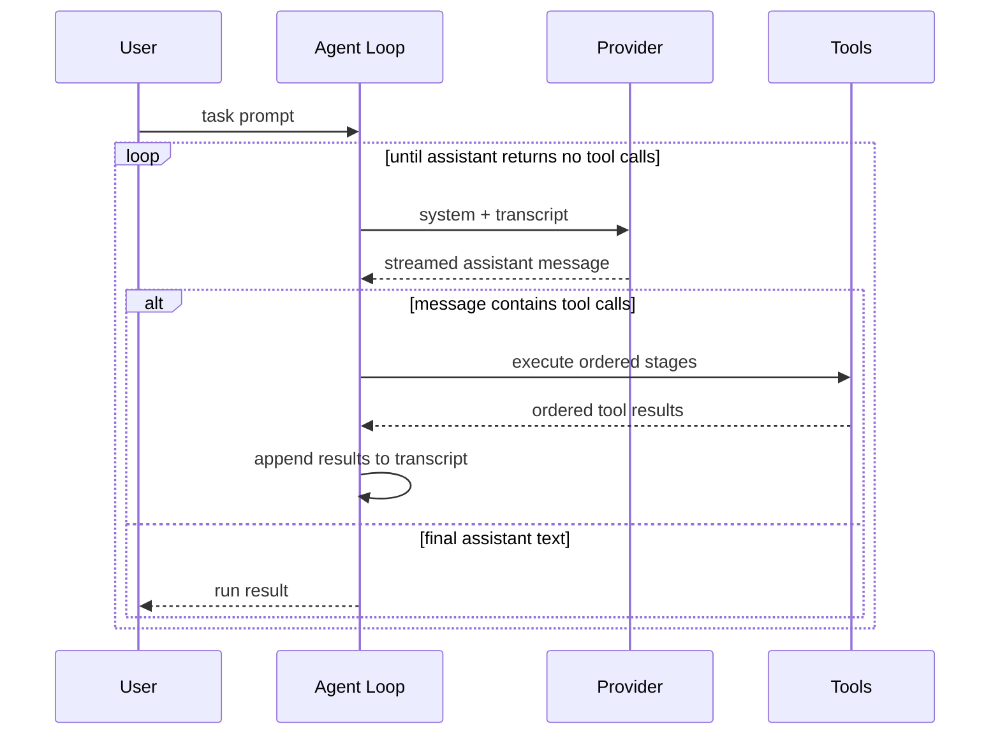
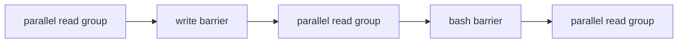

# Pi Core Go Learning Port - Plan

## Goal Capsule

在 `pi-go` 中以课程驱动完成 Pi 核心 coding loop 的 Go 语义移植，最终让一个 DeepSeek-first、无 TUI 的本地 headless agent 在指定目录中独立完成一个固定的小型 bug-fix 任务。

第一阶段只证明最短闭环：模型接收基础上下文，产生文本或工具调用，Runtime 安全调度 `read`、`write`、`edit`、`bash`，把结果加入 transcript 并继续调用模型，直到模型停止调用工具。课程不以复制 TypeScript 文件结构为目标，也不在第一阶段解决 Session、Goal Runtime、权限审批、IM 或多仓库管理。

权威顺序为：本计划的 Product Contract 与 Planning Contract → `docs/course/decisions.md` 的当前决定 → 当前课程文档 → 冻结 Pi 源码与测试。`session-settled:` 只标记已经由学习者明确决定、未经重新讨论和确认不得改变的事项，不是把其余计划内容排除在权威契约之外。出现冲突时先修正文档，不让实现静默选择一套语义。

执行采用交互式课程节奏。每课先讲解和讨论；涉及 Go 实现的课程再完成对应代码与测试。第 00 课是只建立 module、课程文档和验证证据的基线例外，不创建占位 Runtime package。学习者确认理解并明确要求后才能 commit。计划更新不等于自动开始下一课。

停止条件：DeepSeek 当前协议不能表达必需的流式 tool call；核心 loop 无法在 Faux Provider 下确定性验证；或者实现需要引入第一阶段明确排除的 Session、Goal Runtime 或外部服务协议。

---

## Product Contract

### Summary

本项目通过逐课阅读冻结的 Pi 源码、提炼可观察契约、实现 Go 版本并验证自身行为，构建一个能在单一工作目录中完成真实编程任务的最小 coding agent。仓库同时保存最终代码和形成设计的学习过程。

### Actors

- A1. 学习者：阅读、讨论、确认理解，并决定何时提交和进入下一课。
- A2. 本地操作者：提供一个工作目录和一条 coding task prompt，观察 Agent 的工具调用与最终结果，并独立运行验收。

### Requirements

**学习与可追溯性**

- R1. 每课必须在同一仓库交付课程内容和验证证据；涉及 Go 实现的课程还必须交付对应 Go 代码与测试。第 00 课是只建立 module 和课程契约的基线例外，不创建占位 Runtime package。
- R2. 每课只有在学习者确认理解后才能进入待提交状态，并且只有学习者明确要求时才 commit。
- R3. 会影响范围、接口、顺序或验收的讨论必须更新课程文档或决策记录。

**AI 与上下文**

- R4. Go Agent Loop 必须保留 Pi 的 user、assistant、tool call、tool result、stop reason 和多轮 transcript 核心语义。
- R5. 系统必须提供可脚本化 Faux Provider，使模型流、工具循环、错误和取消在无网络、无密钥的环境中确定性验证。
- R14. Agent 的第一次 Run 把原始用户任务转换成 transcript 首条 user message；同一 Agent 后续 Run 把新 user input 追加到已有历史。每次 Provider 调用必须收到包含 workspace/cwd 说明的稳定 system prompt、截至当前的完整有序 transcript 和当前 tool schemas，不增加独立 task 或 workspace context AI 协议字段。第一阶段不实现自动压缩、摘要、持久化恢复或跨 Session 上下文。

**工具循环**

- R6. Tool Loop 必须覆盖工具查找、模型可见 schema、Go 侧参数校验、未知工具、非法参数、截断调用、执行错误和有序 tool results。
- R15. 工具调度必须把连续的只读并行安全调用组成并行阶段，把其他工具作为串行屏障，并按模型源顺序执行这些阶段。
- R16. 未知工具、参数错误、执行错误、单工具超时和非零 bash exit 必须形成 call-local error tool result 并继续同批后续阶段；单工具超时使用 child context，只有 Run context 取消才中止未开始的调用。

**Provider 与 coding 能力**

- R8. 第一个真实 Provider 必须支持 DeepSeek SSE、reasoning content、tool calls、usage 和错误映射；非本地 endpoint 默认要求 HTTPS。
- R9. coding runtime 必须提供 `read`、`write`、`edit`、`bash`；文件工具通过固定 workspace root 执行 root-relative I/O，bash 固定初始 cwd、使用最小环境并支持进程组取消、超时、输出截断和子进程回收。
- R10. `cmd/pi-go` 必须接收一个工作目录和任务 prompt，呈现运行事件并返回进程结果；其输入输出不构成公共 SDK 或稳定外部协议。
- R17. 第一阶段最终验收必须使用仓库内固定 prompt、固定小型 Go bug-fix fixture、不可修改文件哈希和生产文件变更 allowlist，要求 Agent 自主读取代码、修改实现、运行测试并让原本失败的测试通过。
- R18. Runtime 必须明确提示工作目录内容和 tool results 会发送给 DeepSeek；第一阶段要求操作者在启动前自行确认 workspace 可披露，Runtime 只显示披露提示，不实现确认或审批交互。transcript 只驻留内存且没有通用 secret detector 或 redactor。
- R19. Run 取消必须停止新的 Provider 调用和工具阶段，取消并等待所有已启动的 stream、工具和 bash 进程组收敛，然后返回明确的 canceled 非成功结果。观察通道的最终事件和 settlement 语义等本地命令需要展示运行过程时再定义。

### Key Flows

- F1. 课程闭环：选择当前课 → 阅读 Pi → 讲解与讨论 → 完成本课适用的 Go 实现和测试 → 验证 → 记录结论 → 理解确认 → 学习者要求 commit → 下一课。第 00 课按 R1 的基线例外执行。
- F2. coding task：把用户任务转换成首条 user message，组装包含 workspace/cwd 说明的 system prompt、完整 transcript 与 tool schemas → 调用模型 → 执行工具阶段 → 把 tool results 加入 transcript → 再次调用模型 → 完整 assistant response 不含 tool calls 时结束 Run → 外部验收测试独立判断代码结果。

### Acceptance Examples

- AE1. 当一课代码和测试已完成但学习者尚未要求提交时，仓库保留未提交修改，Runtime 不执行任何 Git 提交。
- AE2. 当同一只读阶段中的工具 A、B 按 B、A 的顺序完成时，完成事件允许按 B、A 出现，但 transcript 中 tool results 必须保持 A、B 的模型源顺序。
- AE5. 当调用序列为 `read(a)`、`read(b)`、`write(c)`、`read(c)`、`read(d)` 时，两个 read 组分别并行，`write(c)` 作为屏障位于两组之间。
- AE6. 当并行 read 阶段中一个调用失败时，其他 read 仍完成，后续串行阶段继续执行；所有结果在下一轮一起交给模型。
- AE7. 当固定 fixture 的测试初始失败时，Agent 使用真实 DeepSeek 完成修改后，同一测试通过，不可修改文件哈希保持不变，fixture 内 diff 只包含 allowlist 文件；该验收不声称限制 unsandboxed bash 的主机级副作用。

### Success Criteria

- Faux Provider 下已移植的消息、流、工具、错误、取消和顺序契约都有确定性测试。
- `pi-go` 能在固定 bug-fix fixture 上通过真实 DeepSeek 完成 read、edit 或 write、bash test 的多轮闭环。
- 并行只读阶段没有 data race；取消不会留下失控的模型流、工具 goroutine 或 bash 子进程。
- 操作者能从有界事件和内存 transcript 判断模型做了什么、哪个工具失败以及 Run 为什么结束，默认输出不重复打印完整源码或未截断 tool output。
- 第一阶段代码中不存在 Goal Runtime、Session persistence、IM、RPC、公共 SDK、权限审批或 benchmark/eval 模块。

### Scope Boundaries

**第一阶段不做**

- TUI、主题、按键、命令提示和 slash command UI。
- 多 Provider 矩阵；真实 Provider 只实现 DeepSeek。
- Goal Runtime、结构化 plan/progress/replan/done/blocked 状态机；第一阶段由模型决定是否继续调用工具，由外部测试判断任务是否成功。
- Session 创建、持久化、恢复、自动 compaction、跨 Session 上下文和多 active run 管理；Agent 当前进程内的完整对话 transcript 不属于该推迟范围。
- Steering、follow-up、continue、完整 listener subscription 生命周期和 Agent Manager。
- 公共 Go SDK、gRPC、IM 适配、多用户、多仓库、worktree 与 GitHub issue/PR 管理。
- 权限审批、trust/yolo 配置矩阵和真正 sandbox；本地命令以当前用户权限运行，文件工具路径边界、凭据不向子进程传播、取消、超时和输出限制仍是强制安全不变量。
- 通用 secret scanning 或 redaction。操作者必须只选择允许发送给 DeepSeek 的 workspace；默认事件输出只减少额外复制，不阻止模型看到 tool results。
- Windows bash 进程树管理；第一阶段只验证 macOS 和 Linux 的进程组取消与回收。
- Pi 与 pi-go 的自动 benchmark、eval package、进程比较协议或评分工具。学习者可以在仓库外手动使用同一 fixture 和 prompt 比较两者。

**Deferred to Follow-Up Work**

- 原 U6 的完整 Agent 生命周期与订阅语义。
- 原 U7 的 steering、follow-up、continue 和 turn hooks。
- 原 U11 的 Goal Runtime。
- 原 U12 的 Session persistence 与恢复。
- Agent Manager、IM、worktree、多用户、SDK/RPC、GitHub 管理和更强权限策略。

### Dependencies

- 冻结 Pi 源码和测试：commit `dcfe36c79702ec240b146c45f167ab75ecddd205`，agent package version `0.80.7`。
- Go toolchain：`go.mod` 使用 Go `1.26.0`。
- DeepSeek OpenAI-compatible API；实现真实 Provider 时重新核验官方协议和可用模型，不把当前模型别名硬编码为课程契约。

---

## Planning Contract

### Key Technical Decisions

- KTD1. 以可观察行为为移植边界，使用 Go 原生并发和取消机制，不复制 TypeScript API 形状。（session-settled: user-approved — chosen over line-by-line translation: 目标是掌握并验证 Pi 核心设计）
- KTD2. 当前代码放入 `internal/`，由 `cmd/pi-go` 提供本地运行和验收入口，不做 SDK-first。（session-settled: user-directed — chosen over SDK-first: 核心接口需要随课程校正）
- KTD3. 首个真实 Provider 只实现 DeepSeek，consumer-owned `ai.Provider` 接口保持在模型无关 `internal/ai`；具体实现归类到 `internal/ai/provider/`，其中 DeepSeek 薄层复用最小 OpenAI-compatible Chat Completions 线协议层。（session-settled: user-directed — chosen over a multi-provider matrix or Pi-style registry: 先验证核心 loop）
- KTD4. 不移植 TUI，只保留 Runtime 的本地 headless 运行、可观察事件和结果。（session-settled: user-directed — chosen over porting CLI/TUI behavior: UI 不决定 coding 目标能否完成）
- KTD5. Faux Provider 先于 DeepSeek，用脚本响应锁定模型流、工具循环和 transcript 语义。
- KTD6. 第一阶段不实现 Goal Runtime；通用 Agent Loop 只负责模型与工具循环，任务成功由外部验收判断。（session-settled: user-directed — chosen over building plan/replan/done state now: 当前只验证 coding loop 能否完成任务）
- KTD7. `internal/agent` 定义通用 Tool 契约，`internal/coding/tools` 提供文件和进程实现，避免核心层依赖 workspace。
- KTD8. 第一阶段没有审批或 trust 策略系统；`read`、`write`、`edit` 受 workspace root 限制，bash 只保证从 workspace 启动并仍可访问当前用户资源。bash 使用最小 allowlist 环境加显式非敏感配置，Provider 凭据不通过 env、argv 或 tool config 传播；这不是对恶意 bash 的 secret isolation。（session-settled: user-directed — chosen over per-action approval: 长任务不能被审批循环阻断，完整权限策略延后）
- KTD10. 每课是文档、代码、测试和讨论记录的共同边界，只有学习者明确要求后才 commit。（session-settled: user-directed — chosen over automatic course commits: 学习者需要理解和调整节奏）
- KTD12. 第一轮课程冻结 Pi commit 和 package version；上游升级通过显式决策处理，不静默改变基线。
- KTD13. Provider 对 Agent 暴露可取消的 pull/receive stream。Agent event sink、串行投递和 observer settlement 等本地 headless 入口需要展示运行过程时再定义，不进入基础 transcript loop。
- KTD14. Tool 对模型暴露 JSON Schema，并用自身的 Go 解码与校验逻辑保护执行；初始版本不实现通用 JSON Schema evaluator。
- KTD16. 第一阶段 bash 进程树管理只支持 macOS 和 Linux；Windows 的进程模型与取消语义延后单独设计。
- KTD17. Headless Agent Runtime 与未来 Agent Manager 分层；第一阶段只有单目录、单 active Run 的本地 Runtime。（session-settled: user-approved — chosen over building multi-tenant orchestration into the loop: 先掌握和验证 Agent 核心）
- KTD18. Agent 保存同一对话的完整有序内存 transcript，顺序 Run 的新 user input 继续追加；第一阶段不做 Session 持久化、恢复或自动上下文整理。（session-settled: user-directed — chosen over weakening transcript ownership because the acceptance command starts with one task: 小阶段仍保留完整 Agent 设计）
- KTD19. 工具调度使用屏障式分段：连续 `CanRunParallel` 调用并行，其他调用逐个成为串行屏障，阶段之间保持模型源顺序。（session-settled: user-approved — chosen over Pi default whole-batch parallel and whole-batch sequential fallback: 保留只读并行，同时避免 read/write/bash 竞态）
- KTD20. `CanRunParallel` 是工具显式声明且默认 false；第一阶段只有 `read` 为 true，`write`、`edit`、`bash` 和未知工具均为 false。
- KTD21. 普通工具错误不触发 fail-fast；结果作为模型观察继续同批后续阶段，只有 Run context 取消才停止。（session-settled: user-directed — chosen over skipping the remaining batch after any error: 避免调度器猜测依赖并保持 Pi 的恢复方式）
- KTD22. 固定 fixture 和 prompt 可以供学习者在仓库外手动比较 Pi 与 pi-go，但项目不实现任何比较或评分模块。（session-settled: user-directed — chosen over an in-repo eval module: 比较属于后续独立 benchmark 活动）
- KTD23. 四个 coding tools 操作同一个 Run-pinned workspace；工具只返回原子能力的模型可用结果，不增加 `run_tests` 等 workflow tool。后一个阶段可以观察前一个阶段已完成的文件副作用。
- KTD24. 完整接收且不含 tool calls 的 assistant response 即正常 loop completion，即使文本为空；provider/stream failure、Run cancellation 和 acceptance deadline 是不同终态。CLI 报告 loop 终态，fixture harness 独立判断 coding task 是否成功。
- KTD25. Run cancellation 停止新工作，取消所有已启动 child contexts，等待 stream、tool workers 和 bash process group 收敛后返回 canceled result。工具阶段 terminal assistant 中的每个 tool call 都按模型源顺序得到一个 settlement result：已完成调用保留实际结果，执行中调用记录 canceled，未启动调用明确记录因 Run 取消而未执行；若 Provider aborted/error terminal 自身保留了已完成组装、尚未进入工具阶段的 calls，它们全部不执行并得到同 ID not-executed results。未启动调用绝不产生工具副作用。这样取消后的完整 transcript 可直接供同一 Agent 的下一次 Run 使用，不依赖 Provider request 阶段临时修复 orphaned tool calls；observer settlement 留到 event sink 设计时定义。（session-settled: user-approved — intentional divergence from Pi request-time synthetic `No result provided`: 保持 Agent transcript 为 Provider 所见历史的单一事实源）
- KTD26. Go `os.Root` 是第一阶段文件工具的 workspace boundary primitive；workspace 在 Run 开始时打开，read/create/overwrite/edit/replace 都通过 root-relative 方法完成，不使用易受 symlink TOCTOU 影响的“检查绝对路径后再普通 open”。
- KTD27. 发送给模型的 transcript 只驻留内存；read 和 bash 在内容进入 transcript、event preview 或 Provider request 前完成大小限制。默认事件呈现 metadata、状态和有界 preview，不提供通用 secret redaction。
- KTD28. `Agent.Run(ctx, userInput)` 返回 Agent 当前完整 transcript 的快照与 Go error，不增加重复 Run outcome；正常完成返回 nil error，Provider/stream failure 返回非 nil error，取消保留 context cause，terminal 或合成 assistant message 留在 Agent transcript。
- KTD29. 同一 Agent 的每条新 user message、terminal assistant 和 tool result 都追加到已有 transcript；后续 Provider call 发送完整历史。新对话通过新 Agent 或显式 reset/session boundary 开始，Agent 拒绝并发 Run。
- KTD30. Provider terminal message、Provider Request 和 `RunResult.Transcript` 在 Agent 所有权边界深复制；调用方和 Provider 不能通过嵌套 content slice、tool-call arguments 或 tool schema JSON 反向修改 Agent transcript。clone 规则由 `internal/ai` 统一拥有并供 Faux、Agent 复用。
- KTD31. 同一锁内先拒绝 active Run，再检查 context，并以设置 active 加追加 user 作为 Run acceptance point；预取消在该点前不修改 transcript、不调用 Provider、不产生 aborted assistant，越过该点后到 terminal settlement 前的取消保留 user 并只产生一条 aborted assistant。assistant exactly-once 只约束 assistant 数量；若该 terminal 含已完成 tool calls，KTD25 允许其后追加非执行型 settlement results。
- KTD32. 每次 Provider call 的 stream consumer 在所有退出路径只返回 `(terminal AssistantMessage, error)`；Turn/Run coordinator 在该次调用的唯一位置深复制并追加该消息。第一条有效 terminal event 是该 Turn 的 settlement point，之后的取消不追溯这条 assistant；同一次 `Receive()` 同返有效 terminal event 与 error 时 terminal 优先。terminal 前 raw stream failure 依据 context cause 合成 aborted 或 error assistant，nil stream 合成协议错误 assistant；Agent 等待绑定 context 的 `Receive()` 真正收敛而不遗留竞争 goroutine。第 02 课一个 Run 只有一个 Turn，第 03 课多 Turn Run 对每次 Provider call 重复同一规则；assistant 写入点唯一不排斥协调层随后追加 tool-result settlement。
- KTD33. Agent Runtime 对每个 tool call 只执行一次，不在通用 Tool Loop 自动重试；失败形成 tool result，由模型决定是否发起新调用。未来只有能够明确分类瞬时错误的具体 I/O 后端，才可在单次 `Execute` 内实现有界、可取消的内部重试。
- KTD34. Tool-call terminal 先校验可配对 identity，再按 reason/content 分类：空或重复 call ID、`toolUse` 却无 call 是 Provider protocol error；`stop + calls` 执行，`length + calls` 全部不执行并返回 truncation results；ID 有效时的空/未知 tool name、非法/不合语义的 arguments 和 execute failure 是 call-local errors；Provider error/aborted terminal 中的 calls 全部不执行，只追加 not-executed settlement results。（session-settled: user-approved — extends assistant exactly-once with explicit tool-result closure: 不修改或重复 terminal assistant，也不让失败 Turn 的 calls 产生副作用）

### High-Level Technical Design

第一阶段 Go import 依赖保持单向，composition root 负责装配具体 Provider 和 tools：



一次 Run 的核心序列为：



工具批次通过一次线性扫描分段：



并行阶段为每个 source index 预留 result slot。worker 把 outcome 交给 coordinator，coordinator 按观察到的完成顺序串行发送完成事件；阶段结束后再按 source index 把 tool results 加入 transcript。串行屏障完成后才开始下一阶段。

### Pi Baseline and Intentional Divergence

冻结 Pi 的 agent-core 默认整批并行；全局 `sequential` 或批内任一 sequential tool 会让整批串行。coding-agent 的 `write` 和 `edit` 另用同文件 mutation queue 降低覆盖风险，但 `read` 和 `bash` 不受该队列保护。

pi-go 第一阶段有意不复制这一并发策略。它采用更保守的屏障式分段，换取简单、可解释的读写顺序；这项差异必须由测试和课程文档明确记录，不能被描述成 Pi 的原始行为。

### Course Sequencing

| 课次 | 实现单元 | 主题 | 主要结果 |
|---|---|---|---|
| 00 | U1 | 学习契约与冻结基线 | 最小 Go module 和学习门禁 |
| 01 | U2 | AI 协议与 Faux Provider | 模型无关消息、stream 和脚本 Provider |
| 02 | U3 | 单次 Provider Turn 与 transcript | 一次模型流、assistant message 和 Run 终态 |
| 03 | U4、U5 | 多轮 Tool Loop 与屏障式调度 | tool-result 驱动下一轮、只读并行和串行屏障 |
| 04 | U8 | DeepSeek Provider | SSE、reasoning 和 tool-call streaming |
| 05 | U9 | Coding Tools | read、write、edit、bash 和 workspace 边界 |
| 06 | U10 | Headless coding task | 本地入口和固定 bug-fix 验收 |

课次是学习边界，U-ID 是计划追踪边界；一课可以包含两个紧密依赖的实现单元。原 U6、U7、U11、U12 保留其历史含义，但移出第一阶段。

### Risks and Mitigations

- DeepSeek 模型或 SSE 协议漂移：模型 ID 配置化，Provider 课程开始时重查官方文档，离线 fixture 与真实 smoke test 分开。
- 模型把有依赖的工具放进同一 assistant message：调度器只保证执行顺序，不制造新的 LLM 推理步骤；需要读取结果后再决定的操作必须进入下一轮模型调用。
- `CanRunParallel` 被错误标记：默认 false，只有能证明无副作用的工具才显式开启，并用 race test 与阶段顺序测试锁定。
- bash 逃逸 workspace：第一阶段明确不提供 sandbox；fixture 使用 disposable temp root、隔离 HOME/TMPDIR/cache 和最小环境，文档不把 cwd 或 fixture diff 描述为主机隔离。
- workspace symlink race：文件工具固定 `os.Root` 并只使用 root-relative I/O；测试用 outside canary 验证 ancestor、final 和替换竞态不能越界。
- 数据发送与日志泄漏：操作者只选择 disclosure-safe workspace；工具在进入 transcript 前限制输出，默认事件只提供有界 preview，并明确没有通用 redaction。
- bash 遗留后台进程：每次调用拥有独立进程组；正常退出、超时和取消都在进入下一阶段前完成 terminate、必要时 hard kill、drain 和 reap。
- 真实模型行为不确定：Faux Provider 证明 Runtime 契约，固定真实 fixture 证明一次端到端能力，两者互不替代。

---

## Implementation Units

### U1. Establish Learning Contract and Frozen Baseline

- **Goal:** 建立最小 Go module、冻结 Pi 基线，并定义课程学习与提交门禁。
- **Requirements:** R1-R3；KTD1、KTD10、KTD12。
- **Dependencies:** 无。
- **Files:** `AGENTS.md`、`README.md`、`go.mod`、`docs/course/README.md`、`docs/course/decisions.md`、`docs/course/lessons/00-learning-contract-and-baseline.md`。
- **Approach:** 冻结信息只进入课程文档，不创建课程专用 Runtime package。
- **Test scenarios:** `go list -m` 返回预期 module；所有基线文档引用同一 Pi commit 和 package version。
- **Verification:** module 边界成立，仓库没有占位 Go package 或公共 SDK。

### U2. Define AI Protocol and Faux Provider

- **Goal:** 建立模型无关消息、内容块、usage、stop reason、流事件和可脚本 Provider。
- **Requirements:** R4、R5、R14；KTD3、KTD5、KTD13。
- **Dependencies:** U1。
- **Files:** `internal/ai/message.go`、`internal/ai/model.go`、`internal/ai/provider.go`、`internal/ai/stream.go`、`internal/ai/provider/faux/provider.go`、`internal/ai/provider/faux/provider_test.go`、`docs/course/lessons/01-ai-protocol-and-faux-provider.md`。
- **Approach:** 从 Pi `packages/ai/src/types.ts` 和 stream contract 提取通用类型；Faux Provider 使用脚本事件，不加入 DeepSeek 专用字段。根 README、课程总纲和决策记录已在开课前对齐本计划，不把文档清理混入第 01 课实现。
- **Execution note:** 先用测试定义事件流和取消语义，再实现 Faux Provider。
- **Test scenarios:** 文本增量、reasoning 增量、tool-call argument 分片、正常结束、provider error、context cancel、脚本耗尽和重复读取结束状态。
- **Verification:** 测试不访问网络，脚本输入产生稳定、可比较的事件序列。

### U3. Implement One Provider Turn and Agent Transcript Assembly

- **Goal:** 完成 user message → provider stream → assistant message → Agent transcript 的一次 Provider turn，证明顺序 Run 保留完整历史，并建立明确的正常、失败和取消终态。
- **Requirements:** R4、R5、R14、R19；F2；KTD6、KTD18、KTD24、KTD25、KTD28、KTD29、KTD30、KTD31、KTD32。
- **Dependencies:** U2。
- **Files:** `internal/ai/clone.go`、`internal/ai/clone_test.go`、`internal/ai/provider/faux/provider.go`、`internal/agent/loop.go`、`internal/agent/types.go`、`internal/agent/loop_test.go`、`docs/course/lessons/02-agent-loop-and-transcript.md`。
- **Approach:** 本单元实现有状态 Agent 与无工具的一次 Provider turn；`Agent.Run()` 在同一个锁内拒绝 active Run、检查预取消 context，并以设置 active 加追加新 user input 作为 acceptance point。每次 Provider 请求包含已组装 workspace/cwd 说明的稳定 system prompt、截至当前的完整 transcript 和 tool schemas，不增加独立 task 或 workspace context 字段。Provider terminal message、Provider Request 和 `RunResult.Transcript` 在所有权边界深复制，并由 `internal/ai` 统一提供 clone 规则。完整 response 无 tool calls 时正常结束，包括空文本；不加入 Agent event sink、运行过程展示、Session 持久化、steering、follow-up 或 compaction。
- **Execution note:** 先锁定 Agent transcript 所有权、顺序 Run 历史和 Run 返回结果，再实现 loop。
- **Test scenarios:** 单轮文本、空文本正常结束、reasoning 与 text 混合、同一 Agent 两次顺序 Run 的第二次 request 包含 `[user1, assistant1, user2]`、并发 Run 拒绝、预取消不修改 transcript 且不调用 Provider、acceptance point 后取消保留 user 和唯一 aborted assistant、完整 Provider request 字段、provider error、stream cancel、Run cancel 等待已启动 stream 收敛、明确的 canceled result，以及修改 Provider Request、Provider terminal message 或 RunResult 的嵌套 slice/JSON bytes 都不能反向修改 Agent transcript。这里的“唯一”只计 assistant；第 03 课负责失败 terminal 中 tool calls 的 result closure。
- **Verification:** 每条退出路径产生一致的 assistant message 和明确 Run 结果；取消只在已启动 stream settlement 后返回且没有遗留 goroutine。

### U4. Implement Tool Contract and Error Semantics

- **Goal:** 让 Agent 校验和执行工具，把结果加入 transcript，并由 tool results 驱动下一轮 Provider 调用。
- **Requirements:** R4、R6、R16；F2；KTD7、KTD14、KTD21、KTD34。
- **Dependencies:** U3。
- **Files:** `internal/agent/tool.go`、`internal/agent/validation.go`、`internal/agent/loop.go`、`internal/agent/loop_test.go`、`docs/course/lessons/03-tool-loop-and-staged-scheduling.md`。
- **Approach:** Tool 同时提供模型可见 schema 和 Go 参数解码校验；未知工具、非法参数、execute error、单工具 timeout 和非零 bash exit 都形成 call-local error tool result。单工具 timeout 使用 Run context 的 child context；模型因长度截断的 tool calls 全部失败且不执行。Provider error/aborted terminal 中已完成的 calls 也不执行，但必须追加同 ID not-executed results，保持完整 transcript 可直接继续。
- **Execution note:** 从顺序执行写出失败测试，先证明 tool result 能驱动下一轮，再接入并行阶段。
- **Test scenarios:** 成功调用、未知工具、非法 JSON、参数语义错误、execute error、单工具 timeout 不取消 Run、截断消息不执行、普通错误后同批后续调用继续、`toolUse` 无 call、空/重复 call ID、`stop + calls`、Provider error/aborted calls 不执行但显式闭合、失败 Turn 后同一 Agent 继续 Run、下一轮 Provider 收到以同一原始 user message 开始的完整有序 transcript、未变化的 tool schemas 和包含同一 workspace/cwd 说明的 system prompt、模型从 edit failure 恢复。
- **Verification:** 非取消批次中的每个 tool call 都得到同 ID 的 tool result；普通错误不崩溃、不产生 terminal Run reason，也不阻止下一轮模型恢复。

### U5. Implement Barrier-Based Staged Scheduling

- **Goal:** 在保持源顺序和安全屏障的前提下并行执行连续只读工具。
- **Requirements:** R15、R16、R19；AE2、AE5、AE6；KTD19-KTD21、KTD25。
- **Dependencies:** U4。
- **Files:** `internal/agent/tool.go`、`internal/agent/loop.go`、`internal/agent/loop_test.go`、`docs/course/lessons/03-tool-loop-and-staged-scheduling.md`。
- **Approach:** Tool 通过默认 false 的能力标记声明是否可并行；一次线性扫描把连续 parallel-safe calls 组成阶段，非并行工具各自成为屏障。并行 worker 只提交 outcome；result slots 保持 transcript 源顺序。观察事件和 sink 等本地入口出现展示需求时再接入。
- **Execution note:** 先用受控阻塞工具证明并发度、完成顺序和 transcript 顺序，再实现调度扫描。
- **Test scenarios:** 全 read 并行、read-read-write-read-read 分成三个阶段、连续 write/edit/bash 严格串行、B 先完成但 transcript 保持 A/B、并行 read 单个失败或 child timeout 后其余完成且下一阶段继续；Run cancel 停止启动后续阶段、取消并等待已启动 workers，为 completed/canceled/not-executed 调用按源顺序追加同 ID settlement results；取消后同一 Agent 的下一次 Run 直接发送完整配对历史，不依赖 Provider 层 orphan repair。
- **Verification:** `go test -race ./...` 通过；transcript 源顺序和 cancellation settlement 分别满足测试契约。

### U8. Implement OpenAI-Compatible DeepSeek Provider

- **Goal:** 参考冻结 Pi 的 Provider/API 分层，把 OpenAI-compatible Chat Completions 消息和 SSE 映射到通用 AI stream，再用薄 DeepSeek 配置层提供认证、endpoint 与兼容语义。
- **Requirements:** R8；KTD3、KTD13。
- **Dependencies:** U2。课程顺序位于 U3-U5 之后，但 Provider package 不导入 Agent。
- **Files:** `internal/ai/provider/openaicompatible/request.go`、`internal/ai/provider/openaicompatible/provider.go`、`internal/ai/provider/openaicompatible/stream.go` 及其离线测试，`internal/ai/provider/deepseek/provider.go`、`provider_test.go`、`provider_integration_test.go`，以及 `docs/course/lessons/04-deepseek-provider.md`。
- **Approach:** 只抽取当前 DeepSeek 真正使用的 OpenAI-compatible Chat Completions 线协议，不移植 Pi 的 Provider registry、模型目录、动态刷新、认证存储或多 API dispatch。使用标准库 `net/http` 和可注入 client/transport，显式控制 SSE、取消、错误上限且不实现 Provider-level retry；redirect 继续服从注入 client 的标准策略。DeepSeek 层冻结兼容 profile 并校验 endpoint/认证，模型 ID 和 endpoint 来自运行配置。先用本地 SSE fixture 验证协议，再提供显式 opt-in 的真实 smoke test。
- **Test scenarios:** 文本、reasoning、分片 tool arguments、多 tool calls、usage、HTTP error、malformed SSE、context cancel、远程明文 endpoint 被拒绝、本地测试 endpoint 显式放行；assistant tool calls 后跟显式 completed/canceled/not-executed tool results 和新 user message 时能够直接序列化，不静默插入或删除历史消息。
- **Verification:** 离线 fixture 全通过；有凭据时 smoke test 完成文本和 tool-call 响应，并额外验证一份取消后已显式闭合 tool calls 的历史能够继续请求 DeepSeek，日志和事件不包含 API key。
- **Execution note:** OpenAI-compatible 与薄 DeepSeek 层已完成；离线测试覆盖完整历史转换、pull SSE、reasoning、交错多 tool calls、usage-after-finish、双 terminal、错误/取消 settlement、大小上限、凭据 redaction 和 endpoint policy。3xx 不做特殊处理，其真实影响留待后续有证据时独立验证。真实测试使用 `integration` build tag 与独立环境开关，未 opt-in 时不读取 key 或联网。当前状态为待学习者理解确认。

### U9. Implement Coding Tools and Workspace Boundary

- **Goal:** 提供能修改真实临时仓库并运行验证的 `read`、`write`、`edit`、`bash`。
- **Requirements:** R9、R15、R16、R18、R19；KTD7、KTD8、KTD16、KTD20、KTD23、KTD25-KTD27。
- **Dependencies:** U4、U5。
- **Files:** `internal/coding/workspace.go`、`internal/coding/tools/read.go`、`internal/coding/tools/write.go`、`internal/coding/tools/edit.go`、`internal/coding/tools/bash.go`、`internal/coding/tools/truncate.go`、`internal/coding/tools/tools_test.go`、`docs/course/lessons/05-coding-tools.md`。
- **Approach:** Run 开始时用 `os.Root` 固定 canonical workspace，文件工具只使用 root-relative I/O 并拒绝非 regular-file 目标；write 和 edit 通过 workspace 内临时文件与替换提交结果，edit 使用精确且可验证的唯一替换。bash 绑定 cwd 和独立进程组，使用最小 allowlist 环境，但不声称 sandbox；第一阶段只支持 macOS 和 Linux。read 标记为 parallel-safe，其他三个工具保持默认 false。工具返回 resolved relative path、edit 匹配诊断、bash exit code/stdout/stderr/timeout/truncation 等模型可用结果。
- **Execution note:** 使用临时 workspace 做集成测试，并在实现 bash 后立即验证进程组取消。
- **Test scenarios:** read 成功与不存在、write 新建与覆盖、edit 唯一替换与零/多匹配、非 regular-file 拒绝、`..` 穿越、ancestor/final/dangling symlink、validation-to-open swap 和 outside canary；bash stdout/stderr、非零退出 error result、timeout、startup cancel、正常 shell exit 后后台子进程、grandchild 持有 pipe、输出在进入 transcript 前截断；任意父进程 secret、Provider key 和敏感 handle 不进入子进程或事件，显式允许变量可见；`write → read`、`edit → bash`、`bash-created file → read` 观察同一 workspace。
- **Verification:** `os.Root` 文件操作不能越出 workspace；每个 bash 路径都在下一阶段前 drain、terminate、必要时 kill 并 reap 同进程组 descendants；`go test -race ./...` 通过。

### U10. Assemble Headless Coding Agent and Fixed Acceptance Task

- **Goal:** 让操作者用一个目录和一条 prompt 启动 Agent，并在固定 fixture 上完成真实 bug fix。
- **Requirements:** R10、R17-R19；F2；AE7；KTD2、KTD4、KTD6、KTD17、KTD22-KTD25、KTD27。
- **Dependencies:** U3-U5、U8、U9。
- **Files:** `internal/agent/events.go`、`internal/agent/loop.go`、`internal/agent/loop_test.go`、`internal/coding/prompt.go`、`internal/coding/runtime.go`、`internal/coding/runtime_test.go`、`cmd/pi-go/main.go`、`cmd/pi-go/main_test.go`、`testdata/acceptance/bugfix/task.txt`、`testdata/acceptance/bugfix/`、`docs/course/lessons/06-headless-coding-task.md`、`README.md`。
- **Approach:** 本地入口装配 DeepSeek、内存 transcript 和四个 coding tools；在出现真实终端展示需求时设计基础 Agent event sink、串行投递和有界输出，不实现 TUI 状态。固定 Go fixture 的 `NormalizeTags` starter 实现不能满足“trim、删除空项、按首次出现顺序去重”的既有测试；checked-in prompt 要求定位并修复 bug、运行测试且不修改测试文件。真实验收把 regular-file-only fixture 复制到 checkout 外的 disposable temp root，隔离 HOME/TMPDIR/Go caches，设置最小环境、外部 deadline、immutable hashes、target allowlist 和相邻 canary。
- **Execution note:** 先建立失败 fixture 和不可修改的验收断言，再组装 Runtime；真实模型运行只在离线契约测试全部通过后进行。
- **Test scenarios:** fixture 初始测试失败、Faux 多轮 read/edit/bash 后通过、每轮 request context 完整、基础 event sink 顺序和 settlement、CLI 有界流式输出、help 和运行启动明确显示 DeepSeek data-egress 边界、无效 workspace、缺少 DeepSeek key、zero-tool assistant response 正常结束、provider failure 与用户取消返回不同非成功终态、取消工具批次后同一 Agent 继续 Run、acceptance deadline、真实 DeepSeek 在 final mutation 后运行成功 bash test、独立测试通过、immutable hashes 不变、fixture diff 只含 allowlist、相邻 canary 不变、无遗留进程。
- **Verification:** structured trace 包含 read、edit 或 write、final mutation 后成功 bash test 和 loop terminal reason；同一 checked-in prompt 可以手动交给 Pi 和 pi-go。fixture diff 和 canary 只验证验收目录效果，不宣称 OS-wide containment，也不生成比较分数或 eval 文件。

---

## Verification Contract

### Per-Lesson Gates

涉及 Go 代码的课程必须运行：

```bash
gofmt -w <changed-go-files>
go test ./...
go vet ./...
```

涉及并行、取消或进程管理时还必须运行：

```bash
go test -race ./...
```

课程只提交学习者已确认的课时文件。计划、课程文档和代码出现语义冲突时，先修正文档再通过门禁。

### Provider Gates

默认测试不得读取 DeepSeek key 或调用付费 API。真实 smoke test 必须显式 opt-in，记录模型 ID 和 endpoint，并验证 Provider key 没有通过工具环境、argv、tool config、transcript、事件、日志或错误传播。测试还要用非 Provider secret canaries 证明 bash 只获得 allowlist 环境。真实 smoke test 只证明协议可用，不能替代 Faux Provider 的确定性测试。

运行前必须明确告知操作者：system prompt、用户任务、模型选择的文件内容、命令和 tool output 会发送到 DeepSeek。默认 CLI 事件只显示 metadata、状态和有界 preview；transcript 不落盘，输出限制在内容进入 transcript 和 Provider request 前生效。

### Final Coding Acceptance

最终验收把 checked-in regular files 复制到真实 checkout 外的 disposable temp root，使用独立 HOME/TMPDIR/Go caches、最小环境、外部 deadline 和相邻 canary。先证明 starter tests 失败，再用 `testdata/acceptance/bugfix/task.txt` 启动 `pi-go`，最后独立运行 fixture tests。

通过条件是测试成功、immutable hashes 未改变、fixture diff 只包含 allowlist、相邻 canary 未改变、无遗留子进程，并且 structured trace 包含读取、修改、final mutation 后成功测试和明确 loop terminal reason。这些检查不证明 unsandboxed bash 没有访问或修改主机其他位置。

Pi 与 pi-go 的人工对比在本仓库外进行，不属于 `go test ./...`、命令输出或 Definition of Done。

---

## Definition of Done

- R1-R6、R8-R10、R14-R19 均由至少一个 active U-ID 和可观察验证覆盖。
- U1-U5、U8-U10 的课程文档、代码、测试和决策记录一致；被移出的 U6、U7、U11、U12 没有残留实现。
- Faux Provider 下消息流、完整 request context、基础 transcript、多轮 tool loop、错误继续、屏障调度、串行 event sink 和 cancellation settlement 都有确定性测试。
- DeepSeek Provider 的离线 SSE fixtures 通过，并完成显式真实 text/tool-call smoke test以及一次取消后显式闭合 tool calls、继续同一对话的 Provider compatibility smoke test。
- 四个 coding tools 在临时 workspace 中组合工作，`os.Root` 文件边界、进程组清理、超时、截断和凭据不传播测试通过。
- `cmd/pi-go` 使用固定 prompt 在固定 bug-fix fixture 上完成真实 coding task，独立验收测试通过。
- 第一阶段没有 TUI、Goal Runtime、Session、Agent Manager、SDK/RPC、IM、权限审批、GitHub 管理或自动 Pi 对比模块。
- `gofmt`、`go test ./...`、`go vet ./...` 和适用的 `go test -race ./...` 通过。
- 放弃的实验代码、未使用的抽象、临时 fixture 和失控进程已清理。
- 每个 commit 都由学习者明确要求，并且只包含已经理解和确认的课程文件。

---

## Appendix

### Frozen Pi Source Paths

- `packages/ai/src/types.ts`
- `packages/ai/src/models.ts`
- `packages/ai/src/providers/deepseek.ts`
- `packages/ai/src/providers/deepseek.models.ts`
- `packages/ai/src/api/openai-completions.lazy.ts`
- `packages/ai/src/api/openai-completions.ts`
- `packages/ai/src/api/transform-messages.ts`
- `packages/agent/src/types.ts`
- `packages/agent/src/agent-loop.ts`
- `packages/agent/src/agent.ts`
- `packages/agent/test/agent-loop.test.ts`
- `packages/agent/test/agent.test.ts`
- `packages/coding-agent/src/core/tools/file-mutation-queue.ts`
- `packages/coding-agent/src/core/tools/read.ts`
- `packages/coding-agent/src/core/tools/write.ts`
- `packages/coding-agent/src/core/tools/edit.ts`
- `packages/coding-agent/src/core/tools/bash.ts`

### External Sources for Provider Lesson

- [DeepSeek API documentation](https://api-docs.deepseek.com/)
- [DeepSeek chat completion API](https://api-docs.deepseek.com/api/create-chat-completion)
- [DeepSeek tool calls guide](https://api-docs.deepseek.com/guides/tool_calls)
- [Go `os.Root`](https://pkg.go.dev/os#Root)
