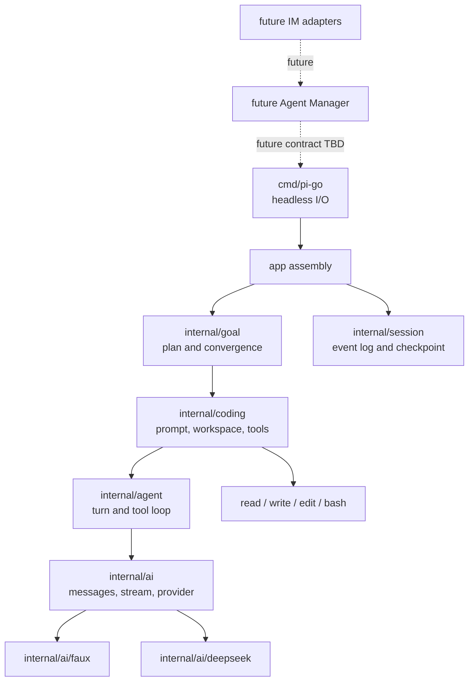
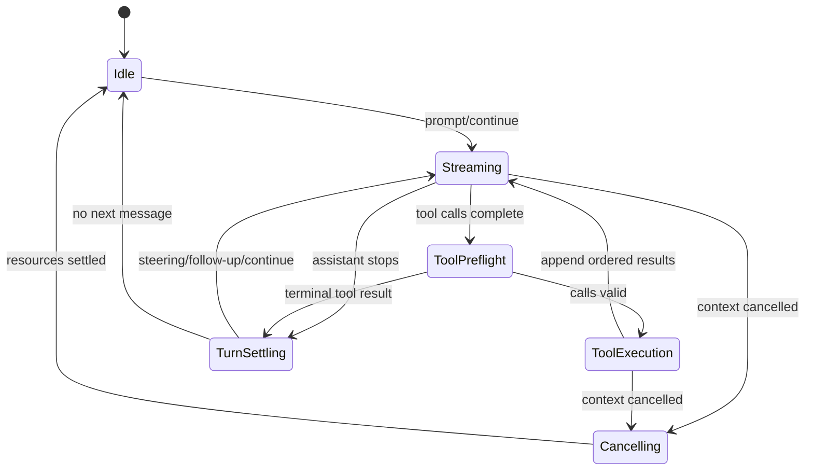

# Pi Core Go Learning Port - Plan

## Goal Capsule

在 `pi-go` 中以课程驱动完成 Pi 核心能力的 Go 语义移植，产出一个 DeepSeek-first、无 TUI、可执行真实 coding 任务并能向目标收敛的 headless Agent Runtime。每课同时交付解释、Go 代码、测试和决策记录；学习者理解并明确要求后才能 commit 和进入下一课。

权威顺序：本计划的产品契约与 KTD → `docs/course/decisions.md` 的当前决定 → 当前课程文档 → 冻结的 Pi 源码与测试基线。发现冲突时停止扩展当前课，先更新权威文档。

执行采用交互式学习节奏，不自动批量实现全部单元，不自动 commit，不自动推送或创建 PR。U1-U12 分别是第 00-11 课的实现边界。

停止条件：核心循环和 coding runtime 不能在 Faux Provider 下确定性验证；DeepSeek 当前 API 无法表达必需的流式工具调用；或新的决定会改变“headless、DeepSeek-first、非 SDK-first”的初始范围。上述情况需要回到学习讨论，不由实现者静默改范围。

## Product Contract

### Summary

项目通过逐课阅读 Pi、提炼行为契约、实现 Go 版本并验证自身行为，构建可用于真实仓库任务的 coding agent。低层 Agent Loop 保持通用，目标规划、coding workspace 和 Session 位于其上层。仓库同时保存最终代码和形成这些设计的学习过程。

### Actors

- A1. 学习者：阅读、练习、讨论、确认理解，并决定何时提交和进入下一课。
- A2. pi-go Agent 操作者：为一个仓库配置 Agent，为每个真实任务创建 Session，并选择执行策略。
- A3. IM 集成方：未来根据部署与语言边界选择 gRPC、公共 Go SDK 或其他稳定接口；当前阶段不提供外部调用或适配器。

### Requirements

#### 学习与可追溯性

- R1. 每课必须在同一仓库交付课程内容、Go 代码、测试和验证证据。
- R2. 每课必须在学习者确认理解后才可进入待提交状态，并且只有学习者明确要求时才 commit。
- R3. 会影响范围、接口、顺序或验收的讨论必须更新课程文档或决策记录。

#### Agent 核心语义

- R4. Go Agent Loop 必须对齐 Pi 基线的 turn、stream、tool call/result、transcript 和事件生命周期语义。
- R5. 系统必须提供可脚本化 Faux Provider，使核心行为在无网络、无密钥和无随机性的环境中验证。
- R6. Tool Loop 必须覆盖参数校验、未知工具、长度截断调用、顺序执行、并行执行和结果排序。
- R7. Agent 必须覆盖 busy、cancel、listener settlement、steering、follow-up、continue 和 turn stop hooks。

#### Provider 与 coding 能力

- R8. 第一个真实 Provider 必须支持 DeepSeek SSE、thinking/reasoning content、工具调用和错误映射；非本地 endpoint 默认要求 HTTPS。
- R9. coding runtime 必须提供 read、write、edit、bash；文件工具强制 workspace 边界，bash 固定初始 cwd 并支持取消、超时和输出截断。
- R10. `cmd/pi-go` 必须作为 Agent Runtime 的本地运行和验收入口，能够接收目标、仓库、Session 和配置，呈现运行事件，并返回可判断成功、失败或 blocked 的结果；其输入输出不构成当前外部兼容协议。
- R11. Goal Runtime 必须在通用 Agent Loop 之上维护 plan、progress、replan、done 和 blocked，不把目标状态塞入低层消息协议。
- R12. 一个仓库使用 `.pi-go/agent.json` 作为可审阅 Agent 配置，每个真实任务拥有独立 Session 并可保存与恢复；Session 状态默认写入仅当前用户可访问的仓库外状态目录。
- R13. 执行策略必须可配置；初始 `trusted` 模式不逐次审批且不把 bash 伪装成 sandbox，但 Provider 凭据隔离、参数校验、取消、超时和输出限制不能关闭。

### Key Flows

- F1. 课程闭环：选择当前课 → 阅读 Pi → 练习和讨论 → Go 实现与测试 → 验证 pi-go 行为 → 记录结论 → 理解确认 → 学习者要求 commit → 下一课。
- F2. coding 任务：加载仓库级 Agent 配置 → 创建任务 Session → Goal Runtime 规划 → Agent Loop 调用模型与工具 → 观察与重规划 → done、failed 或 blocked → 保存事件和结果。

### Acceptance Examples

- AE1. 当一课代码和测试已经完成但学习者尚未要求提交时，仓库保留未提交修改，课程状态最多到“待提交”，系统不执行 commit。
- AE2. 当两个并行工具按 B、A 的时间顺序结束时，完成事件允许是 B、A，但写入 transcript 的 tool results 必须保持模型调用中的 A、B 源顺序。
- AE3. 当 Agent 忙碌时再次 prompt，调用必须失败并提示使用 steering 或 follow-up；消息不能静默插入当前 transcript。
- AE4. 当 coding 任务要求修改仓库并运行验证时，Goal Runtime 必须能多轮调用 read/edit/bash，直到验收通过或产生可解释的 blocked 状态。

### Success Criteria

- Faux Provider 下所有已移植的 Pi 行为契约都有确定性测试。
- pi-go 能在 bug fix、受约束 feature 和测试/重构三类 coding fixtures 上自主修改代码并通过任务指定验收。
- 取消不会留下失控的模型流、工具 goroutine 或 bash 子进程。
- Session 可在进程重启后恢复到一致 transcript 和目标状态。
- 操作者能从配置与文档判断哪些仓库内容会发给 DeepSeek，以及 `trusted` bash 拥有哪些主机权限。

### Scope Boundaries

初始课程不实现 TUI、主题、按键、命令提示和交互式 slash commands。不实现多 Provider 完整矩阵、公共 Go SDK、网络 RPC、飞书或其他 IM 适配器，也不移植 Pi 的实验性 AgentHarness；先实现被 coding-agent 直接使用的低层 Agent 与 Agent Loop。

公共 SDK、网络 RPC/IM、多租户 Agent Manager、完整 sandbox、GitHub issue/PR 工具和更多 Provider 属于核心稳定后的扩展。当前设计必须为它们保留边界，但不能提前实现未被课程验证的抽象。第一轮可用独立进程和 worktree 并行不同 Session，同一 Session 只允许一个 active run。第一轮 bash 进程树取消以 macOS 和 Linux 为运行目标；Windows 支持在核心课程后单独设计和验收。

### Dependencies

- 冻结 Pi 源码和测试：commit `dcfe36c79702ec240b146c45f167ab75ecddd205`，package version `0.80.7`。
- Go toolchain：开发机当前为 `go1.26.1 darwin/arm64`；`go.mod` 的最低版本在第 00 课确定。
- DeepSeek OpenAI-compatible API 与当前模型目录；实现第 07 课时再次核验官方文档。

## Planning Contract

### Key Technical Decisions

- KTD1. 以可观察行为为移植边界，使用 Go 原生并发和取消机制，不复制 TypeScript API 形状。（session-settled: user-approved — chosen over line-by-line translation: 目标是掌握并验证 Pi 核心设计）
- KTD2. 当前代码放入 `internal/`，由 `cmd/pi-go` 提供本地运行和验收入口，不做 SDK-first，也不承诺外部调用协议。（session-settled: user-directed — chosen over SDK-first: 核心接口需要随课程校正）
- KTD3. 首个真实 Provider 只实现 DeepSeek，Provider 接口保持可替换。（session-settled: user-directed — chosen over a multi-provider matrix: 先验证核心 loop）
- KTD4. 不移植 TUI，只保留 Runtime 的本地 headless 运行、可观察事件和结果。（session-settled: user-directed — chosen over porting CLI/TUI behavior: UI 不决定 coding 目标能否完成）
- KTD5. Faux Provider 先于 DeepSeek，用脚本响应和归一化事件轨迹锁定 Agent 语义。
- KTD6. `internal/agent` 只负责通用消息与工具循环，`internal/goal` 负责目标计划和收敛。（session-settled: user-approved — chosen over embedding planning state in the loop: 两层需要独立验证和演进）
- KTD7. `internal/agent` 定义通用 Tool 契约，`internal/coding/tools` 提供文件和进程实现，避免核心层依赖 workspace。
- KTD8. 执行策略可配置，初始默认 `trusted`，不逐工具审批；文件工具受 workspace 约束，bash 只有初始 cwd 而没有 sandbox。bash 使用最小继承环境加显式配置环境，不复制父进程全部环境；Provider 凭据隔离、参数校验、取消、超时和截断始终生效。（session-settled: user-directed — chosen over per-action approval: 长任务不能被审批循环阻断）
- KTD9. Agent 配置按仓库，Session 按真实任务，持久状态不与进程内 Agent 对象等同。（session-settled: user-directed — chosen over one session per repository: 任务需要独立生命周期和并发）
- KTD10. 每课是文档、代码、测试和讨论记录的共同边界，只有学习者明确要求后才 commit。（session-settled: user-directed — chosen over automatic course commits: 学习者需要理解和调整节奏）
- KTD11. DeepSeek 模型 ID 由配置提供；实现时选择官方仍支持的 coding 候选，不让课程依赖已宣布下线的别名。
- KTD12. 第一轮课程冻结 Pi commit 和 package version；上游升级通过新的显式决策处理，不静默改 fixture。
- KTD13. Provider 对 Agent 暴露可取消的 pull/receive stream；Agent 对观察者使用等待完成的 event sink。channel 只允许作为 Provider 内部机制，不成为跨层 API。
- KTD14. Tool 对模型暴露 JSON Schema，并用自身的 Go 解码与校验逻辑保护执行；初始版本不实现通用 JSON Schema evaluator。
- KTD15. 仓库 Agent 配置与任务 Session 状态分离；Session 默认保存到可配置的仓库外状态目录，以 repo identity 和 session ID 定位。
- KTD16. 第一轮 bash 进程树取消只承诺 macOS 和 Linux；Windows 运行时支持在核心课程后单独设计。
- KTD17. Headless Agent Runtime 与未来 Agent Manager 分层。Runtime 负责单 Session 执行与恢复；Manager 负责用户、仓库、并发、worktree 和 IM 路由。（session-settled: user-approved — chosen over building a multi-tenant daemon inside the core runtime: 先掌握和验证 Agent 核心）

### High-Level Technical Design

下面是责任边界，不是最终 Go API：



图中的 IM Adapter 和 Agent Manager 是未来边界，不属于当前 U1-U12。当前依赖保持单向：`ai` 不依赖其他内部层；`agent` 只依赖 `ai`；`coding` 组合 `agent` 和工具；`goal` 组合 coding runtime；`app` 完成配置、Session checkpoint 与运行时装配。Runtime package 不保存冻结 Pi 元数据。`goal` 不导入 `session`，避免领域状态与持久化形成循环依赖。

Agent 单次运行的状态机：



核心流事件不直接等同于公开 channel API。Provider 对 Agent 暴露 pull/receive stream，内部可以使用 channel；Agent 的事件派发通过 awaited sink 等待 listener 完成，确保状态切换和 transcript 对观察者可预测。sink 接收当前 run context，listener 必须在取消后返回；runtime 不承诺挽救忽略 context 且永久阻塞的第三方 listener。

### System-Wide Impact

- 消息类型是 Provider、Agent 和 Session 的共同边界；修改必须同时检查序列化和 fixture。
- 事件顺序影响 UI/IM 消费者和日志回放；并发实现不能用完成时间改写 transcript 源顺序。
- 工具执行拥有最大副作用面；文件路径解析、进程树取消、Provider 凭据隔离和输出限制要在默认 `trusted` 策略下仍生效。
- Goal 状态不能只存在于 prompt 文本；checkpoint 必须能解释当前计划、已完成步骤和停止原因。
- DeepSeek reasoning content 和工具调用的兼容规则属于 Provider 层，不能泄漏成通用消息协议中的模型专用分支。

### Trust Boundaries

- 发给模型的 system prompt、用户目标、已选仓库内容和 tool results 会离开本机并进入配置的 DeepSeek 服务；这是 coding agent 的产品行为，不以“本地工具”名义隐藏。
- `DEEPSEEK_API_KEY` 只用于 Provider HTTP 认证，不注入 bash 子进程，不写入事件、transcript 或 Session checkpoint。
- DeepSeek 远程 endpoint 默认必须使用 HTTPS；只有显式开发配置才能连接本地明文测试服务器。
- read、write 和 edit 拒绝解析后越出 workspace 的路径。符号链接行为必须由测试锁定，不能只做字符串前缀检查。
- `trusted` bash 继承当前用户权限，可以通过绝对路径、`..` 或子命令访问 workspace 外部。初始课程只保证 cwd、取消、超时、进程树清理和输出限制；真正 confinement 属于后续 restricted/sandbox 策略。
- bash 子进程只接收运行所需的最小继承环境和 Agent 配置显式允许的变量，不复制父进程全部环境。这个约束降低意外泄漏，不改变 `trusted` 可读取当前用户文件的事实。
- 仓库内容和工具输出属于不可信输入。它们可以影响模型决策，但不能改变 runtime 对凭据、路径和终态验收的强制规则。
- Session 状态可能包含源代码与工具输出。Session 默认使用仓库外用户状态目录和 owner-only 权限；初始版本不声称提供静态加密。

### Risks and Mitigations

- 上游 Pi 漂移：冻结 SHA 和版本；升级前重新阅读受影响源码并形成显式决策。
- DeepSeek 模型/API 漂移：模型配置化；Provider 课程开始时重查官方文档；协议 fixture 与真实 smoke test 分离。
- Go 并发死锁或泄漏：所有长操作接收 `context.Context`；测试 cancel、listener 阻塞、并行工具和 race detector。
- 工具修改主机或 workspace 外资源：文件工具限制解析后路径；明确记录 `trusted` bash 不隔离主机；端到端测试使用临时 workspace 和专用最小环境，需要隔离的任务以后使用 restricted/sandbox 策略。
- 模型或仓库内容诱导凭据泄漏：Provider key 不进入工具环境和持久化产物；事件日志做凭据检查；操作者只把允许披露的仓库交给 DeepSeek。
- Session 状态泄漏：默认放在非仓库目录，使用 owner-only 权限，文档说明删除方式；静态加密留给后续威胁模型决定。
- 课程节奏改变架构：每次改变先更新决策与受影响 U-ID；不把实验残留留在下一个提交。

### Sequencing

U1 建立所有课程共同基线。U2-U7 完成可确定性验证的 AI/Agent 核心。U8 接入真实 Provider。U9-U10 把通用 loop 组装成 coding runtime。U11 增加 Goal Runtime。U12 增加跨进程 Session。

## Implementation Units

R1-R3 是所有课程单元的共同门禁。U1-U12 依次对应第 00-11 课；每个单元都必须修改对应的 `docs/course/lessons/<NN>-<topic>.md`。下面列出的 Requirements 和 Files 是额外功能追踪，不免除课程文档、理解确认和显式 commit 授权。

### Unit Index

| Unit | 标题 | 主要文件 | 依赖 |
|---|---|---|---|
| U1 | 学习契约与冻结基线 | `go.mod`, `docs/course/` | 无 |
| U2 | AI 协议与 Faux Provider | `internal/ai/`, `testdata/ai/` | U1 |
| U3 | 单轮 Agent Loop | `internal/agent/loop.go`, `internal/agent/events.go` | U2 |
| U4 | 顺序 Tool Loop | `internal/agent/tool.go`, `internal/agent/loop_test.go` | U3 |
| U5 | 并行 Tool Loop | `internal/agent/loop.go`, `internal/agent/loop_test.go` | U4 |
| U6 | Agent 生命周期 | `internal/agent/agent.go`, `internal/agent/agent_test.go` | U5 |
| U7 | Steering 与 Follow-up | `internal/agent/queue.go`, `internal/agent/agent_test.go` | U6 |
| U8 | DeepSeek Provider | `internal/ai/deepseek/` | U2, U7 |
| U9 | Coding Tools | `internal/coding/tools/`, `internal/coding/workspace.go` | U4 |
| U10 | Headless Agent Runtime | `internal/coding/`, `cmd/pi-go/` | U7, U8, U9 |
| U11 | Goal Runtime | `internal/goal/` | U10 |
| U12 | Session 与恢复 | `internal/session/` | U6, U11 |

### U1. 建立学习契约与冻结基线

- Goal：创建最小 Go module，并在课程文档中冻结 Pi 基线与学习门禁。
- Requirements：R1-R3。
- Files：`AGENTS.md`、`go.mod`、`docs/course/README.md`、`docs/course/decisions.md`、`docs/course/lessons/00-learning-contract-and-baseline.md`。
- Approach：不提前建立 Agent 接口或课程专用 Go package；上游 SHA 与 package version 只保存在课程文档，根 Go module 只承载后续完整 Runtime 实现。
- Test Scenarios：module path 与 Git remote 一致；课程文档中的冻结基线一致；根 module 不含课程专用 package 或意外公开包。
- Verification：`go list -m` 返回预期 module；课程状态停在学习者指定的门禁。

### U2. 定义 AI 协议与 Faux Provider

- Goal：建立模型无关消息、内容块、usage、stop reason、流事件和可脚本 Provider。
- Requirements：R4、R5。
- Files：`internal/ai/message.go`、`internal/ai/model.go`、`internal/ai/stream.go`、`internal/ai/faux/`、`testdata/ai/`。
- Approach：从 Pi `packages/ai/src/types.ts` 和 EventStream 提取行为；Provider 对 Agent 使用 pull/receive stream，Agent 观察者使用 awaited sink；保留未知 JSON 的可控表示，不加入 DeepSeek 分支。
- Test Scenarios：文本增量、thinking 增量、tool call 参数分片、结束、provider error、cancel；同一脚本产生稳定事件序列。
- Verification：Faux 测试不访问网络，事件可序列化并被 golden fixture 比较。

### U3. 实现单轮 Agent Loop

- Goal：完成 user message → provider stream → assistant message → transcript 的一轮状态机。
- Requirements：R4、R5。
- Files：`internal/agent/loop.go`、`internal/agent/events.go`、`internal/agent/types.go`、`internal/agent/loop_test.go`。
- Approach：先实现无工具单轮；事件 sink 的完成被等待；context transform 和 model conversion 保持为显式 seam。
- Test Scenarios：正常文本、空响应、provider error、转换失败、事件 listener 延迟、run context 取消后 listener 返回、cancel during stream。
- Verification：事件和 transcript 满足本课记录的行为契约，无 goroutine 泄漏。

### U4. 实现顺序 Tool Loop

- Goal：让 Agent 能校验并顺序执行工具，再把 tool results 交给下一轮模型。
- Requirements：R4、R6。
- Files：`internal/agent/tool.go`、`internal/agent/validation.go`、`internal/agent/loop.go`、`internal/agent/loop_test.go`。
- Approach：Tool 同时提供模型可见 JSON Schema 和 Go 侧参数解码/校验；不实现通用 JSON Schema evaluator；preflight 先校验全部调用；把未知工具、非法参数和长度截断调用转换为失败 tool result；工具执行上下文不暴露 Provider 凭据。
- Test Scenarios：成功、unknown tool、invalid JSON/schema、execute error、terminal result、before/after hook、truncated call 不执行。
- Verification：tool call/result 事件、下一轮 context 和停止原因满足本课测试场景。

### U5. 实现并行工具与排序不变量

- Goal：实现批量工具并发、事件完成顺序和 transcript 源顺序。
- Requirements：R4、R6；Acceptance：AE2。
- Files：`internal/agent/loop.go`、`internal/agent/tool.go`、`internal/agent/loop_test.go`、`testdata/tools/`。
- Approach：preflight 按源顺序执行；允许的工具并发执行；完成事件按实际完成时间发出；持久 tool results 按原始 call 顺序排列；任一 sequential 工具使整批顺序执行。
- Test Scenarios：A/B 反向完成、混合 sequential/parallel、preflight failure、terminal result、cancel while batch running。
- Verification：race detector 通过，事件与 transcript 的两个顺序分别满足契约。

### U6. 实现 Agent 生命周期

- Goal：建立可复用 Agent 对象，管理 transcript、监听器、active run、cancel 和状态清理。
- Requirements：R7。
- Files：`internal/agent/agent.go`、`internal/agent/state.go`、`internal/agent/agent_test.go`。
- Approach：一次只允许一个 active run；prompt busy 时明确失败；listener settlement 纳入 run 完成；所有出口恢复一致 idle 状态。
- Test Scenarios：concurrent prompt、cancel before/during stream、listener reject、provider failure、tool failure、重复订阅与取消订阅。
- Verification：每条退出路径都清除 active run，cancel 可重复调用且不遗留 goroutine。

### U7. 实现 Steering、Follow-up 与 turn hooks

- Goal：对齐运行中插队和下一轮排队行为，并支持 continue、prepare-next-turn 与 stop hooks。
- Requirements：R7；Acceptance：AE3。
- Files：`internal/agent/queue.go`、`internal/agent/agent.go`、`internal/agent/agent_test.go`、`testdata/queue/`。
- Approach：steering 和 follow-up 使用独立队列；只在 Pi 对应的 turn 边界消费；队列内容进入 transcript 的时机由测试锁定。
- Test Scenarios：busy prompt、多个 steering、多个 follow-up、continue with/without transcript、prepare hook 注入、stop hook、cancel leaves queue policy explicit。
- Verification：事件和 transcript 满足本课记录的队列契约。

### U8. 实现 DeepSeek Provider

- Goal：把 DeepSeek SSE 映射到通用 AI 事件，并支持 thinking 与工具调用。
- Requirements：R8。
- Files：`internal/ai/deepseek/client.go`、`internal/ai/deepseek/stream.go`、`internal/ai/deepseek/convert.go`、`internal/ai/deepseek/client_test.go`、`internal/ai/deepseek/stream_test.go`、`testdata/deepseek/`。
- Approach：只依赖 DeepSeek 官方 OpenAI-compatible contract；HTTP transport 可注入；先用本地 SSE fixture，再用显式 opt-in smoke test。
- Test Scenarios：文本、reasoning content、分片 tool arguments、多 tool calls、usage、HTTP error、malformed SSE、invalid tool arguments、cancel、模型配置变化、远程 HTTP endpoint 被拒绝、本地测试 endpoint 显式放行。
- Verification：离线 fixture 全通过；有凭据时显式 smoke test 能完成文本和工具调用，不把密钥写入日志。

### U9. 实现 coding tools 与 workspace 边界

- Goal：提供可用于真实仓库的 read、write、edit、bash 工具，并准确表达 `trusted` 权限边界。
- Requirements：R9、R13。
- Files：`internal/coding/workspace.go`、`internal/coding/policy.go`、`internal/coding/tools/read.go`、`internal/coding/tools/write.go`、`internal/coding/tools/edit.go`、`internal/coding/tools/bash.go`、`internal/coding/tools/truncate.go` 及同目录测试。
- Approach：Tool 契约来自 `agent`；文件路径通过 workspace 解析；edit 使用可验证的精确替换规则；bash 绑定初始 cwd、context 和进程树但不提供 sandbox；工具子进程排除 Provider 凭据；输出按字节与行截断并保留提示。
- Test Scenarios：路径穿越、symlink 边界、文件不存在、非唯一 edit、取消 bash、超时、超长 stdout/stderr、父进程非允许环境变量不进入 bash、Provider key 不进入 bash、trusted 策略无交互审批、bash 可观察地不承诺 confinement。
- Verification：临时 Git fixture 中的四个工具可组合工作；文件工具不会越出 workspace；bash 子进程可清理且不会收到 Provider 凭据。

### U10. 组装 headless Agent Runtime

- Goal：让用户目标通过 DeepSeek 和 coding tools 在指定仓库中执行，并输出结构化事件和终态。
- Requirements：R9、R10、R13；Flow：F2。
- Files：`internal/coding/runtime.go`、`internal/coding/prompt.go`、`internal/coding/runtime_test.go`、`internal/app/config.go`、`internal/app/run.go`、`cmd/pi-go/main.go`、`cmd/pi-go/main_test.go`。
- Approach：CLI 只做 `.pi-go/agent.json` 配置、本地运行控制、结果呈现与装配；具体输入输出格式在实现课程按本地验收需求确定，不形成外部兼容承诺。Agent Runtime 负责单 Session 的 system prompt、上下文和工具注册；不加入 TUI、公共 SDK、gRPC 或多用户 Agent Manager。
- Test Scenarios：Faux 驱动的读改验收、DeepSeek opt-in smoke、无效仓库、缺少密钥、工具失败后恢复、cancel 返回明确终态；blocked 终态在 U11 接入 Goal Runtime 后完成。
- Verification：在 fixture 仓库中完成至少一个多轮修改任务并通过指定测试，本地入口能够呈现事件和明确终态。

### U11. 实现 Goal Runtime

- Goal：在 coding runtime 上实现以目标为导向的 plan、observe、replan 和终止判断。
- Requirements：R10、R11；Acceptance：AE4。
- Files：`internal/goal/runner.go`、`internal/goal/state.go`、`internal/goal/evaluator.go`、`internal/goal/runner_test.go`。
- Approach：Goal state 是结构化领域状态；模型可提出或更新计划，但 runtime 校验状态转移、重试预算和 done/blocked 证据；低层 Agent Loop 不感知 goal。
- Test Scenarios：一次完成、多步计划、验证失败后 replan、无进展检测、预算耗尽、用户取消、明确 blocked、错误 done 声明被验收拒绝。
- Verification：Faux 场景可重放；真实 fixture 必须以验收结果而非模型自报作为完成依据。

### U12. 实现每任务 Session 与恢复

- Goal：持久化任务 transcript、goal state、事件和 checkpoint，使多任务隔离并可恢复。
- Requirements：R12。
- Files：`internal/session/session.go`、`internal/session/store.go`、`internal/session/file_store.go`、`internal/session/recovery_test.go`。
- Approach：Session ID 与仓库 Agent 配置分离；默认使用操作系统用户状态目录并可配置；目录和文件使用 owner-only 权限；使用版本化 envelope 和原子写入；恢复时验证 repo identity、基线与 workspace 身份，不重放已提交副作用。
- Test Scenarios：创建两个并行 Session、重启恢复、损坏 checkpoint、版本不兼容、cancel 后恢复、workspace SHA 改变、默认路径不在目标仓库、目录与文件权限不向其他用户开放。
- Verification：进程重启后 transcript 和 goal state 一致；不同 Session 不共享队列或工具结果。

## Verification Contract

### 每课门禁

每课只运行与本课相关的测试并展示完整结果。涉及 Go 代码时至少执行：

```bash
gofmt -w <本课修改的 Go 文件>
go test ./...
go vet ./...
```

涉及并发、取消、Session 或进程管理的课程还执行：

```bash
go test -race ./...
```

创建 fuzz target 后，在对应课程执行有时间上限的 fuzz 验证，并把产生的最小失败输入纳入 `testdata/` 或 Go fuzz corpus。

### 外部服务门禁

默认测试不得读取 DeepSeek key 或调用付费 API。真实 Provider smoke test 必须显式 opt-in，记录模型 ID 和时间，使用 HTTPS，并验证 Provider key 没有出现在工具环境、transcript、事件或日志中。模型 smoke test 证明协议可用，不替代 Faux Provider 的确定性语义测试。

### Headless Runtime 门禁

端到端测试从临时 Git workspace 启动 `cmd/pi-go`，通过 Faux Provider 驱动确定性任务，至少检查任务断言、最终 diff、越界文件修改、终态和遗留进程。真实 DeepSeek 场景只能作为显式 opt-in smoke test，不能替代离线测试。

## Definition of Done

全局完成要求：

- R1-R13 全部由至少一个 U-ID 和可观察验证覆盖。
- U1-U12 的课程文档、代码、测试和决策记录一致，没有跳过的学习确认。
- 核心 loop 的 Faux 测试、DeepSeek smoke、coding fixture、Goal Runtime 和 Session recovery 均有通过证据。
- headless Agent Runtime 不依赖 TUI，默认不逐工具审批，本地入口可运行并呈现明确终态；文档不把 Runtime 误写成外部服务或多用户 Manager，也不把 `trusted` bash 描述为 sandbox。
- 没有遗留被放弃的实验代码、无效 fixture、失控进程或测试密钥。
- 所有 commit 都由学习者明确要求，并且只包含已经确认课程的相关文件。

每个单元完成要求：该单元的 Test Scenarios 有实现和结果；受影响决策与课程状态已更新；学习者能解释核心行为与 Go 取舍；学习者明确要求后才提交。单元实现完成不等于课程已提交。

## Appendix

### Pi 源码基线

- `packages/agent/src/types.ts`
- `packages/agent/src/agent-loop.ts`
- `packages/agent/src/agent.ts`
- `packages/agent/test/agent-loop.test.ts`
- `packages/agent/test/agent.test.ts`
- `packages/ai/src/types.ts`
- `packages/ai/src/providers/deepseek.ts`
- `packages/coding-agent/src/core/tools/read.ts`
- `packages/coding-agent/src/core/tools/write.ts`
- `packages/coding-agent/src/core/tools/edit.ts`
- `packages/coding-agent/src/core/tools/bash.ts`

### External Sources

- [DeepSeek API documentation](https://api-docs.deepseek.com/)
- [DeepSeek chat completion API](https://api-docs.deepseek.com/api/create-chat-completion)
- [DeepSeek tool calls guide](https://api-docs.deepseek.com/guides/tool_calls)
- [Organizing a Go module](https://go.dev/doc/modules/layout)
- [Go language specification](https://go.dev/ref/spec)
- [`context` package](https://pkg.go.dev/context)
- [Go fuzzing tutorial](https://go.dev/doc/tutorial/fuzz)
