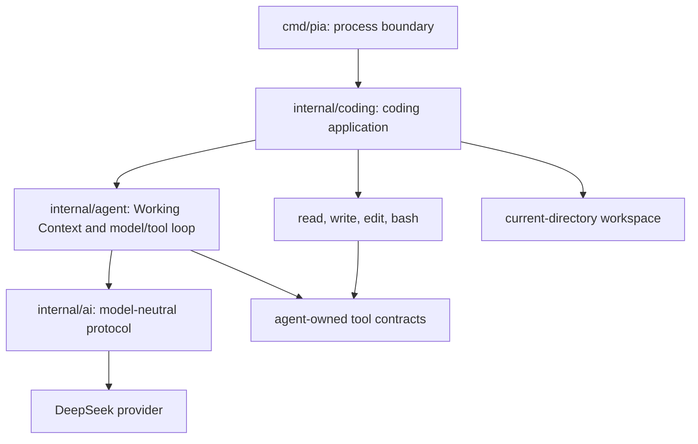
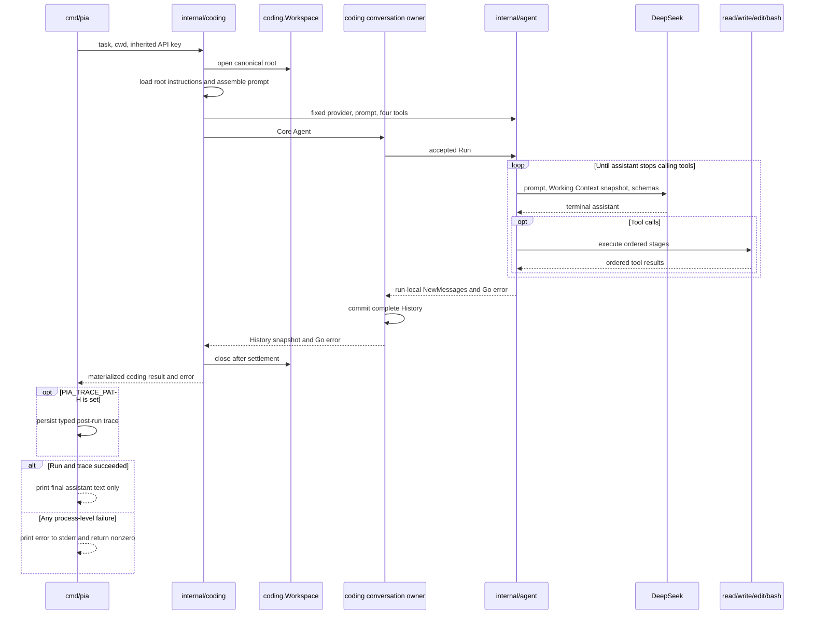
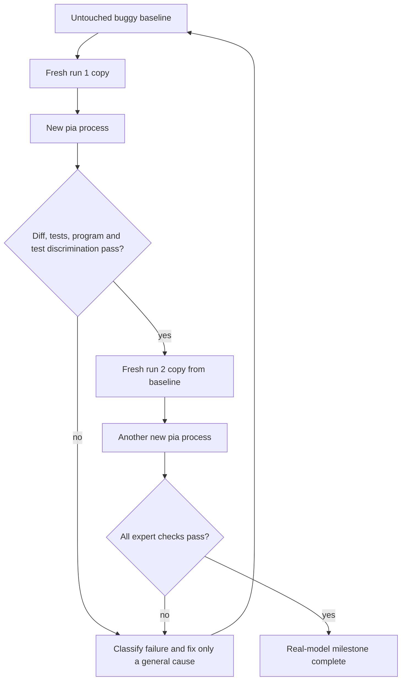

# Pia One-Shot Coding Agent - Plan

> **Post-plan correction (2026-07-20):** D59 establishes Pia as the product name while the current CLI contract remains unstable. D60 expands only `read` to absolute host paths outside the workspace; `write` and `edit` remain contained. References below to a temporary name or all file tools being workspace-only describe the Lesson 06 baseline and are superseded for current behavior.

## Goal Capsule

- **Objective:** 交付第一版可真实使用的 one-shot coding agent，让临时命令 `pia` 在当前工作目录中接收一个任务、调用 DeepSeek 和四个 coding tools，并只输出最终回答。
- **Product authority:** 本计划的 Product Contract 是本次工作的产品契约；它在冲突处取代 `docs/plans/2026-07-15-001-pi-core-go-learning-port-plan.md` 的 Lesson 06 旧设定。冻结 Pi 源码只提供语义和设计证据，不自动成为 Pia 的需求。
- **Later ownership refinement:** Lesson 07 的 D46–D51 后续修正了内部消息所有权：`internal/coding` 的私有 Conversation Owner 保存完整 History，`internal/agent` 保存 Working Context 并返回 run-local delta。本计划的 one-shot prompt、输出、trace 和验收契约不变；下文旧的“Agent owns transcript”只描述 Lesson 06 当时的实现，不再定义当前内部 API。
- **Current regression evidence:** 2026-07-20 的冻结 Pi prompt 对齐先由 fresh `attempts/005`、`006` 建立 `2/2`；随后仅做业务职责命名重构，prompt、workflow 与任务文字均未改变，但仍按 KTD8 重置计数。当前二进制又在 fresh `attempts/007`、`008` 中连续完成相同 Fibonacci 修复、测试判别和程序验证，新基线计数为 `2/2`。
- **Execution profile:** 在现有 `internal/ai`、`internal/agent`、`internal/coding` 分层上完成代码、离线测试、文档与本地真实模型验收。
- **Stop condition:** 只有两个互相独立、从原始错误项目复制出的全新 workspace 连续通过专家验收，才算达到本计划的真实模型里程碑。
- **Open blockers:** 无阻塞规划的问题；临时 trace 契约和具体文件布局可在技术规划中收敛。
- **Tail ownership:** 本次工作继续到实现、质量检查和真实验收；除非学习者另行明确要求，不 commit 或 push。

---

## Product Contract

### Summary

`pia` 是 Pia 第一阶段的临时 one-shot CLI：它把当前目录组装成 coding context，运行已有 Agent model/tool loop，并在终端只返回模型的最终回答。该版本验证 AI、Agent Core 和 Coding Application 三层能组成一个真实 coding agent，但不提前引入 TUI、Session、Goal Runtime 或公共 SDK。

### Problem Frame

Pia 已有模型协议、DeepSeek Provider、Agent loop 和 `read`、`write`、`edit`、`bash`，但还没有一个应用层把这些能力组合成操作者可运行的 coding agent。旧计划同时要求实时事件、披露警告和仓库内 acceptance harness；后续讨论确认这些要求会把第一版 one-shot CLI 推向尚无消费者的事件系统和长期评测基础设施。

第一版需要证明的是完整编码闭环，而不是 UI 或 benchmark 平台。真实成功也不能由模型最后一句话或进程退出码自证，必须由 CLI 之外的专家检查代码、测试和程序行为。

### Key Decisions

- **保留现有三层边界。** (session-settled: user-approved — chosen over 直接在 `main` 中组装全部依赖或机械复制 Pi 包名: 现有依赖方向已经表达 AI、通用 Agent 与 coding 应用的职责。) `internal/ai` 负责模型协议，`internal/agent` 负责 Working Context 和 model/tool loop，`internal/coding` 负责完整 Conversation History、workspace、coding prompt、tools 与 one-shot composition，`cmd/pia` 只负责进程边界。
- **`pia` 只是临时命令名。** (session-settled: user-directed — chosen over 在本阶段确定最终品牌名: 命名不应阻塞真实闭环。) 本阶段不围绕它建立稳定 SDK、配置命名或品牌承诺。
- **one-shot 默认只输出最终回答。** (session-settled: user-directed — chosen over 实时显示 thinking、tool call 和 bash output: 真正的实时体验留给后续 TUI。) 正常运行不显示进度，也不显示数据披露警告。
- **模型配置固定。** (session-settled: user-directed — chosen over 第一版提供模型、thinking 和 effort 配置矩阵: 单一配置更利于收敛首个真实验收。) 使用 `deepseek-v4-pro`，明确开启 thinking，并使用 high reasoning effort。
- **Coding Application 组装一个稳定 system prompt。** (session-settled: user-directed — chosen over 自由改写 Pi prompt 或完整复制 Pi resource loader: 后续横向评测需要尽量控制 prompt 与 workflow 变量。) Prompt 的 identity 只把 `pi` 替换为 `pia`，保留冻结 Pi 的 tool snippets、tool guidelines 和默认 body 顺序，再在对应 `appendSystemPrompt` seam 加入现有 headless one-shot、安全修改与验证指导；project-context framing 与 cwd 顺序保持一致，Pi docs、custom tools、Skills、extensions 和多层 resource loading 等未实现能力仍明确省略。
- **任务成功由外部验收判断。** (session-settled: user-directed — chosen over 从 assistant 文本或 Agent loop 退出推断任务成功: 模型声明与项目事实可能不一致。) 正常完成 model/tool loop 即可返回成功进程状态。
- **真实验收项目只保存在被忽略的 `tmp/`。** (session-settled: user-directed — chosen over 提交 fixture、生成器、隐藏测试或 harness: 当前目标是由专家迭代首个真实能力，而不是维护 benchmark 子系统。)
- **要求两次连续全新运行成功。** (session-settled: user-approved — chosen over 一次成功即完成: 真实模型存在随机性，一次通过不足以证明闭环已收敛。)
- **诊断采用可选的运行后 trace。** (session-settled: user-approved — chosen over 为诊断提前实现实时 Agent events 或完全没有证据: 本地迭代需要看到完整 Conversation History 和工具结果，但默认用户体验仍应安静。)

### Actors

- A1. 操作者：在目标项目目录运行 `pia "<task>"`，提供继承自 shell 的 Provider 凭据，并阅读最终回答。
- A2. Coding Application：读取 workspace context、组装 system prompt、注册 coding tools，并驱动通用 Agent。
- A3. DeepSeek：根据当前完整 Working Context snapshot 和工具 schemas 生成 assistant 文本或 tool calls。
- A4. 验收者：创建本地错误项目、独立检查 Agent 的改动和测试，并判断任务是否真实完成。

### Architecture Boundary

依赖始终向内指向既有契约。CLI 不拥有 coding prompt 或 Agent loop；Provider 不感知 workspace、任务或 coding tool 的产品语义。

### Requirements

**CLI and observable behavior**

- R1. `pia` 必须把唯一的位置参数作为任务 prompt，并把进程启动时的当前工作目录作为唯一 workspace。
- R2. 正常运行必须只向 stdout 写入最终 assistant 文本，不实时显示 reasoning、tool calls、tool results 或 bash output。
- R3. 参数、配置、Provider、协议、取消和已请求的 trace 持久化失败必须写入 stderr 并返回非零退出码；正常完成 model/tool loop 且任何已请求 trace 成功持久化时必须返回零，即使外部验收随后发现项目任务未完成。
- R4. CLI 必须把 `pia` 标注为临时名称，并且不得把当前命令形状声明为稳定公共集成契约。

**Application composition and context**

- R5. `internal/coding` 必须拥有 one-shot coding composition；`cmd/pia` 只处理参数、环境、OS signal、输出和退出状态。
- R6. Coding Application 必须向 Agent 提供一个稳定 system prompt，其中 identity 只把 `pi` 替换为 `pia`，冻结 Pi 的四工具 snippets/guidelines 与全局 guidelines 保持默认 body 顺序，pia-only guidance 在对应 append seam 加入，project-context framing 与 cwd 顺序保持一致。
- R7. 项目指令必须只读取 workspace 根目录中第一个存在的 `AGENTS.md`、`AGENTS.MD`、`CLAUDE.md` 或 `CLAUDE.MD`，优先级按此顺序；本阶段不得向祖先目录或全局资源目录扩展发现范围。
- R8. System prompt 必须以冻结 Pi 默认 prompt 为可比较基线，同时不得声称支持 Pi docs、custom tools、Skills、trust、extensions、custom prompts、Session 或其他未实现的 Pi 功能。
- R9. 通用 `internal/agent` 和 `internal/ai` 契约不得加入 workspace、CLI 或 coding-prompt 专用字段。

**Provider and execution safety**

- R10. 第一版必须固定使用 `deepseek-v4-pro`，明确启用 thinking，并请求 high reasoning effort，不提供运行时模型覆盖入口。
- R11. Provider 凭据必须只从进程继承的 `DEEPSEEK_API_KEY` 读取；程序不得解析 shell 配置文件，也不得主动把 Provider 配置中的凭据复制到参数、工具配置、Conversation History、Working Context、trace metadata、日志或错误。命令主动输出的环境内容遵循 R12，不受这一窄边界保证。
- R12. Bash 必须继续继承启动 `pia` 的完整父进程环境；Provider 生成的命令以启动用户的主机和网络权限执行，可以读取凭据、访问 workspace 外资源、连接外部服务并产生不可逆副作用。第一版不增加 sandbox、approval、secret detector 或通用 redactor。
- R13. 程序不得显示 workspace 数据披露警告或确认流程；操作者负责只在允许发送所选内容和 tool results 给 Provider 的目录运行。

**Diagnostics and acceptance**

- R14. 一个明确的开发用环境变量必须允许操作者指定本地 trace 文件；未设置时不得产生 trace 或改变默认输出。
- R15. Trace 必须在 Run 结束后记录实际 system prompt、canonical workspace、无凭据的模型与工具配置、带类型标记的完整 Conversation History 和顶层 Run error；当前 JSON 字段继续命名为 `transcript`，不要求实时事件、Session 恢复或稳定公共 schema。
- R16. 仓库必须忽略 `tmp/`；真实验收 fixture、每次运行副本和 trace 都只保存在该目录并留给操作者检查，不提交 harness 或 fixture。
- R17. 本地验收的初始项目必须是一个没有测试的可执行 Go 项目，其中公开 `Fibonacci` 实现错误；任务要求修复标准非负 Fibonacci、保留公开签名、添加有意义的测试，并运行测试和程序。
- R18. 每次真实验收必须从不可变错误基线复制全新 workspace，检查最终 diff，运行 `go test ./...` 和程序，并证明 Agent 新增的测试在原始错误实现上失败。
- R19. 在修复通用问题后，必须从原始基线完成两个连续、相互独立的成功运行；不得把针对 Fibonacci 的特殊提示或代码加入产品来换取通过。

**Quality and documentation**

- R20. 默认 Go 测试必须离线、无 API key 且不产生付费 Provider 请求；真实 DeepSeek 运行只作为显式本地验收。
- R21. 本次工作必须同步课程索引、Lesson 05 已完成状态、Lesson 06 内容、架构决定、README 和旧计划中与最终 one-shot 行为冲突的描述。
- R22. 新代码必须遵守项目 Go 质量规则，包括英文设计注释、`gofmt`、单元测试、`go vet`、lint，以及对信号、取消或进程行为变更执行 race tests。

### Key Flows

- F1. One-shot execution
  - **Trigger:** A1 在目标项目目录运行 `pia "<task>"`。
  - **Actors:** A1、A2、A3
  - **Steps:** CLI 校验参数和环境 → Coding Application 打开当前 workspace 并组装 context → Agent 反复调用 Provider 和工具 → 不再有 tool call 时返回最终 assistant → CLI 只打印最终文本。
  - **Outcome:** 进程状态只表达运行闭环是否正常结束，不替代项目验收。
  - **Covered by:** R1-R13
- F2. Opt-in diagnosis
  - **Trigger:** 开发者在运行前设置 trace 路径。
  - **Actors:** A1、A2
  - **Steps:** 正常执行 one-shot loop → Run 收敛 → 将完整诊断记录写到本地目标 → stdout/stderr 仍遵守默认契约。
  - **Outcome:** 开发者能区分 prompt、Provider、Agent loop 和 tool 失败，而无需先实现实时事件系统。
  - **Covered by:** R14-R16
- F3. Expert acceptance loop
  - **Trigger:** 第一版实现通过离线质量检查。
  - **Actors:** A1、A3、A4
  - **Steps:** 从错误基线复制新项目 → 运行固定任务 → 检查代码和测试 → 独立验证 → 将失败归因到 task prompt、system prompt、模型/Provider、Agent loop、tool 或随机性 → 只修复可泛化原因 → 在全新副本重试。
  - **Outcome:** 两次连续独立成功后，真实 coding-agent 里程碑成立。
  - **Covered by:** R17-R22

### Acceptance Examples

- AE1. **Covers:** R1-R3. **Given** 当前目录是目标 Go 项目且凭据有效，**when** Agent 正常完成若干工具轮次，**then** stdout 只包含最终 assistant 文本，stderr 为空且退出码为零。
- AE2. **Covers:** R3. **Given** Agent 正常结束但生成的 Fibonacci 代码仍然错误，**when** CLI 返回，**then** 它仍可返回零；随后由 A4 的独立测试判定该次任务失败。
- AE3. **Covers:** R7. **Given** 根目录同时存在 `AGENTS.md` 和 `CLAUDE.md`，**when** Coding Application 组装 prompt，**then** 只使用 `AGENTS.md`；子目录或祖先目录同名文件不参与发现。
- AE4. **Covers:** R3, R11. **Given** `DEEPSEEK_API_KEY` 没有被启动进程继承，**when** 操作者运行 `pia`，**then** Provider 不启动，错误写入 stderr，退出码非零，程序也不读取 `.zshrc` 补救。
- AE5. **Covers:** R14-R16. **Given** 未设置 trace 路径，**when** Agent 运行，**then** 不产生 trace artifact；设置后，同一运行在结束时留下完整本地 Conversation History 和工具证据，但不额外打印实时进度。Bash 既有的截断输出临时文件不属于 trace 契约。
- AE6. **Covers:** R17-R19. **Given** Agent 添加的测试在修复后通过，**when** A4 把这些测试放回原始错误实现，**then** 至少一个测试失败，否则该次验收因测试无辨别力而失败。
- AE7. **Covers:** R19. **Given** 一次全新运行已通过，**when** 第二次运行从另一个原始基线副本开始，**then** 只有第二次也独立通过所有检查才达到真实验收停止条件。
- AE8. **Covers:** R3、R22. **Given** 操作者在 Provider 或 tool 执行期间发送中断信号，**when** Run 收敛，**then** CLI 返回取消错误和非零状态，不把中止伪装成正常最终回答。

### Success Criteria

- 所有离线测试、vet、lint 和适用的 race tests 通过，且默认验证不读取 API key 或访问网络。
- `pia` 的正常输出与错误输出符合 final-only one-shot 契约，Coding Application、Agent Core 和 AI Provider 的职责没有泄漏到相邻层。
- 本地 Fibonacci 项目在两个连续全新副本中均被真实 `deepseek-v4-pro` 修复，Agent 添加的测试能识别原始 bug，最终程序输出 `55`。
- 每次失败都能通过本地 trace 和最终 workspace 归因；为通过验收所做的产品修复具有通用性。
- 仓库不包含 acceptance fixture、harness、真实 trace、凭据或 TUI/Session/Goal Runtime 的提前实现。

### Scope Boundaries

**Deferred for later**

- TUI、interactive REPL、实时 reasoning/tool/bash 展示和 Agent event sink。
- 多轮 CLI Session、持久化、恢复、compaction、steering、follow-up 和 Goal Runtime。
- 自动 wall-clock、model-turn 或 token/cost execution budget；第一版依赖 operator signal cancellation。
- 模型选择、thinking/effort 配置、多 Provider CLI 与公共配置格式。
- 稳定 trace/event schema、JSON output mode、正式 benchmark/eval harness。
- 权限审批、trust、sandbox、secret scanning/redaction 和 workspace 披露确认。
- Pi 的完整 resource loader，包括 Skills、全局资源、祖先 context、custom/append prompt 和 extensions。

**Outside this milestone**

- 公共 Go SDK、RPC、IM adapters、Agent Manager、多租户、worktree 和 GitHub 自动化。
- 机械复制 Pi 的 TypeScript 包结构、CLI 全功能或产品身份文案。
- 以一次模型成功、assistant 自述或固定工具调用顺序作为任务完成证据。

### Dependencies and Assumptions

- 冻结 Pi 源码为 commit `dcfe36c79702ec240b146c45f167ab75ecddd205`，Agent package version `0.80.7`。
- DeepSeek 官方文档将 `deepseek-v4-pro` 作为模型 ID，并要求 thinking tool-call 后续请求回传完整 `reasoning_content`；现有 Provider 已实现该协议基础。
- 实际验收机器可通过启动 shell 向进程提供 `DEEPSEEK_API_KEY`；必要时验收命令使用 interactive zsh，但产品代码不依赖 zsh。
- 本地真实模型响应具有随机性，因此两次连续成功是当前人工里程碑，不是统计上稳定的 benchmark 结论。

### Sources and Research

- `docs/plans/2026-07-15-001-pi-core-go-learning-port-plan.md`：已有课程与架构契约，以及本计划需要显式修正的 Lesson 06 旧设计。
- `internal/ai/`、`internal/agent/`、`internal/coding/`：当前三层代码与依赖方向。
- 冻结 Pi 的 `packages/coding-agent/src/core/system-prompt.ts`、`packages/coding-agent/src/modes/print-mode.ts`、`packages/agent/src/agent-loop.ts`：system prompt ownership、print-mode 输出和通用 loop 的来源证据。
- [DeepSeek V4 release notes](https://api-docs.deepseek.com/news/news260424/)：V4 系列与 `deepseek-v4-pro` 模型说明。
- [DeepSeek thinking mode guide](https://api-docs.deepseek.com/guides/thinking_mode/)：thinking、tool calls 与 `reasoning_content` 回传要求。
- [DeepSeek model list API](https://api-docs.deepseek.com/api/list-models/)：模型 ID 的运行时查询入口。

---

## Planning Contract

### Product Contract Preservation

Product Contract changed in R3, R11, R12 and R15 without changing the settled product shape. R3 reconciles requested trace failure with process exit semantics; R11 distinguishes application-owned credential propagation from unredacted command output; R12 names the Provider-generated command's existing host and network authority; R15 names the context required to diagnose system-prompt failures. These are conflict-resolving clarifications of the settled execution, trust and trace boundaries; all stable IDs remain unchanged.

### Key Technical Decisions

- KTD1. **Preserve the existing three-layer boundary.** `internal/coding` composes the coding application over `internal/agent`, while `internal/agent` continues to depend only on model-neutral `internal/ai`; `cmd/pia` remains a host adapter. (session-settled: user-approved — chosen over assembling all behavior in `main` or copying Pi package names: the current dependency direction already expresses the intended responsibilities.)
- KTD2. **Keep `pia` temporary.** The name appears in the local command, help/error context and docs, but does not create public packages, stable config or compatibility promises. (session-settled: user-directed — chosen over blocking this milestone on final branding: naming should not delay the real loop.)
- KTD3. **Project only the final answer.** The one-shot path consumes the complete Conversation History snapshot after Run settlement and never adds an Agent event sink or Tool progress callback. (session-settled: user-directed — chosen over live thinking, tool-call and bash display: real-time presentation belongs to a future TUI consumer.)
- KTD4. **Freeze the first product model.** The coding composition uses `deepseek-v4-pro` with DeepSeek thinking enabled and `reasoning_effort=high`; the lower Provider stays configurable for its existing tests and other internal consumers. (session-settled: user-directed — chosen over a Phase 1 model and reasoning configuration matrix: one fixed profile makes the first real acceptance comparable.)
- KTD5. **Preserve an adapted frozen-Pi system prompt.** The coding-owned prompt changes only `pi` to `pia` in the identity, keeps the frozen Pi four-tool/default-guideline body contiguous, appends explicit pia/headless/safety guidance at Pi's application-specific seam, and preserves project-context framing and canonical cwd order. Agent and Provider contracts still receive one string, and unsupported Pi product sections remain absent. (session-settled: user-directed — chosen over free-form Pia wording or copying Pi's complete resource loader: later horizontal evaluation needs prompt differences to stay narrow and attributable.)
- KTD6. **Keep process success separate from task success.** A nil Agent Run error maps to a zero CLI exit even when later expert checks reject the code; no assistant phrase, tool sequence or Goal Runtime field can self-certify the task. (session-settled: user-directed — chosen over inferring success from the assistant response or loop termination: repository facts are authoritative.)
- KTD7. **Keep real acceptance local and ignored.** Only `.gitignore` changes in the repository; baseline, run copies, prompts and traces live under ignored `tmp/` and no fixture or harness package is added. (session-settled: user-directed — chosen over a tracked benchmark fixture and hidden harness: the current milestone needs expert iteration, not permanent eval infrastructure.)
- KTD8. **Require two fresh consecutive successes.** Each success starts a new `pia` process and copies the same untouched baseline; any product code, system prompt or acceptance-task change resets the count. (session-settled: user-approved — chosen over accepting one successful model sample: one pass is too sensitive to model variance.)
- KTD9. **Use an opt-in post-run trace.** The trace captures the settled coding context and complete Conversation History without changing stdout/stderr or introducing real-time events. Its JSON field remains named `transcript`; it is deliberately created after settlement as diagnostics, not reserved before Run as an execution or audit gate. (session-settled: user-approved — chosen over speculative event infrastructure or no diagnostic evidence: prompt and loop iteration need a local audit trail.)
- KTD10. **Let one coding Run own the workspace lifetime.** The coding application opens one canonical `Workspace`, constructs the four existing tools and Agent, waits for Run settlement, materializes the result, then closes the workspace and joins cleanup failures without hiding the primary error. This follows `internal/coding/workspace.go` and the settlement patterns already used by the Agent and Bash.
- KTD11. **Inject Faux only behind the package test seam.** The exported Phase 1 coding entry constructs the fixed DeepSeek product profile; an unexported provider-injected path gives `internal/coding` deterministic integration tests without exposing Provider selection as a `pia` feature.
- KTD12. **Keep one-shot product concerns out of generic AI and Agent contracts.** Final projection, typed trace conversion and project-context loading remain coding-application concerns; `internal/agent/events.go`, new request fields and workflow-specific tools are out of scope. Lesson 07 later changed the generic ownership/result contract for its own context-boundary requirement, not for one-shot presentation.
- KTD13. **Keep lifecycle and product-configuration seams private and narrow.** Offline tests may inspect the fixed DeepSeek configuration and control an owned workspace's close path, but those seams stay package-private and do not become Provider/workspace interfaces for application callers.

### High-Level Technical Design

The one-shot process now composes a coding-owned Conversation History around the Core Agent Working Context while preserving the same observable lifecycle:

Real-model acceptance is intentionally an expert loop rather than a committed test harness:

### Assumptions

- Root project instructions are limited to 50 KiB, must be valid UTF-8 and must resolve through the pinned `os.Root` to a regular file. Only a genuinely absent candidate falls through to the next name; an existing but invalid, unreadable or escaping higher-priority candidate fails before the first Provider request.
- `PIA_TRACE_PATH` is an intentionally unstable development variable. Relative paths resolve from the launch cwd; the writer creates a new `0600` file, rejects an existing target, does not create parent directories and removes a partial file after an encode/close failure.
- Once an Agent Run was accepted, trace generation is attempted after Run and workspace settlement even for Provider failure or cancellation. A requested trace failure makes the process nonzero and suppresses final stdout, but it cannot roll back workspace mutations already committed by tools.
- Trace finalization is a bounded synchronous post-Run operation and does not reuse the already-canceled Run context; otherwise the cancellation evidence it exists to preserve could never be written.
- Trace data uses explicit role and content-type discriminators. Tool-call arguments are stored as strings so malformed model arguments cannot invalidate the enclosing JSON; the trace includes reasoning and may contain source, commands, tool output or secrets that a command deliberately printed.
- The CLI accepts exactly one non-blank raw positional argument, including a value beginning with `-`; it does not add flags. Argument validation precedes key and workspace checks.
- `SIGINT` and `SIGTERM` cancel the Run through context and return a nonzero status after settlement. Phase 1 does not stabilize platform-specific numeric exit codes.
- Phase 1 does not add an automatic wall-clock or model-turn budget. An unexpectedly long silent Run remains operator-cancelable through `SIGINT`/`SIGTERM`; automatic budgets require separate product semantics for partial work and are deferred.

### Implementation Constraints

- Reuse `internal/coding/tools/fileutil.OpenRegularFile` for pinned, nonblocking regular-file validation; do not duplicate FIFO/symlink opening policy or relocate the package without new evidence.
- Reuse the actual `Tool.Definition` schemas in Agent requests and trace context. Keep the separate model-visible snippets and guidelines limited to the four frozen-Pi prompt entries, with an exact adapted-baseline test so later wording drift is deliberate and reviewable.
- Keep API key values out of result and trace metadata. The no-redactor boundary intentionally allows model-requested commands to copy inherited environment data into ordinary tool results.
- Keep code comments in English and explain only evidence-backed, non-obvious choices such as stable prompt snapshots, no-fallback context precedence, post-settlement trace timing and the temporary command/model configuration.
- Do not add Fibonacci wording, result values or acceptance-specific behavior to production prompt or code.

### System-Wide Impact

- **Prompt context:** Every Provider turn receives the same pre-Run prompt snapshot even if a tool later edits a root instruction file; this preserves the Agent's stable prompt contract.
- **Credential boundary:** `pia` reads the key from its parent process and passes it only to Provider configuration, while Bash independently inherits the same parent environment. Documentation must not describe this as credential isolation.
- **Trust and egress boundary:** The task, canonical host path, selected root instruction file, tool schemas and current Working Context are model-visible automatically. The complete Conversation History is not a separate Provider field; before compaction the current coding composition projects the same messages into Working Context. Other workspace files and the parent environment are not automatic context, but root instructions or Provider-generated tool calls can use unsandboxed Bash with the invoking user's host and network authority to expose or mutate them. Resulting output can reach later Provider requests, trace, final text and Bash's existing full-output temp file. Phase 1 therefore trusts the selected workspace, its root instructions and the Provider; workspace trust is not containment.
- **Filesystem lifecycle:** File tools share one borrowed `os.Root`; Bash uses the same canonical host path. The coding Run owns closing the root only after Provider and tool work has settled.
- **Diagnostics:** A trace is a sensitive diagnostic artifact, not a guaranteed audit trail, safe log or stable machine interface. Its path is validated only after Run settlement, so failure to write it affects process status and suppresses final stdout but never reverts completed Provider calls or tool side effects. Mode `0600` restricts new-file access; it does not encrypt, redact, rotate or delete the artifact.
- **Course authority:** U1 aligned `AGENTS.md`, the older Phase 1 plan and course records before implementation. Lesson 07 later refined only internal message ownership through D46-D51; the one-shot prompt, output, trace and acceptance contract remains authoritative here.

### Risks and Mitigations

| Risk | Consequence | Mitigation |
|---|---|---|
| DeepSeek model or thinking protocol changes | Real runs fail despite offline composition tests | Keep protocol fixtures offline, cite current official V4 contracts and use the real `pia` acceptance after all local gates |
| Prompt wording is too weak or too prescriptive | The model misses the task or overfits the fixture | Keep a small Pi-grounded semantic prompt, inspect typed traces and change only general guidance |
| Trace captures sensitive data | Local source, reasoning, command output or printed environment secrets persist on disk | Make trace opt-in, new-file-only and `0600`; document that it has no general redactor |
| Trace persistence fails after tools mutate files | Process reports failure although workspace changes exist | Write after settlement, return nonzero, retain the primary Run cause and state clearly that no rollback occurs |
| Trusted project instructions or model commands exfiltrate host data | Unsandboxed Bash can expose inherited secrets or outside-workspace resources to the Provider and local artifacts | State the complete trust boundary, test automatic versus tool-mediated context, and require operators to select trusted workspaces/instructions; sandbox and approval remain deferred |
| A Provider-generated command mutates host resources or makes network requests | The command has the invoking user's authority, so effects can escape the workspace and cannot be rolled back by `pia` | Document Provider trust and host/network authority explicitly; keep sandbox, approval and rollback outside Phase 1 |
| Trace is mistaken for a complete audit trail | An invalid target is discovered after Provider/tool effects, or Bash separately retains truncated full output | Describe both persistence channels and post-Run validation; never claim trace opt-in controls or captures all local evidence |
| A silent Provider/tool loop runs longer than intended | Cost or side effects continue until the current turn settles or the operator intervenes | Preserve signal cancellation and document that Phase 1 has no automatic turn/time budget; design budgets only with explicit partial-work semantics |
| Bash accesses resources outside workspace | Acceptance checks cannot prove host containment | Preserve the settled unsandboxed boundary and judge only the selected fixture's observable result |
| Project instruction candidate is unsafe or oversized | Startup blocks, escapes context or sends unbounded data | Reuse nonblocking opened-handle validation, enforce the 50 KiB UTF-8 limit and fail before Provider access |
| A single lucky model run hides instability | Milestone appears complete without a repeatable loop | Reset on any product/task change and require two consecutive fresh-process successes |

### Sources Shaping the Plan

- `internal/coding/workspace.go`, `internal/coding/tools/*/tool.go` and `internal/agent/types.go` establish the existing composition inputs and resource ownership.
- `internal/agent/loop.go` and `internal/agent/tool.go` establish terminal-message, run-local delta, call-local failure and cancellation settlement behavior.
- `internal/ai/provider/deepseek/provider.go` and `internal/ai/provider/openaicompatible/request.go` already support fixed model input, thinking and reasoning replay.
- Frozen Pi `packages/coding-agent/src/core/system-prompt.ts` and `packages/coding-agent/src/modes/print-mode.ts` support coding-owned prompt assembly and final-only print behavior without requiring a literal package port.
- DeepSeek's V4 release, thinking guide and model-list references in the Product Contract determine the current model and replay constraints.

---

## Implementation Units

### U1. Align the authoritative Lesson 06 contract

**Goal:** Remove active repository instructions that still require the superseded command path, live events, a startup warning or a tracked acceptance harness before implementation follows them accidentally.

**Requirements:** R4, R13, R16, R21; KTD2, KTD3, KTD7, KTD12.

**Dependencies:** None.

**Files:** `AGENTS.md`, `.gitignore`, `README.md`, `docs/course/README.md`, `docs/course/decisions.md`, `docs/course/lessons/05-coding-tools.md`, `docs/course/lessons/06-headless-coding-task.md`, `docs/plans/2026-07-15-001-pi-core-go-learning-port-plan.md`.

**Approach:** Before implementation, make the new plan the Lesson 06 authority and align every active README, course index, lesson and decision record that still requires the old command/output/warning/fixture behavior. Preserve earlier Agent/tool semantics and add `tmp/` to the root ignore rules. U5 may finish teaching and completion-status details in the same files after implementation. `CLAUDE.md` remains the existing symlink to `AGENTS.md` and is not edited separately.

**Patterns to follow:** Use the correction style already present in `docs/course/decisions.md`: state the new current decision and why previous evidence no longer applies rather than stacking contradictory addenda.

**Test scenarios:** Test expectation: none -- this unit changes authority and ignored-local-artifact policy, not runtime behavior.

**Verification:** A repository search finds no active Phase 1 requirement for the superseded command path, live bash display, startup data warning, checked-in acceptance fixture or event sink; `git check-ignore` confirms paths under `tmp/` are ignored.

### U2. Build the coding system prompt and root context loader

**Goal:** Produce one stable, bounded coding prompt from actual Phase 1 capabilities and the selected workspace.

**Requirements:** R6-R9, R20, R22; F1; AE3; KTD1, KTD5, KTD12.

**Dependencies:** U1.

**Files:** `internal/coding/prompt.go`, `internal/coding/prompt_test.go`.

**Approach:** Start from the frozen Pi default prompt structure and reusable identity/tool/guideline wording. Replace only `pi` with `pia` in the identity, omit unsupported Pi product sections, append the existing pia headless/safety guidance after the contiguous default body, and preserve Pi-style project-context framing/cwd placement around one optional root instruction file. Discover the first candidate by `Lstat`, open it through the existing workspace root regular-file helper, enforce the 50 KiB UTF-8 contract, and keep the resulting string unchanged for the Run.

**Execution note:** Start with prompt and context-precedence tests so size, invalid-file and no-fallback behavior are settled before Runtime composition.

**Patterns to follow:** Mirror `internal/coding/workspace_test.go` for canonical symlink paths and `internal/coding/tools/read/boundary_test.go` plus `fileutil.OpenRegularFile` for internal/escaping symlink and non-regular behavior.

**Test scenarios:**

1. With no instruction candidate, the complete string matches the reviewed frozen-Pi baseline plus explicit pia adaptations, contains exactly the four real tool names and canonical cwd, and has no empty project-context section.
2. Covers AE3. With both `AGENTS.md` and `CLAUDE.md`, only the former is embedded; with only `CLAUDE.MD`, that candidate is embedded; newline-terminated content retains Pi's additional template framing newline.
3. Ancestor and child-directory instruction files are ignored, and a symlink cwd produces the canonical workspace path.
4. An internal symlink to a regular instruction file succeeds; an escaping or dangling higher-priority symlink fails without exposing target content or falling back.
5. A directory, FIFO, unreadable file, invalid UTF-8 or content over 50 KiB fails before any Provider request and does not fall through to a valid lower-priority candidate.
6. Editing the instruction file after prompt assembly cannot change the string used by later Provider turns.

**Verification:** Prompt tests prove stable single-string assembly, exact candidate precedence, bounds and pinned workspace behavior without changing `internal/ai` or `internal/agent`.

### U3. Compose the one-shot coding Run and typed diagnostics

**Goal:** Own the complete DeepSeek/Agent/tool/workspace lifecycle and return enough settled data for final projection and local diagnosis.

**Requirements:** R5, R8-R12, R15, R20, R22; F1-F2; AE2, AE4, AE8; KTD1, KTD4-KTD6, KTD9-KTD12.

**Dependencies:** U2.

**Files:** `internal/coding/runtime.go`, `internal/coding/conversation.go`, `internal/coding/runtime_test.go`, `internal/coding/conversation_test.go`, `internal/coding/trace.go`, `internal/coding/trace_test.go`.

**Approach:** The exported product Run validates the DeepSeek key, obtains the fixed product configuration through a package-private helper, opens one Workspace, builds all four tools and one Core Agent, and drives it through a private coding-owned Conversation Owner before closing the Workspace after settlement. Narrow package-private seams enable Faux composition tests and close-order/error tests without exposing Provider or workspace selection. The result keeps canonical workspace, actual prompt, model/tool context and complete History snapshot without duplicating final text; only after a nil Run error does coding-owned projection scan backward for the last assistant and concatenate its text blocks. An explicit typed trace DTO represents all message/content variants and the top-level error without modifying generic protocol types.

**Execution note:** Prove the multi-turn composition with Faux before invoking DeepSeek; use real temp workspaces so tool side effects, prompt context and cleanup share the production path.

**Patterns to follow:** Reuse Faux request snapshots from `internal/ai/provider/faux`, Agent tool-loop scripts from `internal/agent/tool_loop_test.go`, cross-tool effects from `internal/coding/tools/bash/integration_test.go`, and `errors.Join` cleanup precedence from Bash process code.

**Test scenarios:**

1. A Faux run observes the same system prompt and four real schemas on every request, with complete ordered Working Context growth across read, edit, write and bash stages.
2. Tool mutations are visible to later tools in the same canonical workspace, and the final on-disk state matches the complete Conversation History serialized in the trace `transcript` field.
3. Thinking and earlier assistant text remain in diagnostic data, while final projection concatenates only the last terminal assistant's text blocks in source order.
4. A normal empty assistant projects an empty string; a `length` terminal projects its completed text and remains a nil Run error.
5. Provider failure, malformed protocol and cancellation return a materialized complete Conversation History plus an error; completed tool calls receive existing settlement results and no final text is projected by the caller.
6. A root instruction file changed by a tool does not alter the stable prompt in subsequent requests.
7. Any construction, Run or cancellation path closes the Workspace only after workers and Bash settle; the private ownership seam proves the root stays usable through settlement, becomes closed afterward, and a cleanup failure joins rather than replaces the primary cause.
8. The typed trace covers user, assistant text, thinking, valid or malformed tool-call arguments, tool results, usage, stop reason and top-level error while never copying the configured fake API key into metadata.
9. A capture Provider proves the initial request contains the task, prompt, canonical path and schemas but not an unrelated file or environment sentinel; after a tool explicitly returns the sentinel, the next request contains it.
10. A configured fake credential that no component emits is absent from coding-owned request data, Working Context, Conversation History and trace metadata, while a different synthetic secret deliberately returned by a tool remains in the next request and trace, documenting the no-general-redactor boundary.
11. The private product-config helper fixes the exact model ID `deepseek-v4-pro` and reasoning effort `high`; existing DeepSeek profile tests remain the authority that thinking is enabled on the wire.
12. Error and cancellation Conversation Histories ending in not-executed tool results remain available to trace, while the CLI never invokes or emits final projection when the composed Run error is non-nil.

**Verification:** Offline coding tests prove shared context/action parity, final projection, trace completeness and lifecycle settlement; existing DeepSeek request tests continue to prove thinking/high serialization and reasoning replay.

### U4. Add the temporary `pia` process host

**Goal:** Expose the one-shot coding Run with exact argument, environment, signal, output, trace-file and exit contracts.

**Requirements:** R1-R4, R10-R15, R20, R22; F1-F2; AE1, AE2, AE4, AE5, AE8; KTD2-KTD4, KTD6, KTD9.

**Dependencies:** U3.

**Files:** `cmd/pia/main.go`, `cmd/pia/main_test.go`, `cmd/pia/trace.go`, `cmd/pia/trace_test.go`.

**Approach:** Keep `main` to creating a `SIGINT`/`SIGTERM` context and passing its exit status to `os.Exit` only after the unexported driver has returned. The driver validates one raw task, reads the inherited key and cwd, calls the coding application, optionally persists a new `0600` typed trace, then writes either final text to stdout or an error to stderr. Test seams inject environment/cwd/coding functions without adding public runtime interfaces or network calls.

**Execution note:** Test process mapping independently from model intelligence; CLI tests remain offline and drive success/error/cancel results through injected coding functions.

**Patterns to follow:** Follow Go's `signal.NotifyContext` and writer-injected command tests; keep Provider error redaction in the existing OpenAI-compatible layer rather than adding a second CLI redactor.

**Test scenarios:**

1. Zero, two and blank arguments fail before key lookup or coding execution; a single task beginning with `-` is passed through unchanged.
2. Missing or blank `DEEPSEEK_API_KEY` writes no stdout, performs no network or trace work, and returns nonzero without reading shell configuration.
3. Covers AE1. A successful multi-turn result prints only final text plus one trailing newline; thinking, tool calls, tool results and bash output never appear on stdout or stderr.
4. Empty final text returns zero with zero-byte stdout; a `length` terminal prints its formed text under the existing Agent completion semantics.
5. Covers AE2. A nil coding Run error maps to zero without inspecting files, tool results or assistant claims for task success.
6. Provider/protocol/cancel errors suppress all assistant text, write the error to stderr and return nonzero while preserving the context cause internally.
7. `SIGINT` and `SIGTERM` cancel Provider and Bash phases through context, allow settlement and trace, and do not freeze a platform-specific numeric exit code.
8. Covers AE5. With no trace variable, no trace artifact is created; with a fresh path, success and failure traces contain actual coding context and do not change normal output.
9. An existing regular file, symlink, directory, special file, missing-parent or unwritable trace path is rejected without modifying its target; any partial newly created file is removed.
10. If Run and trace both fail, stderr reports both while the error chain retains the primary Run/cancel cause; if only trace fails after a successful Run, final stdout is suppressed and workspace side effects remain documented as non-rollbackable.
11. A canceled Run can still persist its settled partial Conversation History and top-level cancellation cause because trace finalization does not inherit the canceled Run context.
12. A process-boundary test exercises the real signal-context helper for both `SIGINT` and `SIGTERM`, proving the host wiring cancels before `os.Exit` can terminate cleanup.

**Verification:** Command tests lock final-only output and failure ordering; a local build produces `pia` without adding flags, public SDK or event infrastructure.

### U5. Complete course records and real-model acceptance

**Goal:** Teach and document the implemented design, then prove the real agent can repair the agreed project twice from clean state.

**Requirements:** R16-R22; F3; AE6-AE7; KTD2-KTD9.

**Dependencies:** U4.

**Files:** `README.md`, `docs/course/README.md`, `docs/course/decisions.md`, `docs/course/lessons/05-coding-tools.md`, `docs/course/lessons/06-headless-coding-task.md`; local-only `tmp/pia-acceptance/` artifacts are intentionally untracked.

**Approach:** Mark Lesson 05's Bash commit accurately, add a Lesson 06 record explaining Pi similarities and deliberate differences, and document the temporary name, current-directory invocation, fixed model, final-only output, complete Bash/Provider host-and-network authority, lack of automatic execution budget, Bash full-output temp files and sensitive trace retention. Create one ignored immutable Fibonacci baseline and fresh run directories, use the fixed task wording from R17, and retain every final workspace and trace for learner inspection.

**Execution note:** Real DeepSeek calls begin only after all offline gates pass. After any generalized code, prompt or task correction, discard the prior streak and restart both acceptance runs from the untouched baseline.

**Patterns to follow:** Course records separate frozen Pi evidence, candidate Go mechanisms and settled Pia decisions. The local fixture follows the existing repo's module conventions but is not copied into tracked `testdata`.

**Test scenarios:**

1. The baseline has `go.mod`, an executable calling `Fibonacci(10)`, an incorrect nonnegative `Fibonacci` implementation and no tests; the fixed task states `F(0)=0`, `F(1)=1`, signature preservation, test creation and program/test execution without listing exact test cases.
2. Each run starts a separate `pia` process and a new copy directly from baseline, not from a prior Agent-modified workspace.
3. Covers AE6. Agent-created tests pass against the fixed implementation and at least one fails when moved back onto the original buggy implementation.
4. Expert verification reviews the diff, runs all project tests, runs the executable and observes `55`; it does not require a particular tool name, order or assistant statement.
5. Covers AE7. Two consecutive fresh runs pass every check after the final product/prompt/task revision; any intervening failure or revision resets the count.
6. The tracked tree contains no Fibonacci-specific product code, acceptance fixture, harness, task file or real trace, and ignored local evidence remains available for learner review.

**Verification:** Lesson and repository docs agree with the final code; both retained clean-run workspaces pass expert validation and prove test discrimination; no acceptance artifact appears in `git ls-files`.

**Execution result (2026-07-19):** After the final product, prompt and task freeze, `attempts/001` and `attempts/002` each started a new `pia` process from a fresh copy of the untouched baseline. Both produced a general non-negative Fibonacci base-case fix, added meaningful table tests, passed `go test ./...`, and printed `55` from `go run .`; moving each generated test file back onto its original buggy copy failed on incorrect Fibonacci values. The retained evidence is under ignored `tmp/pia-acceptance/attempts/{001,002}` and `tmp/pia-acceptance/evidence/{001,002}.json`, and no acceptance artifact is tracked.

**Prompt-alignment execution result (2026-07-20):** After a line-by-line frozen-Pi review, the final prompt narrowed identity to `pi -> pia`, moved all pia-only guidance to the application append seam, and restored instruction-content newline framing. `attempts/005` and `attempts/006` then used the same rebuilt binary and unchanged task in separate fresh baseline copies. Both produced a general non-negative Fibonacci base-case fix, added meaningful tests, passed `go test ./...`, printed `55`, and supplied tests that failed on the original buggy implementation. The retained evidence is under ignored `tmp/pia-acceptance/attempts/{005,006}` and `tmp/pia-acceptance/evidence/{005,006}.json`.

**Identifier-naming follow-up result (2026-07-20):** A responsibility-based rename removed reference-implementation names from Go identifiers and tests without changing the prompt text, workflow or acceptance task. KTD8 nevertheless reset the streak because product source changed. The rebuilt binary then passed fresh `attempts/007` and `008`: both fixed the general non-negative Fibonacci base case, added tests that failed on the original buggy implementation, passed `go test ./...`, and printed `55`. Their normalized system prompts match the `006` prompt, and both traces retain the same model and four-tool contracts. Evidence remains ignored under `tmp/pia-acceptance/attempts/{007,008}` and `tmp/pia-acceptance/evidence/{007,008}.json`.

---

## Verification Contract

| Gate | Applies to | Required evidence |
|---|---|---|
| `git diff --check` | U1-U5 | No whitespace errors or malformed patch residue |
| `make check` | U2-U4 and final tree | `go fmt ./...`, `go vet ./...`, `go test ./...` and `golangci-lint run ./...` all succeed offline |
| `go test -race ./...` | U3-U4 and final tree | Runtime cancellation, signal plumbing and existing process/tool concurrency remain race-free |
| Focused prompt/runtime/CLI tests | U2-U4 | Context precedence, four-tool composition, final-only projection, trace and error/cancel paths match each unit's scenarios |
| `go build ./cmd/pia` | U4 | The temporary command builds without public packages or runtime flags |
| Documentation consistency scan | U1, U5 | Active docs no longer require the superseded command path, live events, startup warning or tracked fixture; Lesson 05 commit and Lesson 06 status are accurate |
| Ignore/tracked-tree check | U1, U5 | `tmp/` is ignored and no baseline, run, harness or trace is tracked |
| Real DeepSeek run 1 | U5 | Fresh process/workspace passes diff, project tests, program output `55` and buggy-implementation test discrimination |
| Real DeepSeek run 2 | U5 | A second baseline copy and new process independently pass the same checks with no intervening product/prompt/task change |

Default verification never reads `DEEPSEEK_API_KEY` or contacts the network. Real acceptance is a separate explicit local operation; when the key only exists in `.zshrc`, the acceptance launcher may use interactive zsh to export it before starting `pia`, while production code only reads its inherited environment.

---

## Definition of Done

- Product Contract R1-R22, Flows F1-F3 and Acceptance Examples AE1-AE8 are traced to active implementation units and observable evidence.
- U1 has removed all active Lesson 06 contract conflicts and established `tmp/` as ignored local evidence space.
- U2 produces one stable Pi-grounded prompt with canonical cwd, exact root-file precedence, bounded UTF-8 context and no unsupported feature claims.
- U3 composes fixed DeepSeek, one Workspace, all four real tools, the Core Agent loop and the private Conversation Owner; its typed result and trace preserve complete settled History/error semantics while generic ownership follows Lesson 07.
- U4 builds a temporary `pia` command whose success output contains only final assistant text and whose configuration, trace or Run failures are stderr/nonzero.
- U5 leaves accurate course records and two retained, independent successful acceptance workspaces whose Agent tests expose the original bug and whose executable prints `55`.
- All Verification Contract gates pass after the final code, prompt, task and documentation state; any change that can affect model behavior invalidates earlier real-run evidence.
- No API key is stored in explicit trace metadata, argv, tool configuration, tracked files, logs or error strings; documentation states that inherited environment data deliberately printed by a command is not redacted.
- The final diff contains no event sink, TUI, Session, Goal Runtime, model/config matrix, public SDK, tracked harness, Fibonacci-specific product behavior or abandoned experimental code.
- Local acceptance artifacts remain under ignored `tmp/` for learner inspection, and no commit or push occurs without a new explicit learner request.
