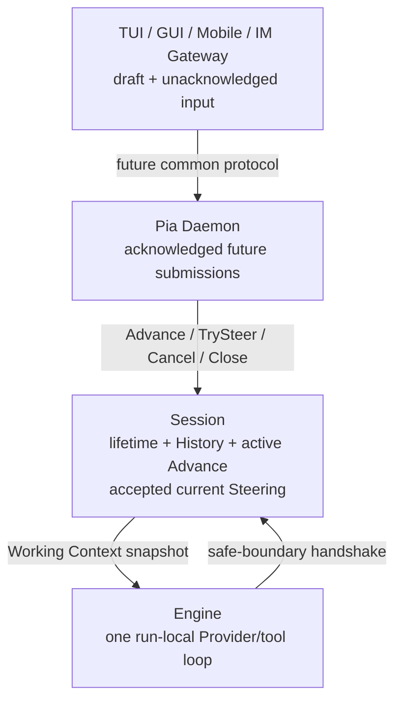
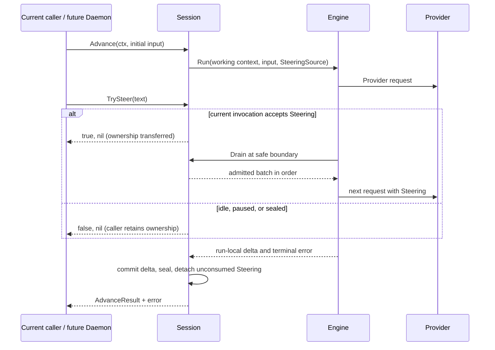
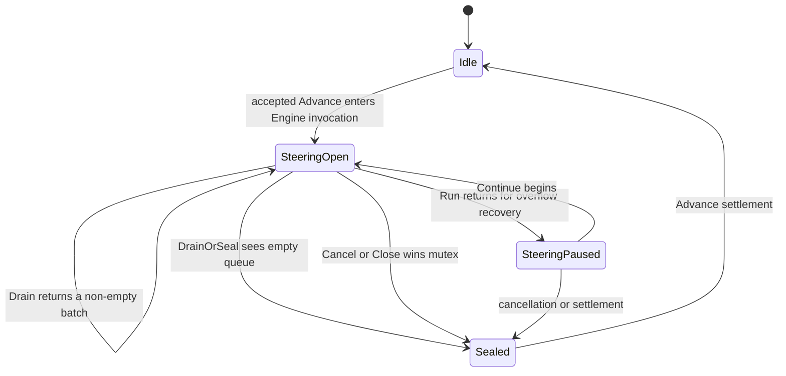

# Daemon-ready Session Boundary - Plan

## Goal Capsule

- **Objective:** 收敛 Pia 的单 Session 输入与控制边界，使 Session 只拥有 Conversation lifetime、active Advance 与当前 execution 已接受的 Steering，并删除未来 submission queue 与无当前消费者的公开等待控制。
- **Product authority:** 本计划记录 Lesson 16 已确认的产品与责任契约，以及基于当前 Pia 路径细化后的实施方案。
- **Execution profile:** 以删除和窄重构为主，同步课程与架构文档；不实现 Daemon、Client Protocol、Gateway、后台 worker 或持久化 submission inbox。
- **Stop condition:** 当前 runtime 不再把 Follow-up/future submission 当作 Session 状态，Steering ownership transfer 可以无异常地表达“未接收”，保留的 cancellation、close、history、overflow 和 safe-boundary 行为通过离线与 race 验证。
- **Open blockers:** 无。未来协议、submission identity、结果订阅、durable inbox 与多 Session routing 均不是本课实现 blocker。
- **Tail ownership:** 完成本课代码、测试和文档后等待学习者确认；除非学习者明确要求，不 commit、push 或创建 PR。

---

## Product Contract

### Summary

Pia 的长期交互拓扑采用严格 Client/Server 架构：TUI、GUI、Mobile 与 IM Gateway 都是 Pia Daemon 的客户端，使用同一套未来协议提交输入和控制任务。客户端拥有草稿与尚未被服务端确认的输入；Daemon 侧未来的 submission owner 拥有已确认但尚未开始的 future submissions；Session 只拥有一个 Conversation 的长期状态、一个 active Advance，以及已被当前 Engine invocation 接受的 Steering；Engine 只拥有一次 run-local Provider/tool loop。

Lesson 16 不建设这个服务层。它只删除与该方向冲突的 Session-owned Follow-up queue 和 public `Wait`，把 Steering admission 改成明确的 ownership-transfer 尝试，并保留 current-execution safe-boundary handshake。

### Problem Frame

Lessons 13–15 分别引入 Session lifecycle、Follow-up queue 与 Steering queue，单独看都能工作，但它们把终端交互策略、future submission ownership、当前 execution input 和 Session lifetime 聚集进同一个 `activeAdvance`。这在单进程终端原型中看似直接，却会在 Daemon 同时服务 Terminal、IM、GUI 与 Mobile 时产生重复 queue、模糊 acknowledgement 和 client-specific policy。

共同协议需要服务端在 Session 之外稳定接收普通 Submission，并根据当前状态决定：启动新的 Advance、尝试加入当前 execution，或继续保留为 future submission。Session 不应知道该输入来自 Enter、Tab、IM message 或 Mobile action，也不应替外层决定异常后自动重投、恢复到 composer 还是丢弃。与此同时，Steering 的 drain/seal 必须和取消、would-stop 保持线性化，不能因外移 future queue 而削弱。

### Key Decisions

- **长期交互采用严格 C/S 拓扑。** (session-settled: user-approved — chosen over Terminal 直连 Session、IM 再走 Daemon 的混合拓扑: 混合入口会产生两套 admission 与控制语义。) TUI、GUI、Mobile 和 IM Gateway 都是 Daemon clients；当前 one-shot CLI 只保留为开发与验收入口。Governs R16–R17.
- **future submissions 属于未来 Daemon 服务层，不属于 Session。** (session-settled: user-approved — chosen over Session 同时拥有 active Steering 与尚未开始的 Follow-up queue: 服务端需要跨 client 使用同一 acknowledgement 和 routing 规则。) 客户端只保留 draft 与尚未被 server acknowledgement 接收的输入。Governs R2, R6, R14, R17.
- **Session 保留 current-execution Steering。** (session-settled: user-approved — chosen over 把全部 Steering queue 外移到客户端或 Gateway: safe-boundary drain/seal 与 active execution lifecycle 需要同一线性化 owner。) Session 只接管 `TrySteer` 返回 accepted 的文本；未接收时 caller 保持 ownership。Governs R5–R10, R15.
- **Engine 继续拥有完整 run-local Provider/tool loop。** (session-settled: user-approved — chosen over Session 逐步驱动单次 Provider call: tool settlement、terminal closure 和 Run ordering 已经是一个内聚 loop。) Engine 识别 safe points，Session 原子执行 drain 或 drain-and-seal；具体接口名称不是本计划的耐久决策。Governs R7–R9, R15.
- **一个 Advance 只由一个外部 Submission 启动。** (session-settled: user-approved — chosen over 同一 Advance 排空多个 Follow-up Runs: future submissions 应在外层分别启动新的 Advance。) 同一个 Advance 仍可包含 accepted Steering 和 overflow recovery continuation。Governs R2, R14.
- **Steering admission 使用 `TrySteer(input) (bool, error)`。** (session-settled: user-approved — chosen over `Steer(input) error` 加预期中的 `ErrSteerUnavailable`: 暂时没有可接入窗口是正常 routing 结果，不是业务失败。) `true, nil` 表示 ownership 已转移；`false, nil` 表示 caller 保持 ownership；blank/closed 等真实错误仍返回 error。Governs R3, R5–R6.
- **Session 保持同步 `Advance`，不增加 worker 或 task handle。** (session-settled: user-approved — chosen over 为未来 Daemon 预先把 Session 改成异步命令处理器: acknowledgement、task identity 与结果订阅属于尚未设计的 server protocol。) Governs R2–R4, R17.
- **删除 public `Wait`，Close 内部继续等待 settlement。** (session-settled: user-approved — chosen over 继续暴露没有当前生产 consumer 的独立 quiescence API: future server 可以等待自己启动的同步 Advance，Session Close 已有内部 completion signal。) Governs R3, R13.
- **Steering hand-back 保持 policy-neutral。** (session-settled: user-approved — chosen over Session 按 Provider failure、Cancel 或 Close 原因自动 requeue/drop/restore: 这些都是 future server 或 client policy。) accepted 但尚未被 Engine 消费的 Steering 继续通过 `AdvanceResult.UnconsumedSteering` 唯一交还 caller；已消费 Steering 只存在于 History。Governs R9–R10, R15.
- **Lesson 16 只做删除式边界修正。** (session-settled: user-approved — chosen over 同课增加内存 SessionService/Coordinator: 在协议、identity 和 persistence 尚未校准前建立 server abstraction 会把猜测固化进 runtime。) Governs R14, R16–R17.

<!-- work-relationships:start -->

<!-- work-relationships:end -->

### Requirements

**Session ownership and API**

- R1. Session 必须继续唯一拥有一个 Conversation 的 Workspace/resources、完整 History、compaction/recovery projection、lifetime 与至多一个 active Advance。
- R2. 一个 accepted `Advance(ctx, input)` 必须只由该 initial input 启动；它可以消费同一 Engine invocation 已接受的 Steering，并可以执行既有 overflow recovery continuation，但不得排空 future Follow-up submissions。
- R3. Session application surface 必须收敛为 `NewSession`、immutable `Info`、同步 `Advance`、`TrySteer`、`Cancel` 与 `Close`；不得为本课增加 `Start`、task handle、status polling、generic command union 或 background worker。
- R4. 并发 `Advance` 必须继续返回 `ErrSessionBusy` 作为 defensive invariant；该错误不得被用作 future submission queue 或正常 server routing 机制。

**Steering transfer and safe boundaries**

- R5. `TrySteer` 必须以 `(bool, error)` 表达 ownership transfer：accepted 为 `true, nil`，没有当前 steerable invocation 为 `false, nil`，输入无效或 Session 已 closing/closed 为明确 error。
- R6. Session 只能保存已由 `TrySteer` 接受、且属于当前唯一 Engine invocation 的 Steering；不得保存普通 future Submission。
- R7. Engine 必须继续在第一次 Provider request 前、一个 assistant message 的全部 tool calls 取得 terminal results 后、以及 would-stop 边界请求 Steering；同一边界前已接受的全部 Steering 按 admission order 作为独立 user Messages 进入一次下一 Provider request。
- R8. would-stop 的空 drain 与 invocation seal 必须是一个 Session mutex 下的原子决定；不得在 Provider request、tool batch 中途或 error/cancellation settlement 开始后注入 Steering。
- R9. drain 与 cancel/close 必须保持 exactly-one 线性化：drain 先取得的 batch 成为已消费输入；cancel/close 先封口时 pending batch 保持未消费并在 Advance settlement hand back。
- R10. accepted 但未消费的 Steering 必须只通过 `AdvanceResult.UnconsumedSteering` 交回 Advance caller；Session 不得根据 settlement 原因自动重新排队、恢复 UI 或丢弃。已消费 Steering 不得重复 hand back。

**Control and lifetime**

- R11. `Cancel()` 必须继续 nonblocking、idempotent，只请求取消当前 active Advance；idle 时 no-op，且不得关闭 Session 或删除 future server-owned submissions。
- R12. `Close(ctx)` 必须继续永久停止新 admission、立即取消 active work，并在 caller context 内等待 clean settlement 与 resource close；timeout 不得重新打开 Session、强关仍被借用的资源或冒充 clean close。
- R13. Public `Wait(ctx)` 必须删除；Close 与 active settlement 所需的私有 completion signal 必须保留，不能通过轮询替代。

**Scope correction and documentation**

- R14. Session-owned `FollowUp` API、`ErrFollowUpUnavailable`、Follow-up window/queue/drain/hand-back、`AdvanceResult.UnconsumedFollowUps` 及其专用测试必须删除，而不是保留兼容 shim。
- R15. 当前 Lesson 15 的 Steering batch、安全点、overflow transfer 与 hand-back 正确性必须保留；只有 admission surface 和 future-input ownership 改变。
- R16. 课程、决策、策略、术语和开发约束必须明确严格 C/S 方向，同时把 Lessons 13–15 的旧结论保留为历史记录并标注 Lesson 16 的 supersession。
- R17. Lesson 16 不得新增 Daemon、Gateway、Coordinator/SessionHost、Client Protocol、submission ID、durable inbox、multi-Session registry、TUI/IM behavior 或 persistence schema。
- R18. 实现必须通过默认离线检查和完整 race tests，并覆盖 `TrySteer` admission、final seal race、cancel/close race、policy-neutral hand-back、overflow transfer，以及删除 Follow-up 后的一次 Advance 单 submission 边界。

### Key Flows

- F1. Ordinary server submission routing
  - **Trigger:** 未来 Daemon 已确认接收一个 client Submission。
  - **Steps:** Session idle 时 Daemon 启动新的 synchronous Advance；Session active 时 Daemon 调用 `TrySteer`；返回 false 时输入仍由 Daemon 保留，并在当前 Advance settlement 后启动新的 Advance。
  - **Outcome:** Client 不需要理解 Session steerable window，也不会把正常 routing miss 当成用户可见 rejection。
  - **Covered by:** R2-R6, R11, R17
- F2. Current-execution Steering
  - **Trigger:** `TrySteer` 在当前 Engine invocation 的 open window 中接受一条或多条输入。
  - **Steps:** Session 接管文本 → Engine 到达 safe boundary → Session 原子 drain batch → Engine 按顺序追加 user Messages → 发起一次下一 Provider request。
  - **Outcome:** Steering 只影响当前 Run，不抢占 Provider/tool，也不创建并发 Run。
  - **Covered by:** R5-R9
- F3. Cancellation before Steering consumption
  - **Trigger:** Session 已接受 Steering，但 Cancel 或 Close 在线性化上先于下一次 drain。
  - **Steps:** Session 封口并请求 execution cancellation → Engine 进入 settlement，不再 drain → pending Steering 随 `AdvanceResult` 唯一 hand back。
  - **Outcome:** 输入不会同时被消费和交还，也不会由 Session 擅自决定后续策略。
  - **Covered by:** R9-R12
- F4. Session lifetime close
  - **Trigger:** Runtime owner 调用 `Close(ctx)`。
  - **Steps:** Session 永久停止 Advance/TrySteer admission → 取消 active Advance → 等待内部 completion → active settlement 后关闭 Workspace/resources。
  - **Outcome:** Clean close 与 caller 停止等待保持区分，且无需 public `Wait`。
  - **Covered by:** R11-R13

### Acceptance Examples

- A1. Session idle 时 `TrySteer("x")` 返回 `false, nil`，文本仍由 caller 拥有，History 不变。
- A2. Engine 的 Provider call 正在进行时，多次 `TrySteer` 均成功；当前 turn 和所有 tool results 完整结算后，下一次 request 一次看到全部 Steering，顺序与 admission 一致。
- A3. Engine 已在 would-stop 原子封口时，并发 `TrySteer` 返回 `false, nil`；该输入不会出现在当前 History 或 hand-back 中。
- A4. 已接受 Steering 后 Cancel 先取得 Session mutex；Advance 返回 cancellation cause 和完整 History，未消费 Steering 只出现在 `UnconsumedSteering`。
- A5. Steering 先被 drain，随后 Cancel；该 Steering 只作为 History user Message 出现，不再 hand back。
- A6. 一个 Advance 正常结束后不会自动消费第二个 future input；外层 owner 必须另行调用 Advance。
- A7. `Close(ctx)` 在 active work 不配合 cancellation 时可因 caller context 返回，但 Session 保持 closing；work 最终 settlement 后资源只关闭一次。
- A8. 删除 Follow-up 与 public Wait 后，one-shot CLI 的 final text、trace、error、History、tool ordering 与 resource close 行为不回归。

### Scope Boundaries

**In scope**

- Session-owned Follow-up 与 public Wait 的删除。
- `Steer` 到 `TrySteer` 的窄 admission 重构。
- current-execution Steering 的 Session/Engine handshake 与 policy-neutral hand-back。
- 同步 Advance、Cancel、Close 与 one-active-Advance invariant 的保留和简化。
- 第三阶段课程边界与严格 C/S 长期方向的文档修正。

**Out of scope**

- Daemon/service 实现、进程常驻、网络 transport 或 common Client Protocol。
- Submission identity、acknowledgement wire contract、result streaming、durable inbox 或 retry delivery。
- Gateway、IM adapter、TUI、GUI、Mobile 的 UI 和按键行为。
- Multi-Session routing、scheduler、worktree management 或 public SDK。
- Session journal、safe resume 或 in-place interrupted execution recovery 的实现。

### Sources

- Frozen Pi `dcfe36c79702ec240b146c45f167ab75ecddd205`: `packages/agent/src/{agent,agent-loop,types}.ts` 与 coding `AgentSession` queue/settlement tests。
- Codex CLI `0fb559f0f6e231a88ac02ea002d3ecd248e2b515`: core Session/active-turn input 与 TUI future-submission ownership 路径。
- OpenCode `cb562b2c6289c2eee707078f9ab644cbe1d3d8a9`: direct interactive prompt queue、durable Session 与 run registry 路径。
- Current Pia: `internal/coding/{session,steering}.go`, `internal/agent/{loop,types}.go`, `cmd/pia/main.go`, Lessons 13–15 与 D97–D106。

---

## Planning Contract

Product Contract preservation: unchanged. 本节只把已确认的 Lesson 16 产品边界映射到当前代码；不增加 actor、flow、requirement 或 scope。

### Key Technical Decisions

- **KTD1 — `activeAdvance` 只保留 execution cancellation 与 current Steering 状态。** 删除 `done`、Follow-up admission flag 与 Follow-up queue；`Session.closeDone` 继续作为 Close 的唯一私有 lifetime completion signal。选择它而不是保留一个无人消费的 per-Advance channel，因为同步 `Advance` 已经向启动者表达 settlement，public `Wait` 删除后没有第二个合法 consumer。Governs R1–R3, R11–R14.
- **KTD2 — 本课保留现有 `agent.SteeringSource`、`Drain` 与 `DrainOrSeal` handshake。** Engine 仍在既有 safe points 拉取输入；Session 的 `sessionSteeringSource` 仍在同一 mutex 下执行 batch drain 或 empty-drain-and-seal。接口名称不是耐久产品决策，但当前实现已经准确承载 R7–R9，因此本课不同时重写 Engine loop。Governs R7–R9, R15, R17.
- **KTD3 — `Advance` 只调用一次 initial-input execution。** 删除 Follow-up dequeue loop，把 `executeInput` 的返回值收敛为 error；Run 或 overflow continuation 后，Advance 在 settlement 路径一次封口并 detach pending Steering。正常 terminal 已经原子封口且没有 pending Steering 时，随后到达的 Cancel 不改写成功；Cancel/Close 先封口且仍有 pending Steering 时，返回 cancellation cause 并 hand back 该 batch。Governs R2, R9–R12, R14–R15.
- **KTD4 — `TrySteer` 的 unavailable 结果不再有 sentinel error。** 方法先校验输入，再在 Session mutex 下区分 closed、accepted 与 unavailable：closed 返回 `false, ErrSessionClosed`，open window 返回 `true, nil` 并 clone/append，idle、paused、sealed 或 cancellation 已生效返回 `false, nil`。删除 `ErrSteerUnavailable`，避免外层把正常 routing miss 当成故障分支。Governs R3, R5–R6.
- **KTD5 — 只迁移仍属于 Steering/Session contract 的测试。** 删除 Follow-up 专用测试文件及 public Wait 测试；其中仍能证明 cancel/close hand-back、terminal-wins 或 safe-boundary 线性化的场景，改写到 Steering 或 Session 测试，并只断言 `UnconsumedSteering`。Governs R9–R15, R18.

### Assumptions

- 当前实现的 `SteeringSource` handshake 足以表达已确认的 synchronous ownership transfer；只有未来协议或新的 Engine consumer 证明 `Drain`/`DrainOrSeal` 名称与 shape 成为负担时，才另开课程替换。
- 删除 Follow-up 后，现有 one-shot CLI 不需要新增外层 future-submission owner，因为它当前一次只提交一个 input；未来 Daemon 才建立普通 Submission routing。
- `waitForCompletion` 继续作为 `Close` 的私有 context-bounded wait helper，不因为删除 public `Wait` 而删除。

### Runtime Relationships

---

## Implementation Units

### U1 — Remove Session-owned future submissions and public Wait

- **Goal:** Make one `Advance` represent exactly one external Submission while preserving synchronous settlement, one-active-Advance exclusion, History commit, cancellation, Close, and private close completion.
- **Requirements:** R1–R4, R11–R14; F1, F4; A6–A8.
- **Files:** `internal/coding/session.go`, `internal/coding/session_test.go`, delete `internal/coding/follow_up_test.go`.
- **Approach:** Remove Follow-up and Wait errors, APIs, result fields, `activeAdvance` state, queue helpers, and the multi-input loop. Keep `Session.closeDone` plus `waitForCompletion` for Close. Make `Advance` execute its initial input once, commit all returned deltas as before, then settle pending Steering according to KTD3. Simplify `executeInput` to return only an error while retaining compaction and overflow continuation.
- **Test scenarios:** Existing sequential Advances remain valid; concurrent Advance still returns `ErrSessionBusy`; Close still permanently rejects admission and waits cleanly; Close caller timeout leaves the Session closing until work settles; no Follow-up or Wait symbol remains in the application surface.
- **Verification:** `go test ./internal/coding`; `rg -n 'FollowUp|ErrFollowUpUnavailable|UnconsumedFollowUps|func \\(s \\*Session\\) Wait' internal cmd`.

### U2 — Make Steering admission an explicit ownership-transfer attempt

- **Goal:** Replace expected unavailable errors with `TrySteer(input) (bool, error)` while preserving the current Engine safe-boundary, cancellation, hand-back, overflow and ordering contracts.
- **Requirements:** R5–R10, R15, R18; F2–F3; A1–A5.
- **Files:** `internal/coding/steering.go`, `internal/coding/steering_test.go`, `internal/coding/session.go`; `internal/agent/types.go` and `internal/agent/loop.go` are verification-only unless implementation evidence overturns KTD2.
- **Approach:** Rename the admission method, delete `ErrSteerUnavailable`, and implement the three-way accepted/unavailable/error result under `Session.mu`. Keep `openSteering`, `pauseSteering`, `drainSteering`, `sessionSteeringSource`, `Drain`, and `DrainOrSeal` behavior unchanged except for any naming/comment corrections required by the new public contract. Rewrite tests to assert ownership explicitly and port only still-live cancellation/close scenarios from the deleted Follow-up suite.
- **Test scenarios:** idle and sealed return `false, nil`; blank and closed return errors; an open invocation accepts multiple messages in order; provider failure and cancellation hand back only pending Steering; consumed Steering is never handed back; overflow continuation preserves Steering; final-seal race yields either accepted-and-consumed or unavailable-with-caller-ownership, never a sentinel error.
- **Verification:** `go test ./internal/coding -run 'Steer|Steering|Cancel|Close|Overflow'`; `go test -race ./internal/coding`.

### U3 — Record the implemented Lesson 16 boundary

- **Goal:** Keep the course and architecture records aligned with the code that actually ships in this lesson.
- **Requirements:** R16–R18; A8.
- **Files:** `docs/course/lessons/16-daemon-ready-session-input-and-control-boundary.md`, `docs/course/README.md`, `docs/course/decisions.md`, and only the already-touched root/course documents whose stated current API or ownership must reflect the final code.
- **Approach:** After code verification, update Lesson 16 from design-ready to implementation-complete/pending learner confirmation, record the exact source and test evidence, and ensure D107 plus supersession notes describe the implemented API without inventing Daemon protocol details.
- **Test scenarios:** Documentation names `TrySteer`, does not present Follow-up or public Wait as current APIs, preserves Lessons 13–15 as historical evidence, and keeps all future service abstractions explicitly deferred.
- **Verification:** `rg -n 'FollowUp|ErrFollowUpUnavailable|UnconsumedFollowUps|ErrSteerUnavailable|\\.Steer\\(|public Wait' README.md AGENTS.md CONCEPTS.md STRATEGY.md docs/course docs/plans`; manually classify every remaining match as historical/supersession text or correct it.

---

## Verification Contract

- After each behavioral unit, run focused `go test` commands for `internal/coding`.
- After all Go changes, run `make check` to format, vet, test, and lint the complete repository.
- Because this lesson changes cancellation and shared-state admission, run `go test -race ./...`.
- Run `git diff --check` and inspect `git status --short` to verify document formatting and ensure only Lesson 16 files plus its already-approved cross-document corrections changed.
- Review the final diff for ownership leaks: no dormant Follow-up queue, no per-Advance completion channel without a consumer, no compatibility shim, no new worker/service/protocol abstraction, and no second Steering owner.

## Definition of Done

- The current Session application surface is `NewSession`, immutable `Info`, synchronous `Advance`, `TrySteer`, `Cancel`, and `Close`; public Follow-up, public Wait, their sentinel errors/result fields, and their queue state are absent.
- One Advance executes one external initial input, while accepted Steering and overflow recovery still remain inside that execution.
- `TrySteer` has unambiguous ownership semantics for accepted, unavailable, invalid, and closed cases.
- Safe-boundary batching, atomic would-stop sealing, cancel/close linearization, policy-neutral hand-back, History commit, and Close settlement are covered by focused and race tests.
- `make check`, `go test -race ./...`, and `git diff --check` pass.
- Lesson 16 and durable architecture records describe the implemented boundary and remain explicit that Daemon, common Client Protocol, future-submission ownership implementation, and public waiting/status controls are deferred.
- No commit, push, PR, or next-lesson advance occurs without explicit learner direction.
