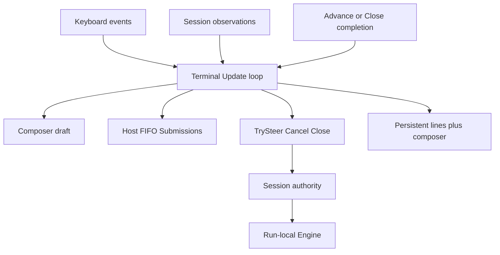
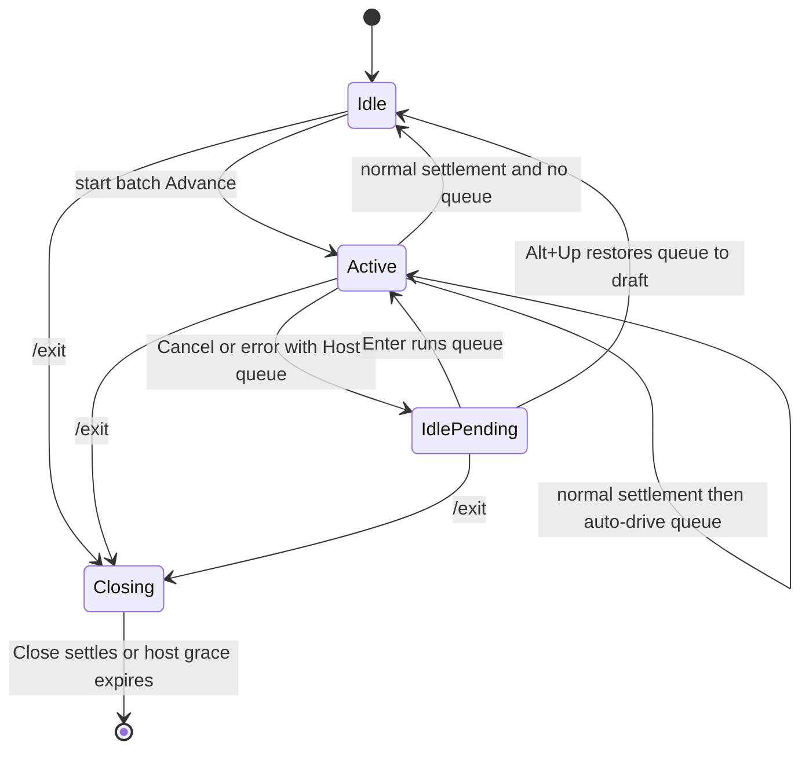
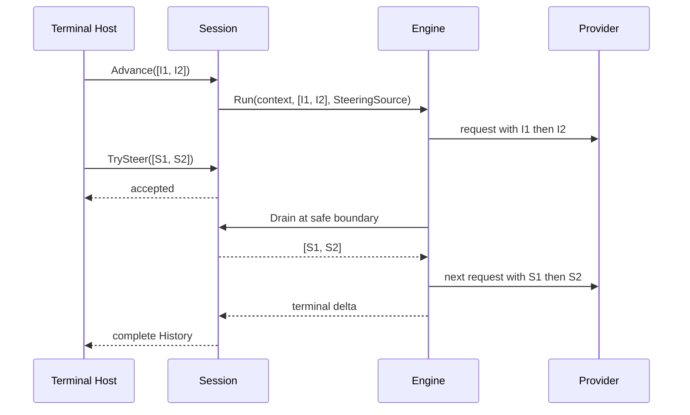

# Phase 3 Interactive Terminal Acceptance - Plan

## Goal Capsule

- **Objective:** 让第三阶段以一个简化、可日常使用的行式交互终端收尾，证明当前单 Session Runtime 能在真实多轮交互中持续推动复杂 coding task。
- **Product authority:** 本计划固定第三阶段退出目标、Host/Session/Engine 输入所有权、交互控制、显示边界和真实验收协议。
- **Execution profile:** 先用离线和 race tests 证明并发与 ownership contract，再用固定 DeepSeek profile 在 ignored disposable workspace 中完成一次可审计的复杂任务；如果失败，保留 trace、定位原因、修复 Pia 并从 fresh baseline 重跑。
- **Open blockers:** 无。具体实现细节可以在不改变 Product Contract 的前提下根据测试与真实 trace 调整。

---

## Product Contract

### Summary

第三阶段将在 Lessons 12–16 的单 Session Runtime 上增加一个本地行式交互终端，用真实复杂 coding task 验证多轮推进和已有 Runtime 能力的组合效果。Versioned Session journal 与 safe resume 不再是第三阶段退出条件，并作为一组后续能力延期。

### Problem Frame

当前 `cmd/pia` 一次创建一个 Session、执行一个 Advance、输出最终结果并关闭。它已经证明 one-shot coding loop 可以工作，但不能证明一个长期 Session 在真实使用中能否连续接受用户推进、保持完整 History、消费实时 observations，并把 Steering、lifecycle、compaction、overflow recovery 与 Skills 组合成可用的 coding workflow。

第三阶段原计划以 durable journal 和 safe resume 收尾。该路线会先建立 persistence writer、recovery reader、workspace rebinding 和 crash semantics，却仍缺少一个日常 consumer 证明当前内存 Runtime 能推动复杂任务。学习者当前更重视 coding progression，而不是进程重启后的恢复，因此 persistence/resume 不应继续作为本阶段完成条件。

### Key Decisions

- **第三阶段以复杂任务交互验收收尾。** (session-settled: user-directed — chosen over ending Phase 3 with journal and safe resume: the immediate priority is proving that Pia can drive a complex coding task.) Governs R1–R5, R23–R26.
- **采用行式本地交互终端。** (session-settled: user-directed — chosen over a sequential-only REPL or full-screen TUI: it provides a real concurrent input consumer without taking on a presentation-system scope.) Governs R6–R9, R20–R22.
- **Host 统一拥有 draft 与未被 Session 接受的 Submissions。** (session-settled: user-approved — chosen over Session-owned Follow-up or per-client core behavior: future clients share server capabilities but keep their own presentation policy.) Governs R10–R14, R17–R19.
- **Session admission 使用 ordered batch-all。** (session-settled: user-approved — chosen over one-at-a-time queue mode or a single initial input: every routed element remains a distinct user Message while one admission transfers the entire ordered batch.) Governs R11–R16.
- **Accepted Steering 永不 hand back。** (session-settled: user-approved — chosen over `UnconsumedSteering`: `TrySteer(true)` permanently transfers ownership, and cancellation or failure commits accepted-but-unseen Steering to History for the next Provider request.) Governs R15–R16.
- **`Alt+Up` 采用 Pi 的 restore-all 行为。** (session-settled: user-directed — chosen over editing only the newest queued item: all Host-owned pending Submissions return to the composer in FIFO order separated by blank lines.) Governs R17.
- **Cancel/error 后等待确认。** (session-settled: user-approved — chosen over unconditional auto-advance: normal settlement may continue submitted work, but cancellation or failure leaves Host-owned input editable until the operator acts.) Governs R18–R19.
- **真实验收只要求一次完整成功。** (session-settled: user-approved — chosen over two consecutive model runs: this lesson validates the interactive product path rather than model success-rate benchmarking, while retaining every failed attempt and invalidating success after product or protocol changes.) Governs R23–R26.
- **Journal 与 resume 一起 defer。** (session-settled: user-directed — chosen over keeping a writer-only journal in Phase 3: persistence without a current recovery consumer would freeze a speculative format.) Governs R4–R5.

### Requirements

**Phase boundary**

- R1. 第三阶段必须增加最终的简化交互终端课程，依赖 Lessons 12–16 已提交的单 Session Runtime。
- R2. 第三阶段退出时，操作者必须能通过一个长期单 Session 的本地交互入口，使用多轮用户输入和 Pia 既有 coding tools 推进一个真实复杂 coding task。
- R3. 该课程必须把终端当作 Runtime 的真实 consumer；如果真实使用暴露错误的 owner、control 或 application boundary，课程直接替换或删除既有抽象，而不是增加 compatibility wrapper。
- R4. Versioned Session journal、clean resume 与 hard-kill checkpoint fallback 不得作为第三阶段实现项或退出条件。
- R5. Journal 与 resume 必须作为相互依赖的后续方向保留；没有 recovery reader 需求时，不单独实现 writer-only durable journal。

**Terminal role and composition**

- R6. 终端必须采用非 alternate-screen 的行式交互形态：已有输出向上保留，底部只维护一个 composer；不得扩展为 pane、主题、selector、scrollback owner 或 full-screen layout。
- R7. 终端可以在同一进程直接 host 一个 Session，但不得把这种本地 composition 宣称为稳定 Client Protocol、公共 SDK 或长期产品拓扑。
- R8. `cmd/pia` 无位置参数时进入 interactive mode；一个非空位置参数继续执行现有 one-shot mode；其他参数仍拒绝。
- R9. 终端不得拥有或复制 Conversation History、Working Context、compaction、Engine loop 或 accepted Steering 的权威状态；它只负责 draft、未接收 Submissions、control intent、观察投影和结果呈现。

**Submission and Steering ownership**

- R10. 每次非空 Enter 都先在 Host 形成一个 Submission；client draft 在 Enter 前仍属于 composer，Host pending queue 是 FIFO。
- R11. Host 每次 routing 都使用当前完整 non-empty FIFO batch，不允许同一个 queue batch 部分转移、跳项或重排。
- R12. `Advance` 接受一个 ordered non-empty Submission batch；每个元素作为独立 user Message 进入同一次 input-started Engine execution，不拼成一个 Message。
- R13. `TrySteer` 接受一个 ordered non-empty batch，并以 `(bool, error)` 表达 whole-batch ownership transfer：`true, nil` 表示 Session 永久接受全部元素，`false, nil` 表示 Host 保留完整 batch。
- R14. Host idle 时以完整 queue 启动 Advance；Host active 时以完整 queue 调用 `TrySteer`；`false` 后不丢弃或重排，等待下一次 Host routing decision。
- R15. `TrySteer(true)` 只保证 Session 接受，不保证 Provider 已看见；Engine 在当前 assistant turn 及其全部 tool results 结算后的安全点原子 drain accepted-before-cutoff 的所有 Steering，并按 admission order 作为独立 user Messages 发起下一次 Provider request。
- R16. Session 不再返回 `UnconsumedSteering`。Cancel、Close 或 Engine error 发生在 accepted Steering 被安全点消费之前时，Session 先提交 Engine terminal delta，再把 pending accepted Steering 按顺序提交到 History；它们不会自动执行，也不会回到 Host。

**Local interaction policy**

- R17. `Alt+Up` 只操作 Host-owned pending queue：原子取回全部元素，以两个换行按 FIFO 顺序拼接在当前 draft 之前，清空 queue；再次 Enter 后该文本成为一个新的 Submission，不恢复原消息边界。
- R18. ESC 在 active 时只调用 idempotent `Cancel()`，不修改 draft、Host queue 或 History；idle 时 no-op。正常 Advance settlement 自动 drive Host queue；Cancel 或 error settlement 不自动 drive。
- R19. Cancel/error 后若 Host queue 非空，空 draft Enter 原样运行 queue，`Alt+Up` 取回编辑，非空 draft Enter 追加后整体运行。`/exit` 调用 `Close` 并忽略 Host-owned queue；Ctrl+C 与 Ctrl+D 在本课明确不支持。

**Observation and trace**

- R20. 交互输出必须实时呈现 bounded semantic progress，包括 turn、tool start/settlement、compaction、queue/Steering/Cancel intent 和 settlement；不展示 raw reasoning、token delta、raw Provider events 或实时 Bash byte stream。
- R21. 每次 Advance settlement 后必须呈现完整 terminal assistant text；progress、input 和 completion 输出由同一个 Terminal update loop 串行投影，不能互相覆盖 composer。
- R22. `PIA_TRACE_PATH` 在 interactive `/exit` clean settlement 后继续生成包含完整 History 的敏感 diagnostic trace；一次 Session 内出现的 Advance errors 必须进入 trace evidence，但已经恢复的错误不必让最终进程以失败退出。

**Complex-task acceptance**

- R23. 最终真实验收使用 ignored `tmp/pia-terminal-acceptance/` 下的 untouched baseline、fresh attempt workspace、外部 verifier、固定任务/Steering/后续 Advance 和固定 Pia binary。
- R24. 验收项目是一个 deterministic multi-package Go dependency-planning CLI，覆盖 manifest parsing、dependency planning、text/JSON rendering 与 command integration；baseline 自身 tests 通过，但不具备目标功能。
- R25. 成功 attempt 必须在同一个 Session 中完成 initial Advance、至少一次已接受 Steering、至少一次后续 Advance，并通过 workspace tests、vet 和 workspace 外部 acceptance assertions。
- R26. 所有 attempt、inputs、trace diagnosis、product fixes、diff 与 verification results 都保存在 ignored evidence 中并总结进 Lesson 17 文档。任何 Pia product code、system prompt、routing contract、task wording、baseline 或 verifier 变化都会使旧成功失效并要求 fresh rerun。

### Actors

- A1. **Operator:** 在一个 workspace 中通过本地终端持续指导复杂 coding task 的工程者。
- A2. **Local Acceptance Terminal:** 捕获 draft、Submission 与 control intent，呈现 observations 和结果的本地 consumer。
- A3. **Session:** 拥有 Conversation、Workspace/resources、History、projection、active Advance、accepted Steering 与 lifecycle 的 Runtime authority。
- A4. **Agent Execution Engine:** 执行一次 run-local Provider/tool loop并返回 message delta。
- A5. **Acceptance verifier:** 位于 Agent workspace 外，独立判断最终 behavior 和 regression。

### Key Flows

- F1. **Interactive routing**
  - **Trigger:** Operator 在选定 workspace 无参数启动 `pia` 并提交文本。
  - **Actors:** A1–A4
  - **Steps:** Terminal 把文本追加到 Host FIFO；idle 时把完整 batch 转给一个 Advance，active 时把完整 batch 交给 `TrySteer`；Session/Engine 按安全点消费 accepted Steering；Terminal 串行投影 observations 和 final assistant text。
  - **Outcome:** 一个长期 Session 持续推进，而 Host 只保留尚未转移的 input。
  - **Covered by:** R2–R3, R6–R16, R20–R21
- F2. **Restore pending input**
  - **Trigger:** Host queue 仍拥有一个或多个未被 Session 接受的 Submissions，Operator 按 `Alt+Up`。
  - **Actors:** A1–A2
  - **Steps:** Terminal 原子清空完整 queue，把其文本按 FIFO 以空行连接，再把当前 draft 放在末尾；Operator 编辑并决定是否重新 Enter。
  - **Outcome:** pending input 可以修改，不需要 Session retract/revision protocol。
  - **Covered by:** R10–R14, R17
- F3. **Cancellation and failure hold**
  - **Trigger:** Operator 按 ESC，或当前 Advance 返回错误。
  - **Actors:** A1–A4
  - **Steps:** ESC 只请求 Cancel；Session 完整 settlement accepted work；accepted-but-unseen Steering 留在 History；Host-owned queue 不自动执行；Terminal 等待 Enter、`Alt+Up` 或 `/exit`。
  - **Outcome:** accepted ownership 不回滚，尚未接受的意图仍可由 Operator 决定。
  - **Covered by:** R16, R18–R19
- F4. **Complex task acceptance**
  - **Trigger:** 固定 Pia binary 在 fresh dependency-planner workspace 启动。
  - **Actors:** A1–A5
  - **Steps:** Operator 提交目标规划任务，在 execution 中 Steering 原始顺序/immutability 约束；首次 settlement 后提交 JSON compatibility follow-up；Pia 调查、修改和验证；外部 verifier 在独立 copy 中检查最终 behavior。
  - **Outcome:** 客观证据证明同一 Session 能推动跨 package coding work；失败则用 trace 定位并修复 Pia 后重新开始。
  - **Covered by:** R23–R26

### Acceptance Examples

- AE1. **Covers R11–R16.** Given Host queue 为 `[S1, S2]`, when active Session 的 `TrySteer([S1,S2])` 返回 true, then Host 一次移除整个 batch，History 或下一次 Provider request 保持两个独立 user Messages 且顺序不变。
- AE2. **Covers R16.** Given S1 已被 `TrySteer` 接受但尚未 drain, when ESC 导致 current execution cancellation, then S1 在 terminal Engine delta 之后只进入 History 一次，不返回 composer，也不触发隐藏 execution。
- AE3. **Covers R17.** Given Host queue 为 `[S1,S2]` 且 draft 为 D, when Operator 按 `Alt+Up`, then queue 为空且 draft 精确为 `S1 + "\n\n" + S2 + "\n\n" + D`; 下一次 Enter 形成一个 Submission。
- AE4. **Covers R18–R19.** Given an Advance settles normally with pending Host queue, then Terminal auto-starts it; given the same queue after Cancel/error settlement, then Terminal holds it until explicit Enter or restore.
- AE5. **Covers R20–R22.** Given tools execute while the Operator edits, then progress lines remain above the composer, final text appears only at settlement, and `/exit` trace contains the complete ordered History without raw live reasoning output.
- AE6. **Covers R23–R26.** Given a fresh dependency-planner baseline, when one recorded interactive Session receives the fixed initial task, accepted Steering and follow-up Advance, then external tests, repository tests and vet pass; any earlier failed attempt remains reviewable.

### Success Criteria

- 操作者可以通过一个长期 Session 交互推进并完成固定 dependency-planner 复杂 coding task。
- 离线与 race tests 独立证明 Terminal routing、batch admission、permanent accepted-Steering ownership 和 cancel/error hold，不把一次模型成功当作并发正确性证据。
- 真实验收证据能区分 terminal usability、Runtime correctness 与模型结果；失败 trace 会产生具体 root cause 和相应 product fix，而不是被丢弃。
- Lessons 12–16 的 observation、History/context、compaction/recovery、Skills、Steering 和 lifecycle 边界在真实 consumer 下保持一致，或在本课内按证据完成纠正。

### Scope Boundaries

**In scope**

- Session/Engine 的 batch initial-input 与 batch Steering admission。
- accepted-but-unseen Steering 的 History commit 与 hand-back 删除。
- 一个 non-alternate-screen line-oriented local Terminal。
- one-shot compatibility、interactive trace 和 deterministic Host tests。
- disposable dependency-planner workspace、external verifier、真实 DeepSeek attempt 与 Lesson 17 review record。

**Deferred for later**

- Versioned Session journal、clean resume、hard-kill checkpoint fallback 与 in-place interrupted execution recovery。
- Pia Daemon、common Client Protocol、durable submission inbox 与 multi-Session orchestration。
- 正式 TUI/GUI/Mobile/IM clients、公共 SDK 与稳定网络或 CLI protocol。
- Provider retry、Goal Runtime、worktree/GitHub management 与稳定 Pi 对照 benchmark。
- Ctrl+C/Ctrl+D controls、full-screen layout、token streaming、raw Bash streaming、arbitrary queued-item selection 和 accepted-Steering retract/revision。

### Product Contract Preservation

Product Contract restructured, no scope reduction: the lesson-start discussion resolved former R11–R12 deferred decisions into R8–R26 while preserving R1–R10's phase goal, local-consumer role and persistence defer boundary.

---

## Planning Contract

### Key Technical Decisions

- KTD1. **Batch inputs are protocol messages, not joined text.** (session-settled: user-approved — chosen over using the first input as `Run` input and the remainder as synthetic Steering: all initial elements must be model-visible before the first Provider request.) `agent.Engine.Run`, Session pre-run compaction and their tests consume an ordered non-empty input batch; each element produces one user Message and observation. Governs R11–R15.
- KTD2. **Pending accepted Steering commits at Session settlement.** (session-settled: user-approved — chosen over `AdvanceResult.UnconsumedSteering`: permanent transfer makes Session the only owner after acceptance.) Error/cancellation settlement detaches the pending batch under the existing Session mutex, appends it after the Engine delta, and emits matching user Message observations before the Advance settles. Governs R15–R16.
- KTD3. **Bubble Tea v2 provides input and serialized rendering.** The implementation uses `charm.land/bubbletea/v2` and `charm.land/bubbles/v2/textarea` without alternate screen. This avoids a custom terminal escape parser while preserving a line-oriented composer, correct Unicode editing, paste support, ESC and `alt+up` key events. Governs R6, R17–R21.
- KTD4. **One Update loop owns Host state.** Bubble Tea `Update` alone mutates pending Submissions, active/cancel/closing flags and textarea value. Session observations and blocking Advance/Close work return typed messages through commands; no callback writes directly to the terminal or Host queue. Governs R9–R21.
- KTD5. **Command mode is selected by positional argument count.** Zero arguments starts interactive mode; one non-blank argument retains one-shot semantics and output; extra or blank arguments remain validation errors. Shared Session construction and trace helpers remain in `cmd/pia`, split into cohesive files rather than a new public package. Governs R7–R9.
- KTD6. **Interactive trace is finalized after `/exit`.** The final Bubble Tea model returns the latest complete History plus accumulated Advance errors; the outer command closes/waits before calling the existing sensitive trace converter and create-new writer. Recovered Advance errors affect trace evidence but not clean interactive exit status. Governs R22, R26.
- KTD7. **Acceptance fixture is disposable evidence, not product code.** Baseline, verifier, binary, attempts, traces and terminal logs live only under ignored `tmp/pia-terminal-acceptance/`; the tracked Lesson 17 document records protocol, hashes, outcomes, diagnoses and fixes without committing model-modified workspaces. Governs R23–R26.

### High-Level Technical Design

The following sketches are directional ownership and lifecycle guidance, not exact Go declarations.

### Sequencing

1. Correct batch and permanent Steering ownership in Agent/Session before the Terminal becomes a consumer.
2. Preserve one-shot behavior while adding the interactive Host and deterministic state-transition tests.
3. Run repository quality/race checks before spending Provider calls.
4. Freeze the binary, baseline, verifier and prompts, then run the real acceptance loop.
5. Diagnose every failed attempt from trace and workspace evidence, fix the owning layer, rerun all offline gates, invalidate prior success and start from a fresh baseline.

### Implementation-Time Unknowns

- Bubble Tea v2's exact test harness and terminal capability behavior should be resolved from the pinned dependency source during U3; if a real terminal cannot distinguish `alt+up`, the implementation may add a narrow tested key alias but must retain `Alt+Up` as the documented action.
- The fixed Close grace duration is a Host implementation choice; it must be short, bounded and documented, without changing Session `Close(ctx)` semantics.
- External verifier cases may be tightened before the first real Provider call, but once that attempt begins the baseline, task wording and assertions freeze until a product defect is diagnosed.

---

## Implementation Units

### U1. Make input ownership batch-complete

- **Goal:** Replace single-input and hand-back semantics with the settled ordered batch and permanent accepted-Steering contract.
- **Requirements:** R11–R16; KTD1–KTD2.
- **Files:** `internal/agent/loop.go`, `internal/agent/types.go`, `internal/agent/*_test.go`, `internal/coding/session.go`, `internal/coding/steering.go`, `internal/coding/compaction.go`, `internal/coding/*_test.go`, `internal/coding/trace.go`.
- **Patterns to follow:** Existing `appendSteering`, `Drain`/`DrainOrSeal`, Session mutex linearization, ownership-independent message clones and Engine delta commit.
- **Approach:** Validate a non-empty batch before acceptance; append each initial input exactly once before the first Provider request; change compaction pending messages to the same batch; make `TrySteer` all-or-none; remove hand-back fields/helpers and commit pending accepted inputs after terminal delta on error/cancellation.
- **Execution note:** Start with focused failing tests for multi-input Provider context and cancellation commit ordering before changing production code.
- **Test scenarios:**
  - Two initial inputs become two ordered user Messages in the first Provider request, run delta and History.
  - Blank element or empty batch is rejected before active admission and History mutation.
  - `TrySteer([S1,S2])` transfers both or neither and deep-copies caller strings.
  - Normal post-tool and would-stop drains preserve assistant/tool-result-before-Steering order.
  - Cancel/error before drain commits terminal delta then all pending Steering once; consumed Steering is not appended again.
  - Close/final-seal races yield accepted-and-eventually-committed or unavailable-and-Host-owned, never hand-back.
  - Threshold compaction budgets every initial user Message and overflow continuation retains pending Steering ownership.
- **Verification:** Focused Agent and coding tests plus package race tests pass.

### U2. Preserve one-shot and add interactive composition

- **Goal:** Make zero-argument interactive startup coexist with the current one-shot entrypoint and sensitive trace behavior.
- **Requirements:** R6–R9, R19, R22; KTD5–KTD6.
- **Files:** `cmd/pia/main.go`, `cmd/pia/one_shot.go`, `cmd/pia/interactive.go`, `cmd/pia/trace.go`, `cmd/pia/main_test.go`, `cmd/pia/main_signal_test.go`, `cmd/pia/trace_test.go`.
- **Patterns to follow:** Existing dependency seams, `resolveTracePath`, Session constructor ownership, create-new `0600` trace and joined settlement errors.
- **Approach:** Extract existing one-shot execution without behavior change; route zero arguments to the interactive composition; expand the private Session interface with batch Advance/TrySteer/Cancel; keep Session config DeepSeek-specific.
- **Execution note:** Characterize one-shot stdout/stderr/trace tests before moving code.
- **Test scenarios:**
  - One argument retains final-only stdout, semantic progress stderr and current failure/trace behavior.
  - Zero arguments constructs one Session and enters the interactive runner.
  - Blank single argument and multiple arguments fail before configuration reads.
  - Interactive clean exit closes exactly once and writes the requested full-History trace.
  - Recovered Advance errors are present in trace input but do not alone fail clean `/exit`.
- **Verification:** Existing and new `cmd/pia` tests pass without weakening one-shot assertions.

### U3. Implement the single-writer Terminal Host

- **Goal:** Provide usable live input, queue routing, controls and serialized semantic presentation.
- **Requirements:** R6, R9–R21; KTD3–KTD4.
- **Files:** `go.mod`, `go.sum`, `cmd/pia/terminal.go`, `cmd/pia/terminal_test.go`, `cmd/pia/line_observer.go`, `cmd/pia/line_observer_test.go`.
- **Patterns to follow:** Observation's bounded value events, current `projectedLine` escaping, Bubble Tea v2 non-alternate-screen persistent printing and textarea update contract.
- **Approach:** Model Host state as draft/queue/active/cancelRequested/closing; drive Session calls through Bubble Tea commands; relay observation values into typed update messages; intercept Enter, ESC, `alt+up`, `/exit`, Ctrl+C and Ctrl+D before textarea update; render only the composer in `View`.
- **Execution note:** Build the Terminal model against a fake Session first; real TTY execution is a later smoke gate.
- **Test scenarios:**
  - Idle Enter starts the entire queue as one batch and clears the draft.
  - Active Enter calls `TrySteer` with the entire queue; true clears it, false retains it.
  - `Alt+Up` restores all queued texts before an existing draft with exact blank-line separators.
  - Normal completion auto-drives retained queue; Cancel/error completion holds it.
  - Empty Enter after hold runs unchanged queue; non-empty Enter appends and runs the whole queue.
  - ESC only cancels active work; duplicate ESC and idle ESC are no-ops.
  - `/exit` ignores Host queue, closes Session and waits; Ctrl+C/Ctrl+D do not quit or mutate controls.
  - Tool/turn/compaction/progress and final assistant text become serialized persistent lines without entering composer state.
  - Observer/completion/input concurrency passes race tests and does not start two Advances.
- **Verification:** Terminal model tests, an interactive PTY smoke test and `go test -race ./cmd/pia` pass.

### U4. Align course and operator documentation

- **Goal:** Make Lesson 17, roadmap, decisions, vocabulary and README describe the implemented boundary without presenting the local Terminal as the future client protocol.
- **Requirements:** R1–R9, R22, R26.
- **Files:** `README.md`, `CONCEPTS.md`, `docs/course/README.md`, `docs/course/decisions.md`, `docs/course/lessons/16-daemon-ready-session-input-and-control-boundary.md`, `docs/course/lessons/17-interactive-terminal-and-complex-task-acceptance.md`, `docs/plans/2026-07-30-002-feature-phase-3-interactive-terminal-acceptance-plan.md`.
- **Patterns to follow:** Existing lesson evidence sections, D-numbered durable decisions and root README's shallow operator navigation.
- **Approach:** Record Lesson 16 conclusions superseded by batch/no-hand-back evidence, assign Lesson 17, document interactive invocation/keys/trace and retain strict future C/S boundaries. Use Lesson 17 as the chronological review log for implementation and real attempts.
- **Test expectation:** Documentation-only assertions are checked by targeted terminology searches and review against the implemented CLI.
- **Verification:** No current docs describe single-input Advance, `UnconsumedSteering`, public Wait or Session Follow-up as the target surface.

### U5. Build the disposable dependency-planner acceptance

- **Goal:** Freeze an objective multi-package coding task and an external verifier without committing the fixture.
- **Requirements:** R23–R26; KTD7.
- **Files:** ignored `tmp/pia-terminal-acceptance/` only, plus the tracked Lesson 17 protocol summary.
- **Patterns to follow:** `tmp/pia-acceptance/` fresh-baseline/attempt/evidence separation and Lesson 06's test-discrimination checks.
- **Approach:** Create `manifest`, `planner`, `render` and CLI packages with a passing baseline; define target dependency closure as the initial task, source-order/immutability as Steering and JSON compatibility as the next Advance; keep verifier tests outside Agent workspace and apply them only to a verification copy.
- **Execution note:** Prove baseline public tests pass and external assertions fail for the intended missing behavior before building the frozen Pia binary.
- **Test scenarios:**
  - Baseline builds, tests and vets cleanly before the requested feature.
  - External assertions fail against untouched baseline for target planning and JSON behavior.
  - Verifier covers shared dependency dedupe, stable source order, unknown dependency, cycle, immutability, default text compatibility and ordered JSON.
  - Attempt creation never mutates baseline and evidence names exact binary/baseline/task/verifier hashes.
- **Verification:** Baseline and verifier preconditions are recorded in ignored evidence and summarized in Lesson 17.

### U6. Close the real-provider acceptance loop

- **Goal:** Complete the frozen complex task in one Session, diagnose failures and leave reviewable proof that the final product path works.
- **Requirements:** R2–R3, R20–R26.
- **Files:** ignored `tmp/pia-terminal-acceptance/attempts`, `tmp/pia-terminal-acceptance/evidence`, any product files justified by a diagnosed defect, and `docs/course/lessons/17-interactive-terminal-and-complex-task-acceptance.md`.
- **Patterns to follow:** Existing `PIA_TRACE_PATH` evidence, Lesson 06/10 attempt accounting and root-cause-first fixes.
- **Approach:** Build once from the verified product commit; run the fixed initial input, wait for a visible execution window, submit the fixed Steering, submit the fixed follow-up after settlement, exit cleanly, run external verification, and inspect trace/workspace evidence. On failure, classify model outcome versus Pia defect; only product defects authorize product changes, after which all gates and a fresh attempt rerun.
- **Execution note:** Never edit an attempt into success or discard failed evidence; each product/protocol change resets the accepted run.
- **Test scenarios:**
  - Terminal visibly reports Steering acceptance rather than silently treating the fixed correction as an unrelated Advance.
  - Final trace contains initial input, Steering and follow-up as correctly ordered distinct user Messages.
  - Final workspace and external verification pass without manual code edits.
  - Every failed attempt has a documented outcome, relevant trace facts, root-cause classification and next action.
  - The first qualifying attempt after the final product/protocol change succeeds.
- **Verification:** One qualifying attempt satisfies the frozen protocol and every automated assertion; Lesson 17 contains the review trail.

---

## Verification Contract

| Gate | Applies to | Evidence |
|---|---|---|
| Focused Agent tests | U1 | Batch input, Steering drain/seal and cancellation ordering tests pass |
| Focused coding tests | U1–U2 | Session admission, History, compaction, Close and trace tests pass |
| Terminal tests | U2–U3 | Host transitions, key mappings, presentation and one-shot compatibility pass |
| Full quality gate | U1–U4 | `make check` succeeds |
| Full concurrency gate | U1–U3 | `make race` succeeds |
| PTY smoke | U3 | Real terminal accepts text, renders persistent progress/composer and exits through `/exit` |
| Baseline precondition | U5 | Public baseline checks pass and external assertions fail before Agent work |
| Real Provider acceptance | U6 | One frozen interactive Session completes the depplan task and all final assertions pass |
| Documentation audit | U4–U6 | README, course map, decisions, Lesson 17 and glossary agree with source and evidence |

---

## Definition of Done

| Unit | Done signal |
|---|---|
| U1 | Session/Engine expose ordered batch Advance/TrySteer semantics, accepted Steering has exactly one eventual History commit, hand-back is absent, and focused race tests pass |
| U2 | Zero-argument interactive and one-argument one-shot modes share one production Session composition without one-shot regression; interactive trace settles on `/exit` |
| U3 | The non-alternate-screen Terminal supports Enter, ESC, `Alt+Up`, `/exit`, queue hold/auto-drive and live semantic output under one update loop |
| U4 | Lesson 17 and all canonical docs record the current implementation, superseded Lesson 16 conclusions and strict future C/S direction |
| U5 | A frozen ignored depplan baseline/verifier/protocol exists with proven positive and negative preconditions |
| U6 | One qualifying real DeepSeek attempt completes initial task + accepted Steering + later Advance, passes public/vet/external checks, and every preceding failure/fix remains reviewable |

The plan is complete only when all units are satisfied, `make check` and `make race` pass after the final product change, the current source supports every documented ownership claim, and the real acceptance evidence proves the requested complex coding workflow rather than only a narrower smoke path.

---

## Sources and Research

- Current Pia `1d4f34b`: `cmd/pia`, `internal/agent`, `internal/coding`, `internal/observation`, Lessons 12–16 and D84–D107.
- Frozen Pi `dcfe36c79702ec240b146c45f167ab75ecddd205`: batch prompt support, `steeringMode: all`, safe-boundary queue consumption and `app.message.dequeue` restore-all behavior.
- Codex CLI `0fb559f0f6e231a88ac02ea002d3ecd248e2b515`: active-turn input separation, queued input editing and safe-point drain evidence.
- OpenCode `cb562b2c6289c2eee707078f9ab644cbe1d3d8a9`: server-side admitted input sequencing and client follow-up editing evidence.
- Bubble Tea v2.0.8 and Bubbles v2.1.1 module sources: non-alternate-screen persistent print commands, modifier-aware key messages and Unicode textarea behavior.
